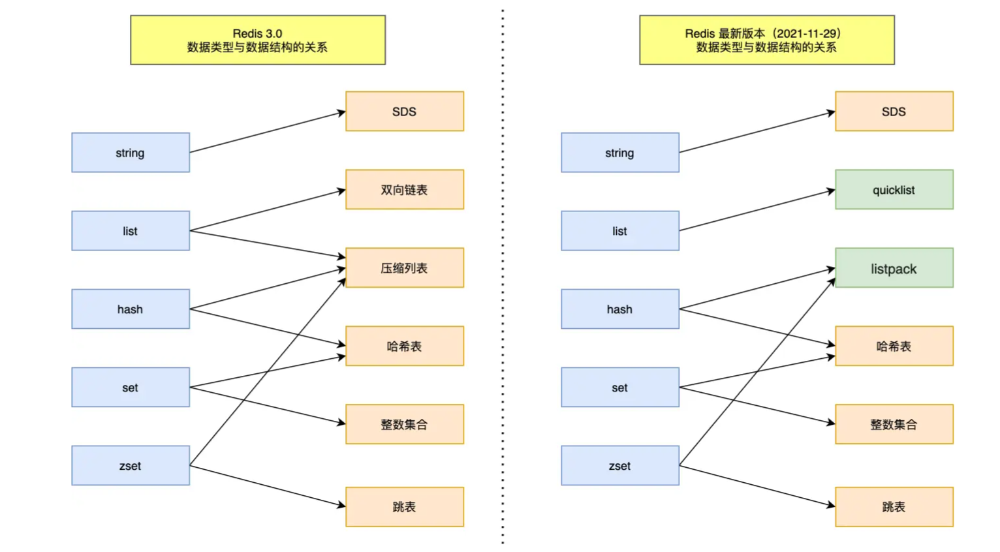
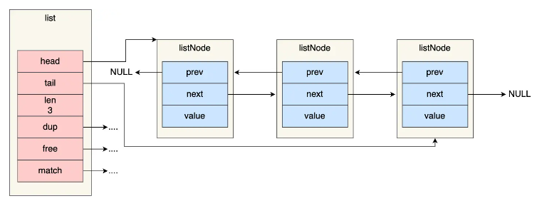
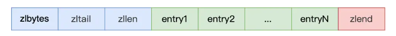
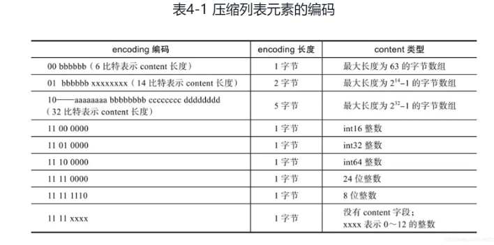
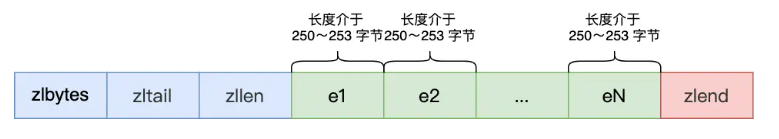
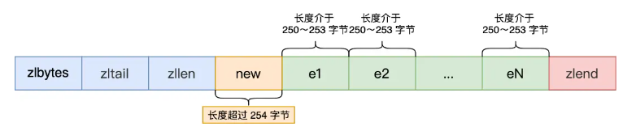
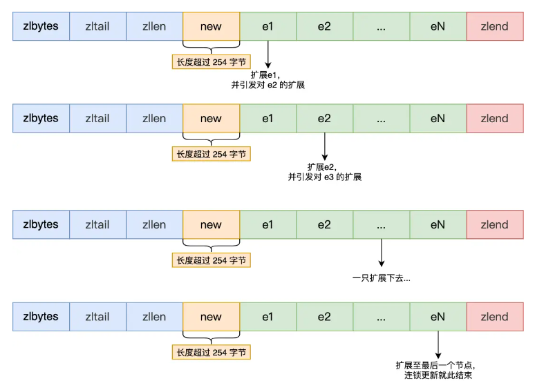
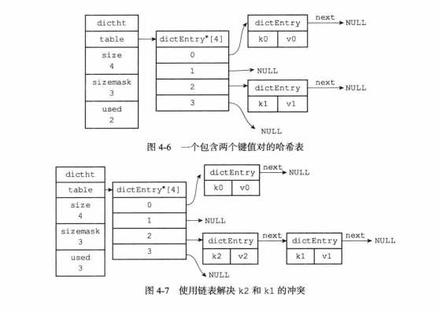
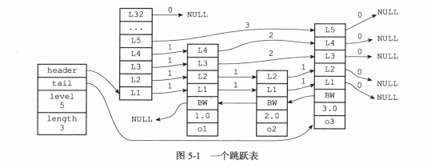
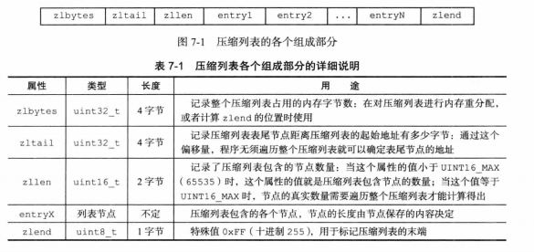

## 概述

下图是 Redis 对象和数据结构的对应关系图，左侧是 Redis3.0 版本的，右侧是 Redis7.0 版本。



## 简单动态字符串（SDS）

### C语言字符串设计缺陷

- 获取字符串长度时间复杂度 **O(N)**
- 字符串里面不能含有 **\0** 字符，只能保存文本数据，**不能保存像图片、音频、视频文化这样的二进制数据**
- 字符串操作函数不高效且不安全，字符串是不会记录自身的缓冲区大小，发生缓冲区溢出将可能会造成程序运行终止

### SDS结构

> Redis 5.0 版本

```c++
struct __attribute__ ((__packed__)) sdshdr16 {
    uint16_t len;  // 字符串长度
    uint16_t alloc;  // 分配的空间长度
    unsigned char flags;  // sds类型
    char buf[];  // 字节数组
};
```

- **len**：字符串长度。获取字符串长度时间复杂度 **O(1)**。
- **alloc**：分配给字符数组的空间长度。修改字符串时通过`alloc - len`可计算出剩余的空间大小，不满足自动扩容。
- **flags**：表示不同类型的 SDS。分别是：sdshdr5、sdshdr8、sdshdr16、sdshdr32 和 sdshdr64 。
- **buf[]**：字符数组，用来保存实际数据。

#### O（1）复杂度获取字符串长度

len 成员变量来记录长度。

#### 二进制安全

len 成员变量来记录长度，所以可存储包含 **\0** 的数据。

#### 不会发生缓冲区溢出

**自动扩容**：

- 如果所需的 sds 长度 **小于 1 MB**，那么最后的扩容是按照**翻倍扩容**来执行的，即 2 倍的 newlen
- 如果所需的 sds 长度 **超过 1 MB**，那么最后的扩容长度应该是 newlen **+ 1MB**。

在扩容 SDS 空间之前，SDS API 会优先检查未使用空间是否足够，如果不够的话，API 不仅会为 SDS 分配修改所必须要的空间，还会给 SDS 分配额外的「未使用空间」。

这样的好处是，下次在操作 SDS 时，如果 SDS 空间够的话，API 就会直接使用「未使用空间」，而无须执行内存分配，**有效的减少内存分配次数**。

#### 节省内存空间

SDS 结构中有个 flags 成员变量，表示的是 SDS 类型。

Redis 一共设计了 5 种类型，分别是 sdshdr5、sdshdr8、sdshdr16、sdshdr32 和 sdshdr64。

这 5 种类型的主要**区别就在于，它们数据结构中的 len 和 alloc 成员变量的数据类型不同**。

```c
struct __attribute__ ((__packed__)) sdshdr16 {
    uint16_t len;
    uint16_t alloc; 
    unsigned char flags; 
    char buf[];
};


struct __attribute__ ((__packed__)) sdshdr32 {
    uint32_t len;
    uint32_t alloc; 
    unsigned char flags;
    char buf[];
};
```

## 链表

`adlist.h/listNode`结构如下：

```c
typedef struct listNode {
    struct listNode *prev;
    struct listNode *next;
    void *value;
} listNode;
```

`adlist.h/list`结构如下：

```c
typedef struct list {
    listNode *head;	// 表头节点
    listNode *tail;	// 表尾节点
    unsigned long len;	// 链表所包含的节点数量
    void *(*dup) (void *ptr);	// 节点值复制函数
    void (*free) (void *ptr);	// 节点释放函数
    int (*match) (void *ptr, void *key);	// 节点值对比函数
} list;
```



【优点】如下：

- **双端**：获取某个节点的前置节点和后置节点的复杂度都是 **O(1)** 。
- **无环**：表头指针和表尾指针都指向 NULL ，对链表的访问以 NULL 为终点。
- 带表头指针和表尾指针：获取表头或表尾节点时间复杂度 **O(1)**。
- 带链表长度计数器：获取链表中的节点数量的时间复杂度只需 **O(1)**。
- 多态：链表节点使用 `void*` 指针来保存节点值，并且可以通过 `list` 结构的 `dup、free、match` 三个属性为节点值设置类型特定函数，链表可以用于保存不同类型的值。

【缺点】如下：

- 链表每个节点之间的内存不连续，**无法很好利用 CPU 缓存**。而数组的内存是连续的，就可以充分利用 CPU 缓存来加速访问。
- 保存一个链表节点的值都需要一个链表节点结构头的分配，**内存开销较大**。

> **版本迭代历史**：
>
> Redis 3.0 的 List 对象在数据量比较少的情况下，会采用「压缩列表」作为底层数据结构的实现，它的优势是节省内存空间，并且是内存紧凑型的数据结构。
>
> Redis 3.2 版本设计了新的数据结构 quicklist，并将 List 对象的底层数据结构改由 quicklist 实现。
>
> Redis 5.0 设计了新的数据结构 listpack，沿用了压缩列表紧凑型的内存布局，最终在最新的 Redis 版本，将 Hash 对象和 Zset 对象的底层数据结构实现之一的压缩列表，替换成由 listpack 实现

## 压缩列表(ziplist)

为了节约内存，**由连续内存块组成的顺序型数据结构**，类似于数组。



- **zlbytes**：记录整个压缩列表占用对内存字节数。作用于内存重新分配或者计算 zlend。
- **zltail**：记录压缩列表「尾部」节点距离起始地址有多少字节。通过该值，无须遍历即可确定表尾节点地址。
- **zllen**：记录压缩列表包含的节点数量。值小于 65535 时即列表节点数量，等于 65535 时列表节点真实数量需要遍历计算。
- **zlend**：标记压缩列表的结束点，固定值 0xFF（十进制255）。
- **entryX**：压缩链表节点。

查询第一个元素和最后一个元素时间复杂度 **O(1)**。但查询其他元素需要遍历，时间复杂度 **O(N)**，所以压缩列表不适合存储过多元素。

**entryX** 节点构成如下：


- **prevlen**：记录了「前一个节点」的长度，目的是为了实现从后向前遍历；
- **encoding**：记录了当前节点实际数据的「类型和长度」，类型主要有两种：字符串和整数。
- **data**：记录了当前节点的实际数据，类型和长度都由 `encoding` 决定；

当往压缩列表中插入数据时，压缩列表就会根据数据类型是字符串还是整数，以及数据的大小，会使用不同空间大小的 prevlen 和 encoding 这两个元素里保存的信息，**这种根据数据大小和类型进行不同的空间大小分配的设计思想，正是 Redis 为了节省内存而采用的**。

**如何分配？**

压缩列表里的每个节点中的 prevlen 属性都记录了「前一个节点的长度」，而且 prevlen 属性的空间大小跟前一个节点长度值有关，比如：

- 如果**前一个节点的长度小于 254 字节**，那么 prevlen 属性需要用 **1 字节的空间**来保存这个长度值；
- 如果**前一个节点的长度大于等于 254 字节**，那么 prevlen 属性需要用 **5 字节的空间**来保存这个长度值；

encoding 属性的空间大小跟数据是字符串还是整数，以及字符串的长度有关，如下图（下图中的 content 表示的是实际数据，即本文的 data 字段）：



- 如果**当前节点的数据是整数**，则 encoding 会使用 **1 字节的空间**进行编码，也就是 encoding 长度为 1 字节。通过 encoding 确认了整数类型，就可以确认整数数据的实际大小了，比如如果 encoding 编码确认了数据是 int16 整数，那么 data 的长度就是 int16 的大小。
- 如果**当前节点的数据是字符串，根据字符串的长度大小**，encoding 会使用 **1 字节/2字节/5字节的空间**进行编码，encoding 编码的前两个 bit 表示数据的类型，后续的其他 bit 标识字符串数据的实际长度，即 data 的长度。

###  连锁更新问题

**问题描述**：压缩列表新增某个元素或修改某个元素时，如果空间不不够，压缩列表占用的内存空间就需要重新分配。而当新插入的元素较大时，可能会导致后续元素的 prevlen 占用空间都发生变化，从而引起「连锁更新」问题，导致每个元素的空间都要重新分配，造成访问压缩列表性能的下降。

> 前面提到，压缩列表节点的 prevlen 属性会根据前一个节点的长度进行不同的空间大小分配：
>
> - 如果前一个**节点的长度小于 254 字节**，那么 prevlen 属性需要用 **1 字节的空间**来保存这个长度值；
> - 如果前一个**节点的长度大于等于 254 字节**，那么 prevlen 属性需要用 **5 字节的空间**来保存这个长度值；

假设一个压缩列表中有多个连续的、长度在 250～253 之间的节点，如下图：



这些节点长度值小于 254 字节，所以 prevlen 属性需要用 1 字节的空间来保存这个长度值。

这时，如果将一个长度大于等于 254 字节的新节点加入到压缩列表的表头节点，即新节点将成为 e1 的前置节点，如下图：



因为 e1 节点的 prevlen 属性只有 1 个字节大小，无法保存新节点的长度，此时就需要对压缩列表的空间重分配操作，并将 e1 节点的 prevlen 属性从原来的 1 字节大小扩展为 5 字节大小。



e1 原本的长度在 250～253 之间，因为刚才的扩展空间，此时 e1 的长度就大于等于 254 了，因此原本 e2 保存 e1 的 prevlen 属性也必须从 1 字节扩展至 5 字节大小。

### 缺陷

- 保存的元素数量增加了，或是元素变大了，会导致内存重新分配，最糟糕的是会有「连锁更新」的问题。

**压缩列表只会用于保存的节点数量不多的场景**，只要节点数量足够小，即使发生连锁更新，也是能接受的。

> Redis 针对压缩列表在设计上的不足，在后来的版本中，新增设计了两种数据结构：quicklist（Redis 3.2 引入） 和 listpack（Redis 5.0 引入）。

## 字典(Dict)

### 字典的实现

Redis底层字典使用哈希表作为底层实现，一个哈希表里面可以有多个哈希表节点，而每个哈希表节点就保存了字典中的一个键值对。

```c
typedef struct dictht {
    dictRntry **table;	// 哈希表数组
    unsigned long size;	// 哈希表大小
    unsigned long sizemask; //哈希表大小掩码，用于计算索引值，总是等于size=1
    unsigned long used;	//哈希表已有节点的数量
}
```

#### 哈希表节点

使用`dictEntry`结构表示：

```c
typedef struct dictEntry {
    void *key;
    union {
        void *val;
        uint64_tu64;
        int64_ts64;
    } v;
    struct dictEntry *next;
} dictEntry;
```

`key`保存键，`v`保存值，`next`指针指向下一个节点.

#### 字典

```c
typedef struct dict {
    dictType *type;	// 类型特定函数
    void *privdata;	// 私有数据
    dictht ht[2];	// 哈希表
    int trehashidx; // rehash索引，当rehash值不在，值为1
} dict;
```

#### 哈希算法

```c
// 使用字典设置的哈希函数，计算键key的哈希值
hash = dict->type->hashFunction(key);
// 使用哈希表的sizemask属性和哈希值，计算出索引值
index = hash & dict->ht[x].sizemask;
```

#### 解决键冲突

链地址法：总是将新节点添加到链表表头的位置。



## 跳跃表(Skip List)



图片最左侧是跳跃表结构：

- `header`：跳跃表头节点
- `tail`：指向跳跃表的表头节点
- `level`：记录目前跳跃表内，层数最大的那个节点的层数（表头节点层数不计算再内）
- `length`：记录跳跃表的长度，即跳跃表目前包含节点的数量（表头节点不计算在内）
- 后退指针`BW`：指向位于当前节点的前一个节点
- 分值`score`：节点按照各自保存的分支从小到大排列

### 跳跃表节点

```c
typedef struct zskiplistNode {
    robj *obj;
    double score;
    struct zskiplistNode *backward; //后向指针
    struct zskiplistLevel {
        struct zskiplistNode *forward;//每一层中的前向指针
        unsigned int span;//x.level[i].span 表示节点x在第i层到其下一个节点需跳过的节点数。注：两个相邻节点span为1
    } level[];
} zskiplistNode;
```

`level`数组可以包含多个元素，每个元素都包含一个指向其它节点的指针。

每次创建一个新的跳跃表节点的时候，程序根据幂次定律(越大的数出现的而概率越小)随机生成一个介于1和32之间的值作为`level`数组的大小。

在同一个跳跃表中，各个节点保存的成员对象必须是唯一的，但多个节点保存的分值可以是相同的：分值相同的节点将按照成员对象在字典序中的大小来进行排序。

## 整数集合(intset)

```c
typedef struct intset {
    uint32_t encoding;	// 编码方式
    uint32_t length;	// 包含元素数量
    int8_t contents[];	// 保存元素的数组
} intset;
```

- `contents`中的数据是从小到大排列，并且数组中不包含重复项
- `length`记录包含元素数量，也是`contents`数组的长度

**升级**

当新元素类型比现在集合中元素类型要长时，需要对集合进行升级。

1. 根据新元素类型，扩展整数集合底层数组的空间大小，并为新元素分配空间。
2. 将底层数组现有的所有元素都转换成与新元素相同的类型，并将类型转换后的元素放到正确的位置上，需要维持有序性不变。

## 压缩列表(ziplist)

