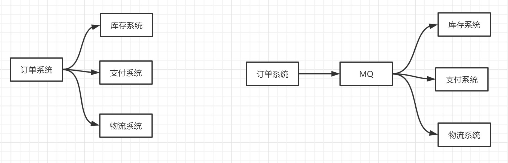
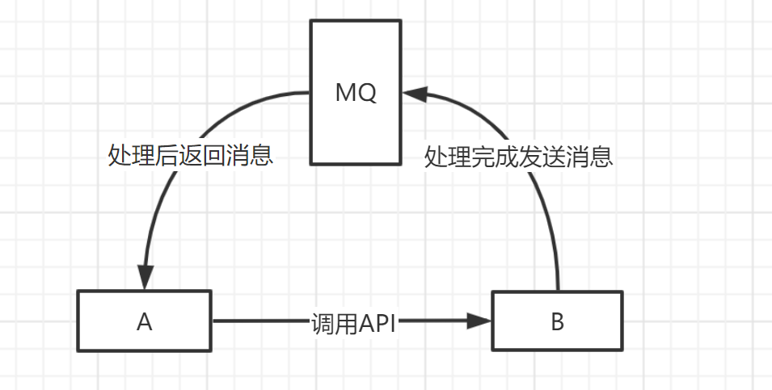

## 1. 为什么要使用MQ

### 1.1 流量削峰

使用消息队列做缓冲。假设一个订单系统最多能处理一万个订单，当订单数量超过一万个后，只能限制超过一万后不允许用户下单。这时可以用MQ做缓冲，把一秒内下的订单分散成一段时间来处理，可能用户在下单后几十秒后才收到下单成功的操作，但是比不能下单要好。

### 1.2 应用解耦

用户创建完成订单后，后面会调用库存系统、物流系统、支付系统，任何一个系统出现异常，都会造成下单操作异常。

可以使用消息队列对调用的系统进行解耦，这样系统之间调用的问题就会减少很多，比如，物流系统发生故障，需要几分钟来进行修复，在这几分钟的时间里，物流系统要处理的数据被缓存在消息队列中，用户下单的操作可以正常完成。当物流系统恢复后，继续处理订单信息即可。中间用户再下单就感受不到物流系统的障碍，提高系统的可用性。

### 1.3 异步处理

A调用B的API，只需要监听B处理完后的信息，B处理完成后会发送一条信息给MQ，MQ会将此信息转发给A服务。

这样A服务不同循环调用B的查询，也不用提供`callback api`。

## 2. RocketMQ优缺点

**优点**：

- 单机吞吐量：十万级
- 可用性：非常高，分布式架构
- 消息可靠性：经过参数优化配置，消息可以做到0丢失
- 功能支持：MQ功能较为完善，还是分布式的，扩展性好
- 支持10亿级别的消息堆积，不会因为堆积导致性能下降
- 源码是Java，方便结合公司自己的业务二次开发
- 天生为金融互联网领域而生，对于可靠性要求很高的场景，尤其是电商里面的订单扣款，以及业务削峰，在大量交易涌入时，后端可能无法及时处理的情况
- **RoketMQ**在稳定性上可能更值得信赖，这些业务场景在阿里双11已经经历了多次考验，如果你的业务有上述并发场景，建议可以选择**RocketMQ**

**缺点**：

- 支持的客户端语言不多，目前是Java及c++，其中c++不成熟
- 没有在 MQ核心中去实现**JMS**等接口，有些系统要迁移需要修改大量代码
