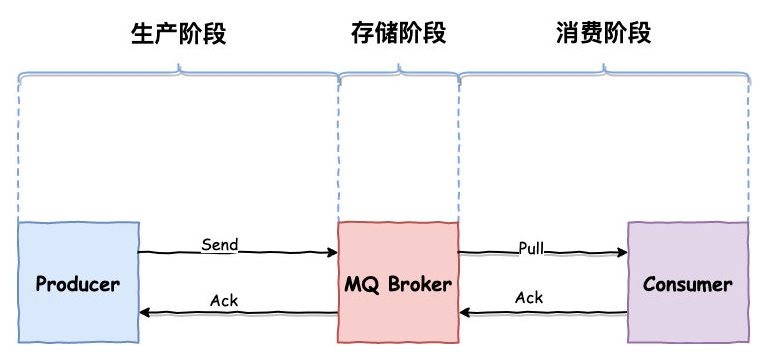

## RocketMQ如何保证消费幂等？

> 也可以理解为RocketMQ如何防止重复消费？

### 消息幂等

当出现消费者对某条消息重复消费的情况时，**重复消费的结果与消费一次的结果是相同**，并且**多次消费并未对业务系统产生任何负面影响**，那么这个消费者的处理过程就是幂等的。

### 适用场景

**1. 发送消息时重复**

当一条消息已被成功发送到服务端并完成持久化，此时出现了网络闪断或者客户端宕机，导致MQ服务端对客户端应答失败。 此时生产者意识到消息发送失败并尝试再次发送消息，消费者后续会收到两条内容相同但Message ID不同的消息。

**2. 投递时消息重复**

消息已投递到消费者并完成业务处理，当客户端给服务端反馈应答的时候网络闪断，导致消费成功的状态无法返回给MQ服务端。为了保证消息至少被消费一次，RocketMQ服务端将在网络恢复后再次尝试投递之前已被处理过的消息，消费者后续会收到两条内容相同并且Message ID也相同的消息。

**3. 负载均衡时消息重复**

当RocketMQ的Broker或客户端重启、扩容或缩容时，会触发Rebalance，此时消费者可能会收到少量重复消息。

### 处理方法

因为**不同的Message ID对应的消息内容可能相同**，有可能出现冲突（重复）的情况，所以真正安全的幂等处理，不建议以Message ID作为处理依据。

最好的方式是**以业务唯一标识作为幂等处理的关键依据**，而业务的唯一标识可以通过消息Key设置。

以支付场景为例，可以将消息的Key设置为订单号，作为幂等处理的依据。具体代码示例如下：

```java
Message message = new Message();
message.setKey("ORDERID_100");
SendResult sendResult = producer.send(message);    
```

消费者收到消息时可以根据消息的Key，即订单号来实现消息幂等：

```java
consumer.subscribe("ons_test", "*", new MessageListener() {
    public Action consume(Message message, ConsumeContext context) {
        String key = message.getKey()
        // 根据业务唯一标识的Key做幂等处理。
    }
});   
```

处理方式如下：

#### 1. 数据库对唯一标识字段设置唯一索引

#### 2. 对数据库使用`select for update`或者乐观锁

```java
select * from t_order where order_no = 'THIS_ORDER_NO' for update  //开启事务
if(order.status != null) {
    return ;//消息重复，直接返回
}
```

#### 3. 基于关系数据库事务插入消息表

在数据库中增加一个消息消费记录表，把消息插入到这个表，并且把原来的订单更新和这个插入的动作放到同一个事务中一起提交，就能保证消息只会被消费一遍了。

1. 开启事务
2. 插入消息表（解决主键冲突，需要选择好唯一标识）
3. 更新订单表（消费逻辑）
4. 提交事务

按照上面步骤：如果消息消费成功，则消息也插入成功。此时就算再次投递该条消息，也会因为插入消息表失败而回滚事务，从而保证消费幂等。

#### 4. 拆解消息

第三个方案基于事务，可能导致锁表时间过长等性能问题。考虑下面这个场景：

1. 检查库存（RPC）
2. 锁库存（RPC）
3. 开启事务，插入订单表（MySQL）
4. 调用某些其他下游服务（RPC）
5. 更新订单状态
6. commit 事务（MySQL）

这种情况下，采取消息表+本地事务的实现方式，消息消费过程中很多子过程是不支持回滚的。特别是RPC调用，如果增加分布式事务，将大大降低系统并发。

**拆解消息过程：**

1. 库存系统消费A：检查库存并做锁库存，发送消息B给订单服务
2. 订单系统消费消息B：插入订单表（MySQL），发送消息C给自己（下游系统）消费
3. 下游系统消费消息C：处理部分逻辑，发送消息D给订单系统
4. 订单系统消费消息D：更新订单状态

上面操作使得每一步的操作都比较原子，意味着使用消息表+事务的方案显得可行。

### 参考：

- https://jaskey.github.io/blog/2020/06/08/rocketmq-message-dedup/

## 如何保证消息不丢失/可靠性？

一条消息从生产到被消费，将会经历三个阶段：



### 生产阶段

**概述**：通过请求确认机制保证消息传递可靠性。如果消息发送失败，可以尝试一下操作：

- 直接捕获异常重试
- 将消息存储到db，然后由后台线程定时重试，确保消息一定到达Broker

**同步发送消息**：

```java
try {
    SendResult sendResult = mqProducer.send(msg);
} catch (RemotingException e) {
    e.printStackTrace();
} catch (MQBrokerException e) {
    e.printStackTrace();
} catch (InterruptedException e) {
    e.printStackTrace();
} catch (MQClientException e) {
    e.printStackTrace();
}
```

`send`方法不抛出异常就表示消息发送成功，业务中可以对异常进行捕获进行重试。

**异步发送消息**：

```java
try {
    // 异步发送消息到，主线程不会被阻塞，立刻会返回
    mqProducer.send(msg, new SendCallback() {
        @Override
        public void onSuccess(SendResult sendResult) {
            // 消息发送成功，
        }

        @Override
        public void onException(Throwable e) {
            // 消息发送失败，可以持久化这条数据，后续进行补偿处理
        }
    });
} catch (RemotingException e) {
    e.printStackTrace();
} catch (InterruptedException e) {
    e.printStackTrace();
} catch (MQClientException e) {
    e.printStackTrace();
}
```

异步发送一定要重新回调方法，可以在消息发送失败回调`onException()`方法中进行重试处理。

可以通过下面两个参数设置重试次数：

```java
// 同步发送消息重试次数，默认为 2
mqProducer.setRetryTimesWhenSendFailed(3);
// 异步发送消息重试次数，默认为 2
mqProducer.setRetryTimesWhenSendAsyncFailed(3);
```

### 存储阶段

**同步刷盘**：只有在消息真正持久化至磁盘后 RocketMQ 的 Broker 端才会真正返回给 Producer 端一个成功的 ACK 响应。同步刷盘对 MQ 消息可靠性来说是一种不错的保障，但是性能上会有较大影响，一般适用于金融业务应用该模式较多。

**异步刷盘（默认）**：能够充分利用 OS 的 **PageCache** 的优势，只要消息写入 **PageCache** 即可将成功的 ACK 返回给 Producer 端。消息刷盘采用后台异步线程提交的方式进行，降低了读写延迟，提高了 MQ 的性能和吞吐量。

所以，为了保证 `Broker` 端不丢消息，可以设置为**同步刷盘**：

```java
## 默认情况为 ASYNC_FLUSH 
flushDiskType = SYNC_FLUSH 
```

当`Broker`服务器未在同步刷盘时间内（**默认为5s**）完成刷盘，则将返回该状态——刷盘超时。

**集群部署**：

为了保证可用性，`Broker `通常采用一主（**master**）多从（**slave**）部署方式。为了保证消息不丢失，消息还需要复制到 **slave** 节点。

默认方式下，消息写入 **master** 成功，就可以返回确认响应给生产者，接着消息将会异步复制到 **slave** 节点。

> flushDiskType 默认值是ASYNC_FLUSH（异步刷盘）

若 master 突然**宕机且不可恢复**，那么还未复制到 **slave** 的消息将会丢失。

所以为了提高消息的可靠性，采用**同步刷盘**方式，**master** 节点将会同步等待 **slave** 节点复制完成，才会返回确认响应。

**小结**：

结合生产阶段与存储阶段，若需要**严格保证消息不丢失**，broker 需要采用如下配置：

```bash
## master 节点配置
# 同步刷盘
flushDiskType = SYNC_FLUSH
# 同步master服务器
brokerRole = SYNC_MASTER

## slave 节点配置
brokerRole = slave
# 同步刷盘
flushDiskType = SYNC_FLUSH
```

### 消费阶段

消费者从 broker 拉取消息，然后执行相应的业务逻辑。一旦执行成功，将会返回 `ConsumeConcurrentlyStatus.CONSUME_SUCCESS` 状态给 Broker。

如果 Broker 未收到消费确认响应或收到其他状态，消费者下次还会再次拉取到该条消息，进行重试。这样的方式有效避免了消费者消费过程发生异常，或者消息在网络传输中丢失的情况。**但业务方需要考虑是否保证消息幂等**。具体方案见上文。

### 参考

- https://github.com/apache/rocketmq/blob/master/docs/cn/best_practice.md

## 如何处理消息积压？

### 产生原因

#### 消费耗时

代码中如果没有复杂的递归和循环的话，内部计算耗时相对外部 I/O 操作来说几乎可以忽略。外部 I/O 操作通常包括如下业务逻辑：

- 读写外部数据库，例如 MySQL 数据库读写。
- 读写外部缓存等系统，例如 Redis 读写。
- 下游系统调用，例如 Dubbo 调用或者下游 HTTP 接口调用。

#### 消费逻辑异常

消费者业务异常或者宕机，导致生产者不停投递消息到 Broker，消息被积压在 Broker 没有被消费

### 如何避免消息堆积？

- 梳理消息的消费耗时

  主要关注一下信息：

  - 消息消费逻辑的计算复杂度是否过高，代码是否存在无限循环和递归等缺陷。
  - 消息消费逻辑中的 I/O 操作（如：外部调用、读写存储等）是否是必须的，能否用本地缓存等方案规避。
  - 消费逻辑中的复杂耗时的操作是否可以做异步化处理，如果可以是否会造成逻辑错乱（消费完成但异步操作未完成）。

- 设置消息的消费并发度
  - 逐步调大线程的单个节点的线程数，并观测节点的系统指标，得到单个节点最优的消费线程数和消息吞吐量。
  - 得到单个节点的最优线程数和消息吞吐量后，根据上下游链路的流量峰值计算出需要设置的节点数，节点数=流量峰值/单线程消息吞吐量。

### 如何处理消息堆积？

消费逻辑无问题并且消费耗时正常情况下，可以考虑下面方案：

- **消费者扩容**

  Topic 中 MessageQueue 的数量大于 Comsumer 实例数量时，可以增加 Consumer 实例数量。MessageQueue 会进行 Rebalance重新分配给 Consumer 实例。但要考虑 DB 读写压力。

- **消息迁移到新 Topic，然后扩容 MessageQueue**

  Topic 的 MessageQueue 的数量小于或者等于消费者数量，这种情况，再扩容消费者就没什么用，就得考虑扩容 MessageQueue。可以新建一个临时的 Topic，临时的Topic多设置一些 MessageQueue，然后先用一些消费者把消费的数据丢到临时的Topic，因为不用业务处理，只是转发一下消息，速度很快。接下来用扩容的消费者去消费新的 Topic 里的数据，消费完了之后，恢复原状。

- **根据具体业务能否限制消息发送速率**

  结合具体业务，使用令牌桶等限流算法限制消息发送速率。

### 参考：

- https://help.aliyun.com/zh/apsaramq-for-rocketmq/cloud-message-queue-rocketmq-4-x-series/use-cases/how-do-i-handle-accumulated-messages
