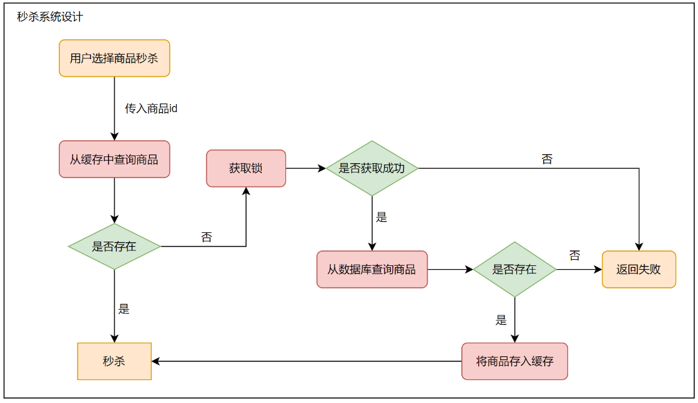
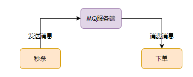
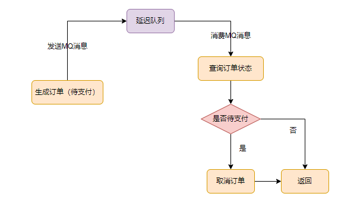

## 瞬时高并发简述
一般在秒杀时间点（比如：12点整）前几分钟，用户并发量才开始徒增，到达时间点时，并发量达到顶峰。

这种活动是大量用户抢少量商品的场景（比如京东抢茅台），大部分用户秒杀会失败，只有极少用户秒杀会成功。

在正常情况下，当商品被抢完后，大部分用户会收到商品已抢完的提醒，收到提醒后，用户并发量会急剧下降。所以流量峰值持续的时间非常短。

针对这种 **瞬时高并发** 的场景，可以从从下面几点进行系统设计：

- 页面静态化
- CDN加速
- 缓存
- MQ
- 限流
- 分布式锁
## 页面静态化
活动页面是并发量最大的地方，如果流量都能直接访问服务端，服务端恐怕承受不住这么大压力，而直接挂掉。

活动页面绝大多数内容是固定的，比如：商品名称、商品描述、图片等。为了减少服务端请求，通常会对活动页面做静态化处理。用户浏览商品等常规操作，不会请求到服务端，只有到秒杀时间点，用户点击秒杀按钮才允许访问服务端。这样就能过滤掉大部分请求。

### CDN加速
用户分布在全国各地，比如：北京、深圳、成都、新疆。网速各不相同。

【**问题**】：**如何让用户最快访问到页面呢？**

这就需要使用 CDN（Content Delivery Network），内容分发网络。使用户就近获取所需内容，降低网络阻塞。

## 秒杀按钮设计
大部分用户怕错过秒杀时间点，会提前进入到活动页面。但此时秒杀按钮是**置灰**的，不可点击。但此时用户会不停的刷新页面，希望第一时间看到秒杀按钮点亮。

【**问题**】：**如何控制秒杀按钮呢？**

可以使用 js 文件控制。

一般 css、js 和图片资源都会提前存到 CDN 上，但 CDN 上 js 文件如何更新呢？

秒杀开始时，系统会生成一个新的 js 文件，标志为 true，但需要对 CDN 进行配置，让其保证标志的**及时性**。

此外，还可以让前端增加一个控制，让用户每隔 3s 发送一次请求。

## 读多写少
在秒杀过程中，系统会先检查库存是否足够，如果足够才允许下单，写数据库。如果不够，直接返回商品已抢完。

由于只有少部分用户能够抢到商品，所以大部分情况下都是**读数据库**，典型的**读多写少**场景。

如果有数十万请求过来，同时通过数据库查询库存是否足够，数据库可能会挂掉（数据库连接资源有限）。所以需要应用缓存 Redis。当然 Redis 也需要多节点部署。

## 缓存问题
通常情况下，在 redis 中保存商品的基础信息，比如：商品id、商品名称、商品属性、库存等信息，数据库中也会保存对应的信息，毕竟只依赖缓存并不可靠。

用户在点击秒杀按钮时，在请求秒杀接口中，会传入商品id参数，然后服务端需要校验该商品是否合法。如果存在则放入缓存中，否则秒杀失败。

### 缓存击穿
举个例子：商品A第一次秒杀时，缓存中是没有数据的，但数据库中有。在前面也说到，如果从数据库中查询到数据，就会存入缓存。

但是，在高并发场景下，同一时刻会有大量的请求，都在秒杀同一件商品，万一这时该商品缓存失效，这些请求同时去查询缓存中没有数据，然后又同时访问数据库，很可能导致数据库挂掉。

**解决方法一：加锁**



**解决方法二：设置缓存用不过期**

即使如此，还是需要进行加锁，多加一份保险。

### 缓存穿透
如果有大量请求传入商品id，在缓存和数据库中都不存在数据，这些请求每次都会穿透缓存，直接访问数据库。由于前面已经加了锁，所以并发量并不会很大，但是会降低请求处理性能。

解决方法如下，这里就不详细叙述：

- 布隆过滤器（数据更新不频繁场景）
- 缓存不存在的数据
## 库存问题
库存扣完后，在用户未支付的情况下，扣减的库存是要加回去的。要特别注意**库存不足**和**超卖**问题。

### 数据库扣减库存
最简单的实现如下：
```sql
update product set stock=stock-1 where id=123;
```
但是如何控制库存不足的情况下，不让用户操作呢？

可以在`update`前检查一下库存即可：

```java
int stock = mapper.getStockById(123);
if(stock > 0) {
    int count = mapper.updateStock(123);
    if(count > 0) {
        addOrder(123);
    }
}
```
但是，上面并没有解决并发场景下的问题，仍会出现超卖的情况。

最简单的方式是**加锁**，比如`synchronized`关键字，但这样性能不好。

优雅点的方式：基于数据库的**乐观锁**，少一次数据查询，还能保证数据操作的原子性。

```sql
update product set stock=stock-1 where id=product and stock > 0;
```
在 sql 后面添加 `stock > 0`就能保证不会出现超卖现象。

但是这样会频繁访问数据库，造成行锁竞争，高并发情况下对数据库造成压力。

### redis 扣减库存
redis 的`incr`方法是原子性的，可以用来扣减库存：
```java
public int checkStock() {
    boolean exist = redisClient.query(productId, userId);
    if(exist) {
        return -1;
    }
    int stock = redisClient.queryStock(productId);
    if(stock <= 0) {
        return 0;
    }
    redisClient.incrby(productId, -1);
    redisClient.add(productId, userId);
    return 1;
}

```
代码流程如下：

1. 先判断该用户是否已经秒杀过该商品，秒杀过的用户不能再参与。
2. 查询库存，如果小于等于0，则表示库存不足。
3. 如果库存充足，则扣减库存，然后记录本次秒杀用户。

但是上面流程在高并发的情况下还是存在问题，因为**查询库存**和**扣减库存**不是「原子操作」，会出现库存为负数的情况，即库存超卖。

同样，上面代码也可以加锁，但也会造成性能降低的问题。

可以将上述代码优化如下：

```java
public int checkStock() {
    boolean exist = redisClient.query(productId, userId);
    if(exist) {
        return -1;
    }
    if(redisClient.incrby(productId, -1) < 0) {
    	return 0;
    }
    redisClient.add(productId, userId);
    return 1;
}
```
但该方案也会存在问题：多个请求同时扣减库存，大多数请求`incrby`后结果都会小于0，虽然库存为负数不会造成超卖问题，但在**退库存**的时候就会导致库存不准。
### lua脚本扣减库存
lua 脚本能够保证原子性，跟 redis 结合能很好解决上面问题。
```java
StringBuilder lua = new StringBuilder();
lua.append("if (redis.call('exists', KEYS[1]) == 1) then");
lua.append("    local stock = tonumber(redis.call('get', KEYS[1]));");
lua.append("    if (stock == -1) then");
lua.append("        return 1;");
lua.append("    end;");
lua.append("    if (stock > 0) then");
lua.append("        redis.call('incrby', KEYS[1], -1);");
lua.append("        return stock;");
lua.append("    end;");
lua.append("    return 0;");
lua.append("end;");
lua.append("return -1;");
```
该代码的主要流程如下：

1. 先判断商品 id 是否存在，如果不存在则直接返回。
2. 获取该商品 id 的库存，判断库存如果是-1，则直接返回，表示不限制库存。
3. 如果库存大于 0，则扣减库存。
4. 如果库存等于 0，是直接返回，表示库存不足。
## 分布式锁
### setNx 加锁
```java
if (jedis.setnx(lockKey, val) == 1) {
   jedis.expire(lockKey, timeout);
}
```
但该方法加锁不是原子性的。
### set 加锁
```java
String result = jedis.set(lockKey, requestId, "NX", "PX", expireTime);
if ("OK".equals(result)) {
    return true;
}
return false;
```
其中：

- `lockKey`：锁的标识。
- `requestId`：请求 id。
- `NX`：只在键不存在时，才对键进行设置操作。
- `PX`：设置键的过期时间为 millisecond 毫秒。
- `expireTime`：过期时间

由于该命令只有一步，所以它是原子操作。
### 释放锁
【**问题**】：在加锁时，已经有了`lockKey`锁标识，为什么还需要记录`requestId`呢？

作用在于**释放锁**时使用。保证释放的是自己加的锁，而不是别人加的锁。

【**问题**】：为什么要用`requestId`，而不是`userId`？

假设使用`userId`，本次请求流程在第5s走完，锁的过期时间设置为3s，假设在第5s正准备删除锁时。而第4s时另一个请求刚好使用相同的`userId`加锁，会成功。所以在第5s删除锁时，会删除别人的锁。

### 自旋锁
如果有1w个请求同时竞争一把锁，只有一个请求时成功的，其余9999个请求都会失败。这在秒杀场景下会出现下面问题：

每1w个请求中只有1个成功，如此下去直到库存不足，这样的秒杀就没有意义了。

解决上面问题可以使用**自旋锁**。在规定的时间窗口内，比如500ms，自选不断尝试加锁。

```java
try {
  Long start = System.currentTimeMillis();
  while(true) {
      String result = jedis.set(lockKey, requestId, "NX", "PX", expireTime);
     if ("OK".equals(result)) {
        return true;
     }
     
     long time = System.currentTimeMillis() - start;
      if (time >= timeout) {
          return false;
      }
      try {
          Thread.sleep(50);
      } catch (InterruptedException e) {
          e.printStackTrace();
      }
  }
 
} finally{
    unlock(lockKey,requestId);
}  
return false;
```
## MQ异步处理
秒杀有三个核心流程：**秒杀、下单、支付**。

并发量最大的是**秒杀**，下单和支付实际并发量很小。所以在设计秒杀系统时，需要将下单和支付从主流程中抽取出来，做成**异步**处理。

使用MQ需要关注下面几个问题，这里就不详细介绍：

- 消息丢失问题
- 重复消费问题
- 垃圾消息问题
- 延迟消费问题
### 订单取消
通常情况下，用户秒杀成功，下单后，在15分钟之内还未完成支付的话，订单会自动取消，回退库存。

**15分钟未支付订单自动取消功能，如何实现**？

首先可以想到使用**Job**，优点是简单，但实时性不好。

更好的方案是使用**延迟队列**。


## 如何限流
真实用户手动点击的情况下，1秒只能点击一次秒杀按钮。但是服务器1秒可以请求上千次。

所以需要做一下限制，处理这些非法请求。

两种常用的限流方式：

- 基于 Nginx 限流
- 基于 Redis 限流
### 对同一用户限流
限制同一用户 id 请求次数频率，比如每分钟不超过5次。
### 对同一ip限流
限制同一ip的请求频率，但这种可能存在误杀情况，比如：一个公司出口ip相同，里面如果有多个用户同时发起请求，有些用户可能会把限制住。
### 对接口限流
有些高手使用**代理**，这样对ip限流就无效了。

可以对接口进行限流，但这样可能会影响一些正常用户的访问，得不偿失。

### 增加验证码
用户每次请求前，需要先输入验证码，每个验证码一次性使用，现在大部分使用的是**移动滑块**验证码。
### 提高业务门槛
比如只有会员才能参与活动，或者只有指定等级用户才能参与等等。
## 参考

- [如何设计一个高并发的秒杀架构？ - 掘金](https://juejin.cn/post/7044032901662375949#heading-17)
