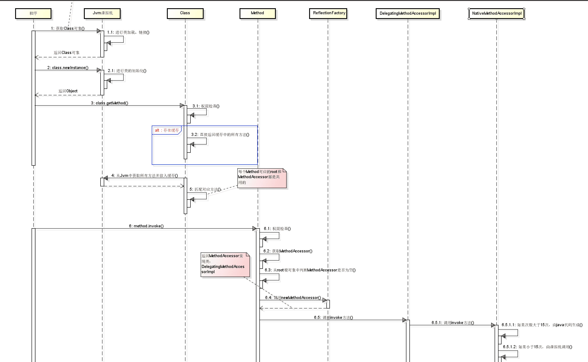

## 反射基础

反射机制：允许在运行时发现和使用类的信息，将 Java 类中各种成分映射成 Java 对象。

### Class 类

手动编写的类被编译后会产生一个 Class 对象，每个 class 标识的类在内存中**有且只有一个**与之对应的 Class 对象来描述类型信息，Class 类只存私有构造函数，因此对应的 Class 对象只能由 JVM 创建和加载。Class 类的对象作用是**运行时**提供或获得某个对象的类型信息

### 源码理解

> 原文链接：
>
> - https://www.cnblogs.com/yougewe/p/10125073.html
>
> - https://pdai.tech/md/java/basic/java-basic-x-reflection.html

```java
public class HelloReflect {
    public static void main(String[] args) {
        try {
            // 1. 使用外部配置的实现，进行动态加载类
            TempFunctionTest test = (TempFunctionTest)Class.forName("basic.TempFunctionTest").newInstance();
            test.sayHello("call directly");
            // 2. 根据配置的函数名，进行方法调用（不需要通用的接口抽象）
            Object t2 = new TempFunctionTest();
            Method method = t2.getClass().getDeclaredMethod("sayHello", String.class);
            method.invoke(test, "method invoke");
        } catch (ClassNotFoundException e) {
            e.printStackTrace();
        } catch (InstantiationException e) {
            e.printStackTrace();
        } catch (IllegalAccessException e) {
            e.printStackTrace();
        } catch (NoSuchMethodException e ) {
            e.printStackTrace();
        } catch (InvocationTargetException e) {
            e.printStackTrace();
        }
    }

    public void sayHello(String word) {
        System.out.println("hello," + word);
    }
}
```

执行流程具体如下：



### 小结

1. 反射类及反射方法的获取，都是通过从列表中搜寻查找匹配的方法，所以查找性能会随类的大小方法多少而变化。
2. 每个类都会有一个与之对应的 Class 实例，从而每个类都可以获取 method 反射方法，并作用到其他实例身上。
3. 反射也是考虑了线程安全的，放心使用。
4. 反射使用软引用 relectionData 缓存 class 信息，避免每次重新从 jvm 获取带来的开销。
5. 反射调用多次生成新代理 Accessor，而通过字节码生存的则考虑了卸载功能，所以会使用独立的类加载器。
6. 当找到需要的方法，都会 copy 一份出来，而不是使用原来的实例，从而保证数据隔离。
7. 调度反射方法，最终是由 jvm 执行 `invoke0()` 执行。

## 反射调用静态方法

> 下面实例使用反射调用静态方法的两种类型：public 和 private

创建一个类`GreetingAndBye`

```java
public class GreetingAndBye {
    public static String greeting(String name) {
        return String.format("Hey %s, nice to meet you!", name);
    }

    private static String goodBye(String name) {
        return String.format("Bye %s, see you next time.", name);
    }
}
```

这个类包含两个静态方法，一个是`private`，一个是`public`

### 调用`public static`方法

```java
@Test
public void invokePublicMethod() throws NoSuchMethodException, InvocationTargetException, IllegalAccessException {
    Class<GreetingAndBye> clazz = GreetingAndBye.class;
    Method method = clazz.getMethod("greeting", String.class);

    Object result = method.invoke(null, "Eric");

    System.out.println(result);
}
```

当调用静态方法时，`invoke`的第一个参数传`null`

### 调用`private static`方法

```java
@Test
public void invokePrivateMethod() throws NoSuchMethodException, InvocationTargetException, IllegalAccessException {
    Class<GreetingAndBye> clazz = GreetingAndBye.class;
    Method method = clazz.getDeclaredMethod("goodBye", String.class);
    method.setAccessible(true);

    Object result = method.invoke(null, "Eric");

    System.out.println(result);
}
```

当调用的方法为`private`时，需要使用`getDeclaredMethod`代替`getMethod`。并且需要调用`method.setAccessible(true)`去调用`private`方法。

## 反射检测抽象类、接口、实现类

```java
public abstract class AbstractExample {
    public abstract LocalDate getLocalDate();

    public abstract LocalTime getLocalTime();
}
```

```java
public interface InterfaceExample {
}
```

### 检测抽象类

```java
public void givenAbstractClass_whenCheckModifierIsAbstract_thenTrue() throws Exception {
    Class<AbstractExample> clazz = AbstractExample.class;

    System.out.println(Modifier.isAbstract(clazz.getModifiers())); // true
}

public void givenAbstractClass_whenCheckIsAbstractClass_thenTrue() {
    Class<AbstractExample> clazz = AbstractExample.class;
    int mod = clazz.getModifiers();

    System.out.println(Modifier.isInterface(mod));  // false
    System.out.println(Modifier.isAbstract(mod));   // true
}
```

### 检测接口

```java
public void givenInterface_whenCheckModifierIsAbstract_thenTrue() {
    Class<InterfaceExample> clazz = InterfaceExample.class;
    int mod = clazz.getModifiers();
    System.out.println(Modifier.isInterface(mod));  // true
    System.out.println(Modifier.isAbstract(clazz.getModifiers()));  // true 注意该方法检测接口也是抽象类
}
```

### 检测实现类

```java
public void givenConcreteClass_whenCheckIsAbstractClass_thenFalse() {
    Class<Date> clazz = Date.class;
    int mod = clazz.getModifiers();

    System.out.println(Modifier.isInterface(mod));  // false
    System.out.println(Modifier.isAbstract(mod));   // false
}
```

### 判断静态方法

```java
    /**
     * 判断是不是静态方法
     */
    @Test
    public void whenCheckStaticMethod_ThenSuccess() throws Exception {
        Method method = StaticUtility.class.getMethod("getAuthorName", null);
        System.out.println(Modifier.isStatic(method.getModifiers()));   // true
    }

    /**
     * 获取类中的静态方法
     */
    @Test
    public void whenCheckAllStaticMethods_thenSuccess() {
        List<Method> methodList = Arrays.asList(StaticUtility.class.getMethods())
                .stream()
                .filter(method -> Modifier.isStatic(method.getModifiers()))
                .collect(Collectors.toList());
        System.out.println(methodList);
    }
```


## 方法详解

### 1. `getMethod()`

可以使用寻找类中所有的`public`的方法，包括从基类继承的、从接口实现的所有public方法。

### 2. `getDeclaredMethod()`

获取类中定义的任何方法，包括`public, protected, default, private`，但是不包括继承的方法。

### 3. `setAccessible()`

设置访问控制检查。当调用`private`或`protected`方法时，需要`method.setAccessible(true);`，否者会抛出`IllegalAccessException`异常。