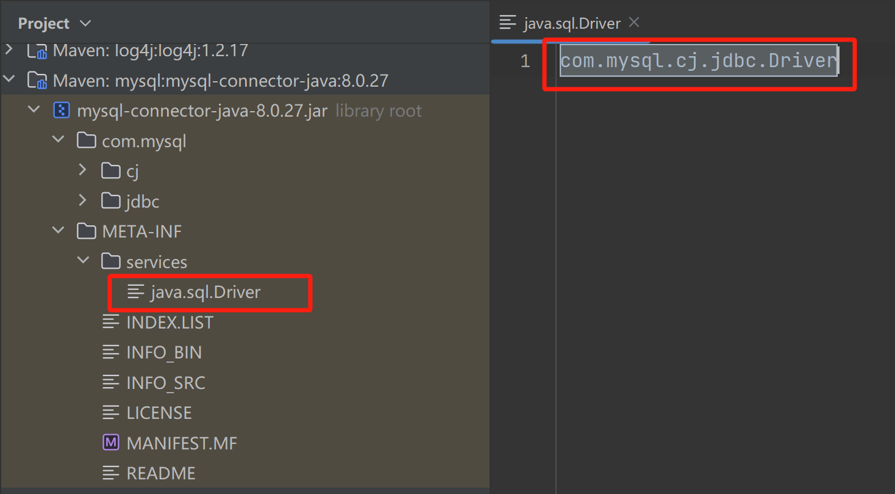

## 简介

SPI（Service Provider Interface），是 JDK 内置的一种服务提供发现机制，可以用来启用框架扩展和替换组件，核心思想是**解耦**。比如`java.sql.Driver`接口，其他不同厂商可以针对同一接口做出不同的实现，MySQL 和 PostgreSQL 都有不同的实现提供给用户。

当服务提供者提供了一种接口的实现后，需要在 classpath 下的 `META-INF/services/` 目录下创建一个以服务接口命名的文件，文件的内容就是接口的具体实现类。

当使用该服务时，扫描 `META-INF/services/` 下配置文件，就可以加载类使用该服务。JDK 中查找服务的工具类是：`java.util.ServiceLoader`。

---

以 MySQL 驱动为例：



## 源码实现

以上面连接数据库作为示例，看看 java8 SPI 怎么实现的。

入口在 `java.sql.DriverManager` 类中：

```java
    static {
        loadInitialDrivers();
        println("JDBC DriverManager initialized");
    }

    private static void loadInitialDrivers() {
        String drivers;
        try {
            drivers = AccessController.doPrivileged(new PrivilegedAction<String>() {
                public String run() {
                    return System.getProperty("jdbc.drivers");
                }
            });
        } catch (Exception ex) {
            drivers = null;
        }
        // If the driver is packaged as a Service Provider, load it.
        // Get all the drivers through the classloader
        // exposed as a java.sql.Driver.class service.
        // ServiceLoader.load() replaces the sun.misc.Providers()

        AccessController.doPrivileged(new PrivilegedAction<Void>() {
            public Void run() {

                ServiceLoader<Driver> loadedDrivers = ServiceLoader.load(Driver.class);
                Iterator<Driver> driversIterator = loadedDrivers.iterator();

                /* Load these drivers, so that they can be instantiated.
                 * It may be the case that the driver class may not be there
                 * i.e. there may be a packaged driver with the service class
                 * as implementation of java.sql.Driver but the actual class
                 * may be missing. In that case a java.util.ServiceConfigurationError
                 * will be thrown at runtime by the VM trying to locate
                 * and load the service.
                 *
                 * Adding a try catch block to catch those runtime errors
                 * if driver not available in classpath but it's
                 * packaged as service and that service is there in classpath.
                 */
                try{
                    while(driversIterator.hasNext()) {
                        driversIterator.next();
                    }
                } catch(Throwable t) {
                // Do nothing
                }
                return null;
            }
        });

        println("DriverManager.initialize: jdbc.drivers = " + drivers);

        if (drivers == null || drivers.equals("")) {
            return;
        }
        String[] driversList = drivers.split(":");
        println("number of Drivers:" + driversList.length);
        for (String aDriver : driversList) {
            try {
                println("DriverManager.Initialize: loading " + aDriver);
                Class.forName(aDriver, true,
                        ClassLoader.getSystemClassLoader());
            } catch (Exception ex) {
                println("DriverManager.Initialize: load failed: " + ex);
            }
        }
    }
```

上面的代码主要步骤是：

1. 从系统变量中获取有关驱动的定义。

2. 使用 SPI 来获取驱动的实现。

3. 遍历使用 SPI 获取到的具体实现，实例化各个实现类。

4. 根据第一步获取到的驱动列表来实例化具体实现类。

主要关注第2,3步，第 2 步使用 SPI 获取驱动的实现，对应实现：

```java
ServiceLoader<Driver> loadedDrivers = ServiceLoader.load(Driver.class);
```

这里没有去 `META-INF/services` 目录下查找配置文件，也没有加载具体实现类，只是封装了接口类型和类加载器，并初始化了一个迭代器。

接着看第三步，遍历使用 SPI 获取到的具体实现，实例化各个实现类，对应的代码如下：

```java
// 获取迭代器
Iterator<Driver> driversIterator = loadedDrivers.iterator();
// 遍历所有的驱动实现
while(driversIterator.hasNext()) {
    driversIterator.next();
}
```

在遍历的时候，首先调用`driversIterator.hasNext()`方法，这里会搜索 classpath 下以及jar包中所有的`META-INF/services`目录下的`java.sql.Driver`文件，并找到文件中的实现类的名字，此时并没有实例化具体的实现类。

然后是调用`driversIterator.next();`方法，此时就会根据驱动名字具体实例化各个实现类了。具体的扫描加载源码见`java.util.ServiceLoader` 方法。

## 参考

- https://pdai.tech/md/java/advanced/java-advanced-spi.html
