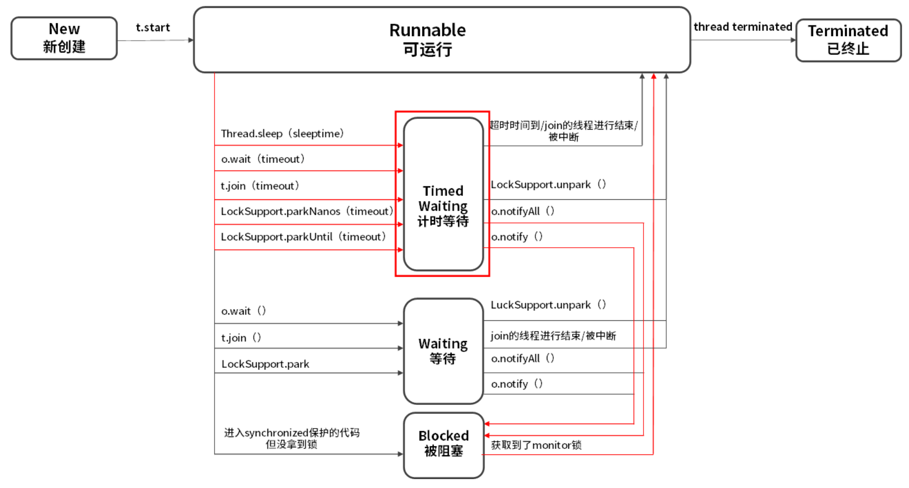

## 六种线程状态及转化关系

`java.lang.Thread.State`枚举类中定义了六种线程的状态，可以调用线程 Thread 中的`getState()`方法**获取当前线程的状态**。

- New：尚未启动
- Runnable：**可运行**或者**正在等待分配资源**
- Blocked：被阻塞（没抢到 monitor 锁）
- Waiting：等待（等待某个条件，比如 join 线程执行完毕）
- Timed Waiting：计时等待
- Terminated：被终止

## New 新建
即用**new关键字**新建一个线程，这个线程就处于**新建状态**。
## Runnable 可运行
操作系统中的**就绪 Ready** 和**运行 Running** 两种状态，在 Java 中统称为 Runnable。

Java 中处于 Runnable 状态的线程有可能正在执行，也有可能没有正在执行，正在等待被分配 CPU 资源。

如果一个正在运行的线程是 Runnable 状态，当它运行到任务的一半时，执行该线程的 CPU 被调度去做其他事情，导致该线程暂时不运行，它的状态依然不变，还是 Runnable，因为它有可能随时被调度回来继续执行任务。
### **Running** 运行
处于就绪状态的线程获得了 CPU 之后，**真正开始执行 run() 方法的线程执行体时**，意味着该线程就已经处于**运行状态**。需要注意的是，**对于单处理器，一个时刻只能有一个线程处于运行状态。**

对于抢占式策略的系统来说，系统会给每个线程一小段时间处理各自的任务。时间用完之后，系统负责夺回线程占用的资源。下一段时间里，系统会根据一定规则，再次进行调度。

**运行状态转变为就绪状态**的情形：

- 线程失去处理器资源。线程不一定完整执行的，执行到一半，说不定就被别的线程抢走了。
- 调用 `yield()` 静态方法，暂时暂停当前线程，让系统的线程调度器重新调度一次，它自己完全有可能再次运行。

yield方法的官方解释：
> A hint to the scheduler that the current thread is willing to yield its current use of a processor. The scheduler is free to ignore this hint.

提示调度程序，当前线程愿意放弃当前对处理器的使用。这时，**当前线程将会被置为就绪状态**，和其他线程一样等待调度，这时候根据不同**优先级**决定的**概率**，当前线程完全有可能再次抢到处理器资源。
## Blocked 被阻塞
阻塞状态表示线程**正等待监视器锁**，而陷入的状态。

以下场景线程将会阻塞：

- 线程等待进入 synchronized 同步方法。
- 线程等待进入 synchronized 同步代码块。

线程取得锁，就会从阻塞状态转变为就绪状态。
## Waiting 等待
进入该状态表示**当前线程需要等待其他线程做出一些的特定的动作**（通知或中断）。

Blocked 与 Waiting 的区别是 Blocked 在等待其他线程释放 monitor 锁，而 Waiting 则是在等待某个条件，比如 join 的线程执行完毕，或者是 `notify()/notifyAll()` 。
### 运行->等待

- 当前线程运行过程中，其他线程调用`join`方法，当前线程将会进入等待状态。
- 当前线程对象调用`wait()`方法。
- `LockSupport.park()`：出于线程调度的目的**禁用当前线程**。
### 等待->就绪

- 等待的线程**被其他线程对象唤醒**，`notify()`和`notifyAll()`。
- `LockSupport.unpark(Thread)`，与上面park方法对应，给出许可证，**解除等待状态**。

【**问题**】：如果其他线程调用 `notify()` 或 `notifyAll()` 来唤醒它，它会直接进入 Blocked 状态。为什么呢？

因为唤醒 Waiting 线程的线程如果调用 `notify()` 或 `notifyAll()`，要求必须首先持有该 monitor 锁，所以处于 Waiting 状态的线程被唤醒时拿不到该锁，就会进入 Blocked 状态，直到执行了 `notify()/notifyAll()` 的**唤醒它的线程**执行完毕并释放 monitor 锁，才可能轮到它去抢夺这把锁，如果它能抢到，就会从 Blocked 状态回到 Runnable 状态。

## Timed Waiting** **超时等待
区别于 `Waiting`，它可以在**指定的时间**自行返回。
### 运行->超时等待

- 调用静态方法，`Thread.sleep(long)`
- 线程对象调用`wait(long)`方法
- 其他线程调用指定时间的`join(long)`。
- `LockSupport.parkNanos()`。
- `LockSupport.parkUntil()`。
### 超时等待->就绪

- 同样的，等待的线程被其他线程对象唤醒，`notify()`和`notifyAll()`。
- `LockSupport.unpark(Thread)`。
## 消亡状态
即**线程的终止**，表示线程已经执行完毕。前面已经说了，已经消亡的线程不能通过start再次唤醒。

- run()和call()线程执行体中顺利执行完毕，**线程正常终止**。
- 线程抛出一个没有捕获的Exception或Error。

需要注意的是：主线成和子线程互不影响，子线程并不会因为主线程结束就结束。
## sleep 和 yield 的区别：

- sleep(long)方法会**使线程转入超时等待状态**，时间到了之后才会转入就绪状态。而yield()方法不会将线程转入等待，而是强制线程进入就绪状态。
- 使用sleep(long)方法**需要处理异常**，而yield()不用。
