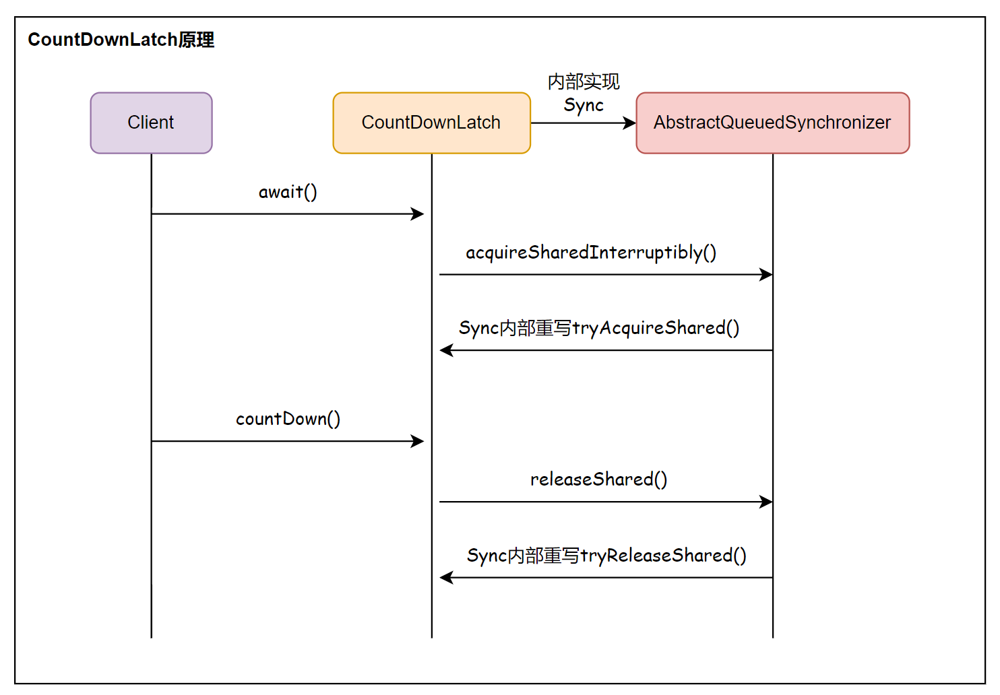

## 信号量 Semaphore

### 原理

Semaphore 内部维护了一组虚拟的许可，许可的数量可以通过构造函数的参数指定。访问特定资源前，必须使用`acquire()`方法获得许可，如果许可数量为 0，该线程则一直阻塞，直到有可用许可。访问资源后，使用`release()`方法释放许可。

`Semaphore(int permits, boolean fair)`提供了 2 个参数。`permits` 代表资源池的长度；`fair` 代表 「公平许可」 或 「非公平许可」。Semaphore 中主要用到的是`acquire()` 和`release()`两个方法，分别用来获取信号量和释放信号量。

### 使用场景

通常用于那些资源有明确访问数量限制的场景，常用于限流 。

- 数据库连接池：同时进行连接的线程有数量限制，连接不能超过一定的数量，当连接达到了限制数量后，后面的线程只能排队等前面的线程释放了数据库连接才能获得数据库连接。

- 停车场场景：车位数量有限，同时只能容纳多少台车，车位满了之后只有等里面的车离开停车场外面的车才可以进入。

semaphore 基于 AQS 实现，参数`permits`表示许可数，它最后传递给了 AQS 的`state`值。线程在运行时首先获取许可，如果成功，许可数就减 1，线程运行，当线程运行结束就释放许可，许可数就加 1。如果许可数为 0，则获取失败，线程位于 AQS 的等待队列中，它会被其它释放许可的线程唤醒。

## CountDownLatch

### 原理

`CountDownLatch` 是一个计数器闭锁。主要的功能就是：在完成一组线程中执行的操作之前，它允许一个或多个线程通过`await()`方法来阻塞处于一直等待状态，用给定的计数初始化`CountDownLatch`，调用`countDown()`方法计数减一，当计数器减少到 0 时，再唤起这些线程继续执行。

`CountDownLatch` 中主要用到的是 `countDown()` 和 `await()` 这两个方法。`await()` 用于以执行完成任务的阻塞等待，使当前线程在计数为零之前一直阻塞。`countDown()` 递减计数，如果计数达到零，说明所有任务都执行完成。

它还提供了带参数的 `await(long timeout,TimeUnit unit)`方法，来指定其他线程等待的时长。如果超时还未完成，则直接跳出阻塞执行下面的流程。

---

下面是`await()` 和 `countDown()` 调用关系图：



`CountDownLatch` 利用 AQS 的 `state `变量充当计数器，`state` 由 `volatile` 修饰并使用 CAS 更新。

> 下面源码是JDK1.8

#### `countDown()`方法

```java
public void countDown() {
    sync.releaseShared(1);
}
```

调用 AQS 的 `AbstractQueuedSynchronizer#releaseShared` 方法：

```java
public final boolean releaseShared(int arg) {
    if (tryReleaseShared(arg)) {
        // 将在同步队列中阻塞的线程唤醒，具体可见AQS源码分析
        doReleaseShared();
        return true;
    }
    return false;
}
```

在`CountDownLatch`内部的`Sync`类实现了`tryReleaseShared()`方法：

```java
protected boolean tryReleaseShared(int releases) {
    // Decrement count; signal when transition to zero
    for (;;) {
        int c = getState();
        if (c == 0)
            return false;
        int nextc = c - 1;
        // 使用CAS操作修改state的值，让其减一
        if (compareAndSetState(c, nextc))
            return nextc == 0;
    }
}
```

`AbstractQueuedSynchronizer#doReleaseShared()` 方法：

```java
 private void doReleaseShared() {
        for (;;) {
            // head同步队列中的队列头
            Node h = head;
            if (h != null && h != tail) {
                int ws = h.waitStatus;
                // SIGNAL 表示当此节点的前驱结点释放锁时，然后当前节点中的线程就可以去获取锁运行 
                if (ws == Node.SIGNAL) {
                    // 将节点的状态使用CAS算法更新为0，0表示初始化状态
                    if (!compareAndSetWaitStatus(h, Node.SIGNAL, 0))
                        // 状态更新0失败，则进行下次循环
                        continue;            // loop to recheck cases
                    // 状态成功更新为0后，唤醒节点中的线程
                    unparkSuccessor(h);
                }
                /**
                 * 如果节点状态值为0，则使用CAS方法更新节点状态值为 Node.PROPAGATE
                 * PROPAGATE 是四中状态值之一：该状态表示可运行，只在共享模式下使用
                 */
                else if (ws == 0 &&
                         !compareAndSetWaitStatus(h, 0, Node.PROPAGATE))
                    continue;                // loop on failed CAS
            }
            if (h == head)                   // loop if head changed
                break;
        }
    }
```

#### `await()`方法

```java
public void await() throws InterruptedException {
    sync.acquireSharedInterruptibly(1);
}
```

进入`AbstractQueuedSynchronizer#acquireSharedInterruptibly()`方法：

```java
public final void acquireSharedInterruptibly(int arg)
    throws InterruptedException {
    // 等待过程不可中断
    if (Thread.interrupted())
        throw new InterruptedException();
    if (tryAcquireShared(arg) < 0)
        // 阻塞主线程
        doAcquireSharedInterruptibly(arg);
}
```

`tryAcquireShared()` 方法在 `Sync` 内部类中实现：

```java
protected int tryAcquireShared(int acquires) {
    return (getState() == 0) ? 1 : -1;
}
```

当该方法小于 0，也就是说当前 `state` 不等于 0 时（说明还有任务未被提交），会执行 `doAcquireSharedInterruptibly()` 方法：

```java
 private void doAcquireSharedInterruptibly(int arg)
        throws InterruptedException {
        // 将主线程加入队列，队列中有两个节点，第一个是虚拟节点，第二个就是主线程节点
        final Node node = addWaiter(Node.SHARED);
        boolean failed = true;
        try {
            for (;;) {
                // 总共只有两个节点，主线程前一个就是首节点
                final Node p = node.predecessor();
                if (p == head) {
                    // 这里又执行到CountDownLatch中Sync类中实现的方法，判断state是否为0
                    int r = tryAcquireShared(arg);
                    if (r >= 0) {
                        setHeadAndPropagate(node, r);
                        p.next = null; // help GC
                        failed = false;
                        return;
                    }
                }
                // 如果state不为0，这里会把主线程挂起阻塞
                if (shouldParkAfterFailedAcquire(p, node) &&
                    parkAndCheckInterrupt())
                    throw new InterruptedException();
            }
        } finally {
            if (failed)
                cancelAcquire(node);
        }
    }
```


------------------------------------------------
### 使用场景

- 让单个线程等待：多个线程(任务)完成后，进行汇总合并
- 让多个线程等待：模拟并发，让并发线程一起执行

## 循环屏障 CyclicBarrier

阻塞一组线程直到这些线程同时达到某个条件才继续执行。

它与`CountDownLatch`很类似，但又不同，`CountDownLatch`需要调用`countDown()`方法触发事件，而`CyclicBarrier`不需要，它就像一个栅栏一样，当一组线程都到达了栅栏处才继续往下走。

下面是一个使用示例：使用一个`CyclicBarrier`使得三个线程保持同步，当三个线程同时到达`cyclicBarrier.await();`处大家再一起往下运行。

```javascript
public class CyclicBarrierTest {
    public static void main(String[] args) {
        CyclicBarrier cyclicBarrier = new CyclicBarrier(3);

        for (int i = 0; i < 3; i++) {
            new Thread(()->{
                System.out.println("before");
                try {
                    cyclicBarrier.await();
                } catch (InterruptedException e) {
                    e.printStackTrace();
                } catch (BrokenBarrierException e) {
                    e.printStackTrace();
                }
                System.out.println("after");
            }).start();
        }
    }
}    

```

### 原理

`CyclicBarrier` 内部类 `Generation`：用于控制`CyclicBarrier`的循环使用。

```java
private static class Generation {
    boolean broken = false;
}
```

主要属性：

```java
// 重入锁
private final ReentrantLock lock = new ReentrantLock();
// 条件锁，名称为trip，绊倒的意思，可能是指线程来了先绊倒，等达到一定数量了再唤醒
private final Condition trip = lock.newCondition();
// 需要等待的线程数量
private final int parties;
// 当唤醒的时候执行的命令
private final Runnable barrierCommand;
/** The current generation */
private Generation generation = new Generation();

// 当前这一代还需要等待的线程数
private int count;

```

#### `await()`方法

整个逻辑分成两部分：

1. 最后一个线程逻辑，当`count`减为 0 的时候，打破栅栏，它调用`nextGeneration()`方法通知条件队列中的等待线程转移到AQS的队列中等待被唤醒，并进入下一代。
2. 非最后一个线程走下面的`for`循环逻辑，这些线程会阻塞在`condition`的`await()`方法处，它们会加入到条件队列中，等待被通知，当它们唤醒的时候已经更新换「代」了，这时候返回。

```java
public int await() throws InterruptedException, BrokenBarrierException {
    try {
        // 不需要超时
        return dowait(false, 0L);
    } catch (TimeoutException toe) {
        throw new Error(toe); // cannot happen
    }
}

private int dowait(boolean timed, long nanos)
    throws InterruptedException, BrokenBarrierException,
TimeoutException {
    final ReentrantLock lock = this.lock;
    // 加锁
    lock.lock();
    try {
        // 当前代
        final Generation g = generation;
        // 检查
        if (g.broken)
            throw new BrokenBarrierException();
        // 中断检查
        if (Thread.interrupted()) {
            breakBarrier();
            throw new InterruptedException();
        }
        // 当前代还需要等待的线程数减一
        int index = --count;
        // 如果是当前代的最后一个线程
        if (index == 0) {  // tripped
            boolean ranAction = false;
            try {
                // 初始化时传值就走这里
                final Runnable command = barrierCommand;
                if (command != null)
                    command.run();
                ranAction = true;
                // 调用下一代方法，唤醒当前代线程
                nextGeneration();
                return 0;
            } finally {
                if (!ranAction)
                    breakBarrier();
            }
        }

        // loop until tripped, broken, interrupted, or timed out
        // 该循环只有非最后一个线程才能走到
        for (;;) {
            try {
                if (!timed)
                    // 线程等待
                    trip.await();
                else if (nanos > 0L)
                    // 超时等待
                    nanos = trip.awaitNanos(nanos);
            } catch (InterruptedException ie) {
                if (g == generation && ! g.broken) {
                    breakBarrier();
                    throw ie;
                } else {
                    // We're about to finish waiting even if we had not
                    // been interrupted, so this interrupt is deemed to
                    // "belong" to subsequent execution.
                    Thread.currentThread().interrupt();
                }
            }

            if (g.broken)
                throw new BrokenBarrierException();

            if (g != generation)
                return index;

            if (timed && nanos <= 0L) {
                breakBarrier();
                throw new TimeoutException();
            }
        }
    } finally {
        lock.unlock();
    }
}

private void nextGeneration() {
    // signal completion of last generation
    // 调用condition的signalAll()将其队列中的等待者全部转移到AQS的队列中
    trip.signalAll();
    // set up next generation
    // 重置count
    count = parties;
    // 进入下一代
    generation = new Generation();
}
```


## CountDownLatch 和 CyclicBarrier 区别

- 两者都能实现阻塞一组线程等待被唤醒。
- CyclicBarrier 最后一个线程到达时自动唤醒，CountDownLatch 通过显式地调用`countDown()`实现的。
- CyclicBarrier 通过重入锁及其条件锁实现的，CountDownLatch 是直接基于AQS实现的。
- CyclicBarrier 可以重复使用，CountDownLatch 只能使用一次。