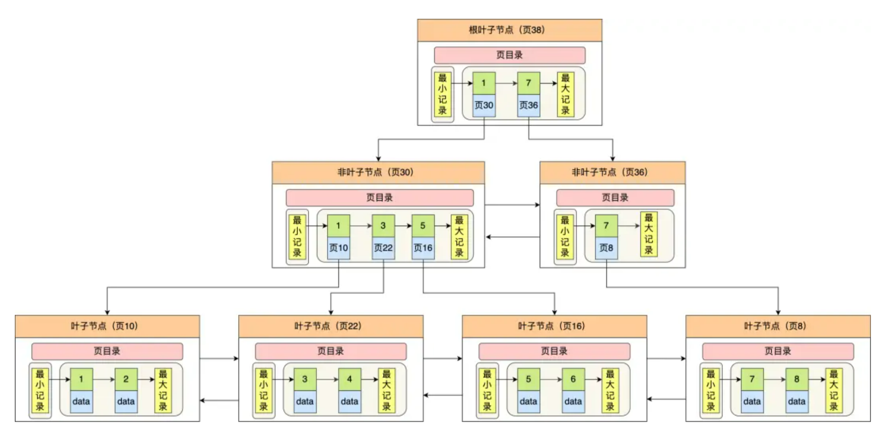
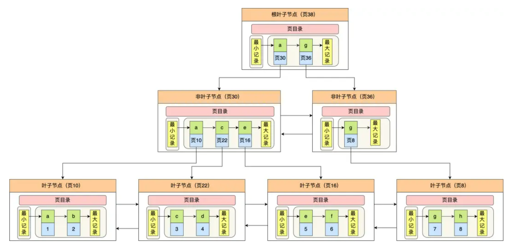

## B+树存储结构

B+ 树每个节点都是一个数据页。下图是【聚簇索引】：

 B+ 树的特点：

- 只有叶子节点（最底层的节点）才存放了数据，非叶子节点（其他上层节）仅用来存放目录项作为索引。
- 非叶子节点分为不同层次，通过分层来降低每一层的搜索量。
- 所有节点按照索引键大小排序，构成一个双向链表，便于范围查询。

如何实现快速查找主键为 6 的记录，以上图为例子：

- 从根节点开始，通过二分法快速定位到符合页内范围包含查询值的页，因为查询的主键值为 6，在[1, 7)范围之间，所以到页 30 中查找更详细的目录项。
- 在非叶子节点（页30）中，继续通过二分法快速定位到符合页内范围包含查询值的页，主键值大于 5，所以就到叶子节点（页16）查找记录。
- 接着，在叶子节点（页16）中，通过槽查找记录时，使用二分法快速定位要查询的记录在哪个槽（哪个记录分组），定位到槽后，再遍历槽内的所有记录，找到主键为 6 的记录。

## 聚簇索引和二级索引

聚簇索引和二级索引的区别：

- 聚簇索引：叶子节点存放的是「实际数据」，所有完整的用户记录都存放在聚簇索引的叶子节点。聚簇索引只能有一个。
- 二级索引：叶子节点存放的是「主键值」，而不是实际数据。

InnoDB 在创建聚簇索引时，会根据不同的场景选择不同的列作为索引：

- 如果有主键：默认会使用主键作为聚簇索引的索引键。
- 如果没有主键：就选择第一个不包含 NULL 值的唯一列作为聚簇索引的索引键。
- 在上面两个都没有的情况下，InnoDB 将自动生成一个隐式自增 id 列作为聚簇索引的索引键。

因为一张表只有一个聚簇索引，为了实现非主键字段的快速搜索，就有了【二级索引】如下图：数据部分是「主键值」。

如果某个查询语句使用了二级索引，但是查询的数据不是主键值，这时在二级索引找到主键值后，需要去聚簇索引中获得数据行，这个过程就叫作「回表」，也就是说要查两个 B+ 树才能查到数据。

当查询的数据是主键值时，因为在二级索引就能查询到，不用再去聚簇索引查，这个过程就叫作「索引覆盖」，也就是只需要查一个 B+ 树就能找到数据。

