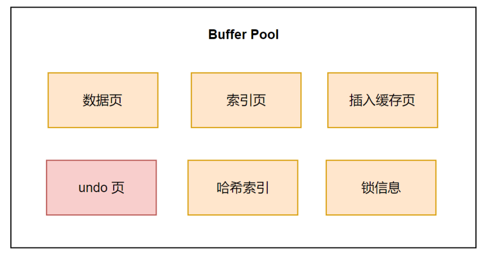

Innodb 存储引擎设计了一个 Buffer Pool 缓冲池，来提高数据库的读写性能。
有了缓冲池后：

- 当读取数据时，如果数据存在于 Buffer Pool 中，客户端会直接读取 Buffer Pool 中的数据，否则再去磁盘中读取。
- 当修改数据时，首先是修改 Buffer Pool 中数据所在页，然后将其设置为脏页，最后由后台线程将脏页写入磁盘。
## Buffer Pool 有多大
默认配置下 Buffer Pool 只有 **128MB**。可以通过配置 `innodb_buffer_pool_size`参数来设置 Buffer Pool 的大小，一般建议设置为物理内存的 60% ~ 80%。
## Buffer Pool 缓存什么

InnoDB 会把存储的数据划分为若干个「页」，以页作为磁盘和内存交互的基本单位，一个页的默认大小为 16KB。因此，Buffer Pool 同样需要按「页」来划分。

在 MySQL 启动的时候，**InnoDB 会为 Buffer Pool 申请一片连续的内存空间，然后按照默认的16KB的大小划分出一个个的页， Buffer Pool 中的页就叫做缓存页**。此时这些缓存页都是空闲的，之后随着程序的运行，才会有磁盘上的页被缓存到 Buffer Pool 中。
Buffer Pool 除了缓存「索引页」和「数据页」，还包括了 undo 页，插入缓存、自适应哈希索引、锁信息等等。

## 参考

- [揭开 Buffer Pool 的面纱](https://www.xiaolincoding.com/mysql/buffer_pool/buffer_pool.html)

