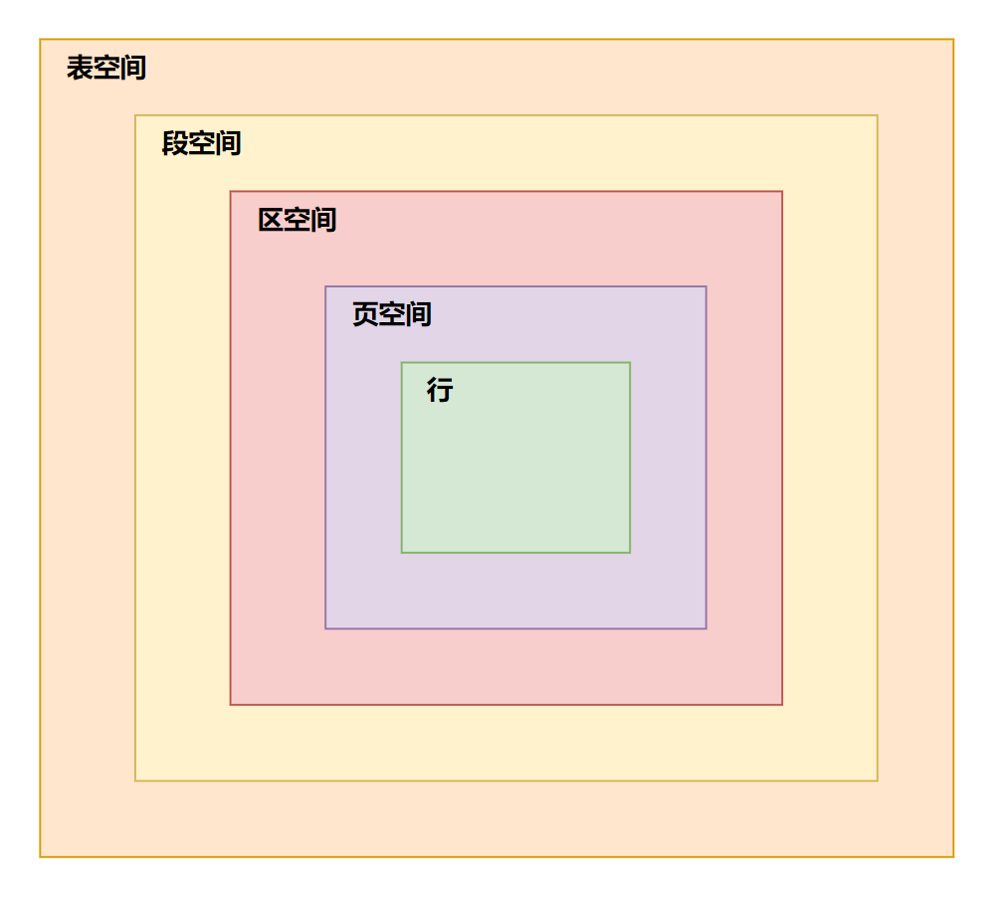
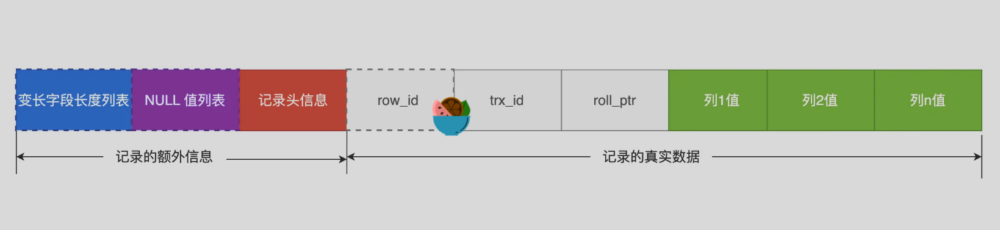
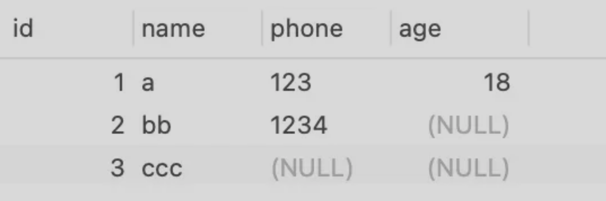
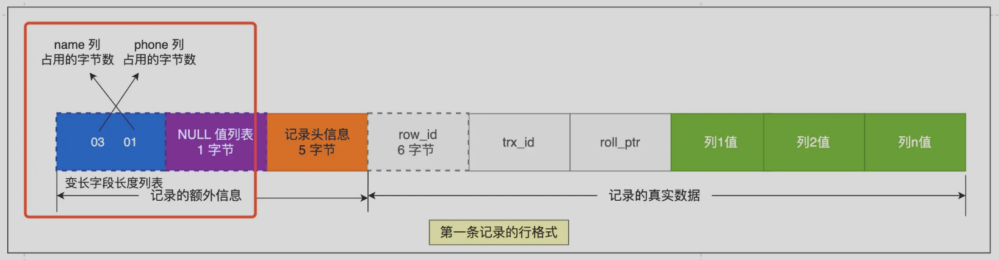
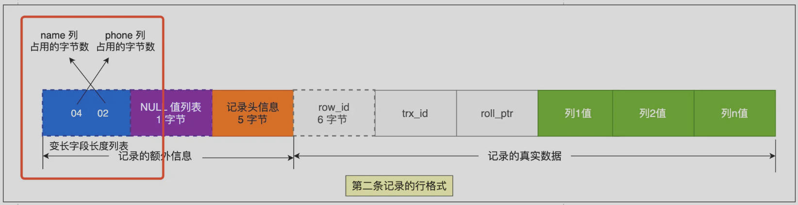
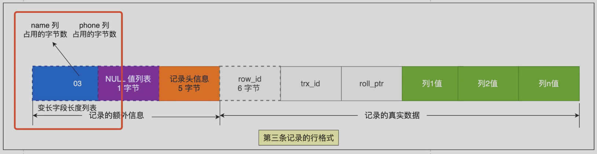
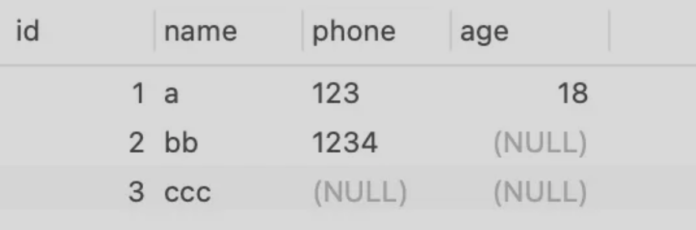
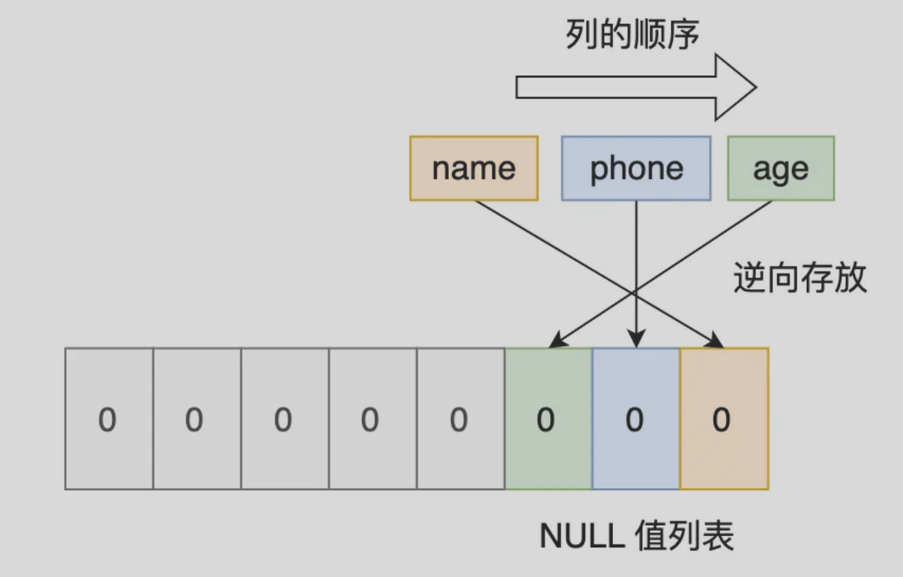
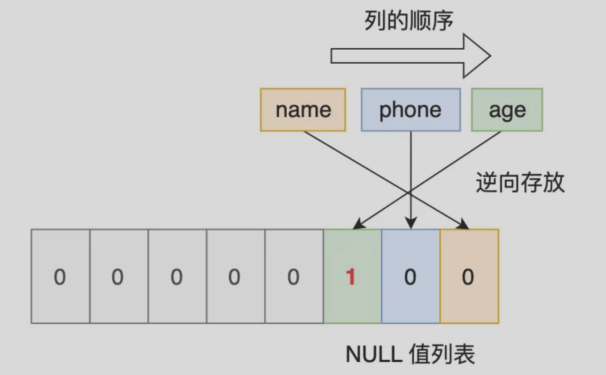
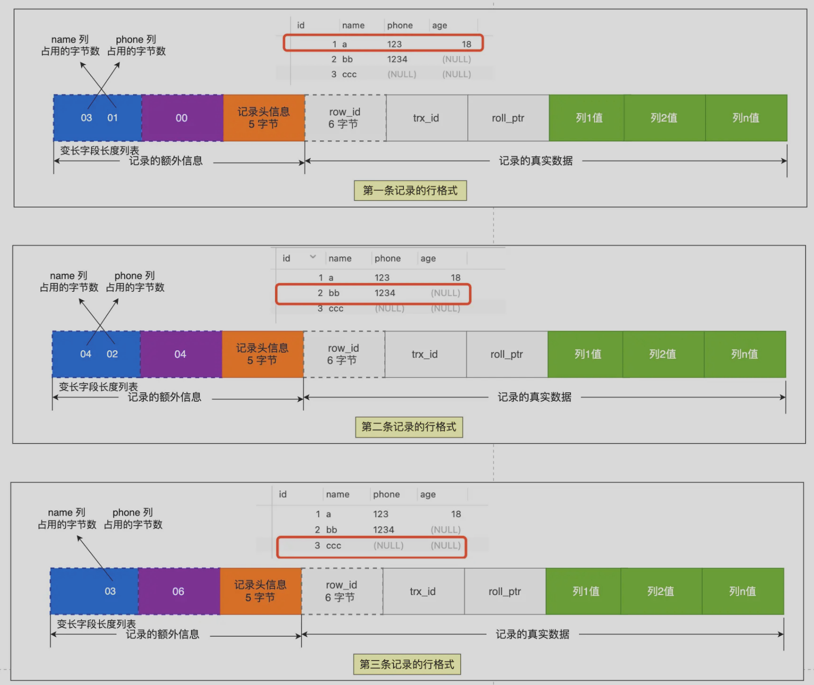

## MySQL 数据文件存储在哪个文件

每创建一个数据库都会在「/var/lib/mysql/ 」 目录里面创建一个以该数据库为名的目录，然后保存表结构和表数据的文件都会存放在这个目录里。

- **db.opt**：存储当前数据库的默认字符集和字符校验规则。
- **表名.frm**：存储表结构信息。
- **表名.ibd**：存储表数据。

## 表空间文件结构

**表空间由段「segment」、区「extent」、页「page」、行「row」组成**，InnoDB存储引擎的逻辑存储结构大致如下图：



### 行

数据库表中的记录都是按「行」进行存放的，每行记录根据不同的行格式，有不同的存储结构。

### 页

记录是按照行来存储的，但是数据库的读取并不以「行」为单位，否则一次读取（也就是一次 I/O 操作）只能处理一行数据，效率会非常低。

因此，**InnoDB 的数据是按「页」为单位来读写的**，也就是说，当需要读一条记录的时候，并不是将这个行记录从磁盘读出来，而是以页为单位，将其整体读入内存。

**默认每个页的大小为 16KB**，也就是最多能保证 16KB 的连续存储空间。

页是 InnoDB 存储引擎磁盘管理的最小单元，意味着数据库每次读写都是以 16KB 为单位的，一次最少从磁盘中读取 16KB 的内容到内存中，一次最少把内存中的 16KB 内容刷新到磁盘中。

### 区

B+ 树中每一层都是通过双向链表连接起来的，如果是以页为单位来分配存储空间，那么链表中相邻的两个页之间的物理位置并不是连续的，可能离得非常远，那么磁盘查询时就会有大量的随机 I/O，随机 I/O 是非常慢的。

【**怎么解决呢？**】

在表中数据量大的时候，为某个索引分配空间的时候就不再按照页为单位分配了，而是按照「区」为单位分配。每个区的大小为 1MB，对于 16KB 的页来说，连续的 64 个页会被划为一个区，这样就使得链表中相邻的页的物理位置也相邻，就能使用顺序 I/O 了。

### 段

表空间是由各个段组成的，段是由多个区组成的。段一般分为「数据段」、「索引段」和「回滚段」等。

- 索引段：存放 B + 树的非叶子节点的区的集合。
- 数据段：存放 B + 树的叶子节点的区的集合。
- 回滚段：存放的是回滚数据的区的集合，MVCC 利用了回滚段实现了多版本查询数据。

## InnoDB 行格式

有下面 4 种行格式：

- **Redundant**：MySQL 5.0 版本之前用的行格式，不紧凑。
- **Compact**：MySQL 5.1 版本之后，行格式默认设置成 Compact。一种紧凑的行格式，可以让一页存储更多行记录。
- **Dynamic** 和 **Compressed**：从 MySQL5.7 版本之后，默认使用 Dynamic 行格式。 两个都是紧凑的行格式，它们的行格式都和 Compact 差不多，都是基于 Compact 改进一点东西。

### COMPACT 行格式



#### 记录的额外信息

##### 1. 变长字段长度列表

> `varchar(n)` 和 `char(n)` 的区别：`char `是定长的，`varchar `是变长的，变长字段实际存储的数据的长度（大小）不固定的。

在存储数据的时候，要把数据占用的大小存起来，存到「变长字段长度列表」里面，读取数据的时候才能根据这个「变长字段长度列表」去读取对应长度的数据。其他 TEXT、BLOB 等变长字段也是这么实现的。

【示例】创建下面表进行演示：

```mysql
CREATE TABLE `t_user` (
  `id` int(11) NOT NULL,
  `name` VARCHAR(20) DEFAULT NULL,
  `phone` VARCHAR(20) DEFAULT NULL,
  `age` int(11) DEFAULT NULL,
  PRIMARY KEY (`id`) USING BTREE
) ENGINE = InnoDB DEFAULT CHARACTER SET = ascii ROW_FORMAT = COMPACT;
```

假设有下面三条记录：



第一条记录「只看变长字段」：

- `name`字段值为 `a`，占 1 字节。
- `phone` 字段值为 `123`，占 3 字节。

这些变长字段的真实数据占用的字节数会按照列的顺序 **逆序存放**，所以「变长字段长度列表」里的内容是「 03 01」，而不是 「01 03」。



同理，第二天记录：



**第三条记录** 中 `phone `列的值是 NULL，**NULL 是不会存放在行格式中记录的真实数据部分里的**，所以「变长字段长度列表」里不需要保存值为 NULL 的变长字段的长度。



***

【为什么「变长字段长度列表」的信息要按照逆序存放】

因为「记录头信息」中指向下一个记录的指针，指向的是下一条记录的「记录头信息」和「真实数据」之间的位置，这样的好处是向左读就是记录头信息，向右读就是真实数据，比较方便。

「变长字段长度列表」中的信息之所以要逆序存放，是因为这样可以**使得位置靠前的记录的真实数据和数据对应的字段长度信息可以同时在一个 CPU Cache Line 中，这样就可以提高 CPU Cache 的命中率**。

**当数据表没有变长字段的时候，比如全部都是 int 类型的字段，这时候表里的行格式就不会有「变长字段长度列表」了**，因为没必要，不如去掉以节省空间。

所以「变长字段长度列表」只出现在数据表有变长字段的时候。

##### 2. NULL 值列表

表中的某些列可能会存储 NULL 值，如果把这些 NULL 值都放到记录的真实数据中会比较浪费空间，所以 Compact 行格式把这些值为 NULL 的列存储到 NULL 值列表中。

如果存在允许 NULL 值的列，则每个列对应一个二进制位（bit），二进制位按照列的顺序逆序排列。

- 二进制位的值为`1`时，代表该列的值为 NULL。
- 二进制位的值为`0`时，代表该列的值不为 NULL。

另外，NULL 值列表必须用整数个字节的位表示（1字节8位），如果使用的二进制位个数不足整数个字节，则在字节的高位补 `0`。

当一条记录有 9 个字段值都是 NULL，那么就会创建 2 字节空间的「NULL 值列表」，以此类推。

**当数据表的字段都定义成 NOT NULL 的时候，这时候表里的行格式就不会有 NULL 值列表了**。

> :bulb:所以在设计数据库表的时候，通常都是建议将字段设置为 NOT NULL，这样可以至少节省 1 字节的空间（NULL 值列表至少占用 1 字节空间）。

***

【举例】以上面表举例：



第一条记录：


但是 InnoDB 是用整数字节的二进制位来表示 NULL 值列表的，现在不足 8 位，所以要在高位补 0，最终用二进制来表示：



第二天记录：



将三条记录的 NULL 值列表填充完毕后，行格式为下面这样：



##### 3. 记录头信息

列举比较重要的几个：

- **delete_mask**：标识此条数据是否被删除。执行 `detele` 删除记录的时候，并不会真正的删除记录，只是将这个记录的 「delete_mask」标记为 1
- **next_record**：下一条记录的位置。记录与记录之间是通过链表组织的，指向的是下一条记录的「记录头信息」和「真实数据」之间的位置，这样的好处是向左读就是记录头信息，向右读就是真实数据，比较方便。
- **record_type**：表示当前记录的类型，0 表示普通记录，1 表示 B+ 树非叶子节点记录，2 表示最小记录，3 表示最大记录。

#### 记录的真实数据

记录真实数据部分除了自定义的字段，还有三个隐藏字段，分别为：**row_id**、**trx_id**、**roll_pointer**。

##### row_id

建表的时候指定了主键或者唯一约束列，那么就没有 row_id 隐藏字段了。如果既没有指定主键，又没有唯一约束，那么 InnoDB 就会为记录添加 row_id 隐藏字段。row_id **不是必需**的，占用 6 个字节。

##### trx_id

事务id，表示这个数据是由哪个事务生成的。 trx_id 是**必需**的，占用 6 个字节。

##### roll_pointer

这条记录上一个版本的指针。roll_pointer 是**必需**的，占用 7 个字节。

> :bulb:  MVCC 机制就跟 trx_id 和 roll_pointer 的作用有关。

## varchar(n) 中的 n 最大取值

**MySQL 规定除了 TEXT、BLOBs 这种大对象类型之外，其他所有的列（不包括隐藏列和记录头信息）占用的字节长度「加起来」不能超过 65535 个字节**。

`varchar(n)` 字段类型的 n 代表的是最多存储的字符数量，并不是字节大小。

要算 `varchar(n)` 最大能允许存储的字节数，还要看数据库表的字符集，因为字符集代表着：1个字符要占用多少字节，比如 ascii 字符集， 1 个字符占用 1 字节，那么 `varchar(100)` 意味着最大能允许存储 100 字节的数据。

【单字段情况】

在算 `varchar(n)` 中 n 最大值时，需要减去 「变长字段长度列表」和 「NULL 值列表」所占用的字节数的。

【多字段情况】

如果有多个字段的话，要保证「所有字段的长度 + 变长字段字节数列表所占用的字节数 + NULL值列表所占用的字节数」 <= 65535。

## 行溢出后，如何存储数据

如果一个数据页存不了一条记录，InnoDB 存储引擎会自动将溢出的数据存放到「溢出页」中。

在记录的真实数据处只会保存该列的一部分数据，而把剩余的数据放在「溢出页」中，然后「真实数据」处用 20 字节存储指向溢出页的地址，从而可以找到剩余数据所在的页。

## 参考

- [MySQL一行记录如何存储](https://www.xiaolincoding.com/mysql/base/row_format.html)
