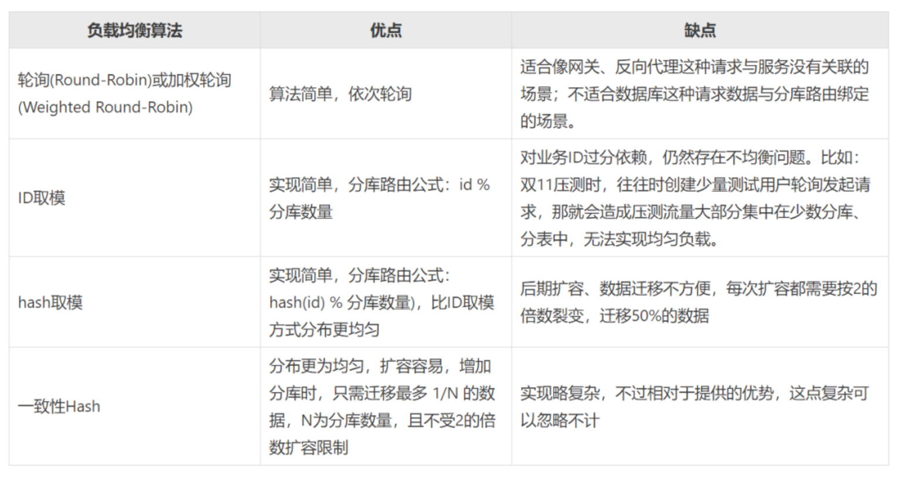
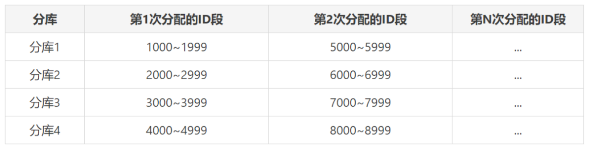

## 分库分表背景

### 从性能上看

#### 数据量限制

单表数据量过大，导致读写性能差。
> 一般建议单表行数超过 500w 行或者单表容量超过 2GB，才推荐分库分表。
> 根据 B+树索引存储计算，单表不建议超过 2000w 行，因为当 B+树为三层时，存储量约 2.45kw（在一条数据为 1k 的情况下计算），数据量太大会导致 B+树层级更高，影响查询性能。

#### 数据库性能瓶颈
有以下几种情况：

- 磁盘空间不足，无法扩容。
- 数据库服务器 CPU 压力过大，导致读写性能较慢。
- 数据库服务器内存不足、网络带宽不足，导致读写性能瓶颈。
- 数据库连接数过多，导致客户端连接超时。
### 从可用性上看
单库发生意外可能会丢失所有数据。
## 切分方案选择

### 分表方案选择

基于业务，可以估算出每天记录数据条数，然后根据系统使用年限等计算需要多少张表，一般一张表记录 500w 行数据。
### 分库方案选择

分库除了要考虑平时业务峰值读写 QPS 外，还需要考虑例如双十一大促期间可能达到的峰值。
假如只需要 3500 个数据库连接数，如果单库可以承担最高 1000 个数据库连接，就可以拆分为 4 个库。
## 对数据进行切分
分为水平切分、垂直切分。

## 分库分表导致的问题

### 如何让数据均匀分布？
热点事件出现后，热点数据会存到某个特定库/表，造成读写压力不均。
此问题跟**负载均衡**问题类似，下面是常见的负载均衡算法：


选择**一致性哈希**算法，并且修改如下：

1. 一致性 Hash 有 `2^32-1` 个节点，根据业务可以调整 Hash 环的数量，假设为 4096 个。
2. 一致性 Hash 通过 `hash(DB 的 ip) % 2^32` 公式计算 DB 在 Hash 环中的位置。如果 DB 的数量较少，需要通过增加虚拟节点来解决 Hash 环偏斜的问题，而且 DB 在环中的位置肯呢个会随着 IP 的变动而变化，尤其在云环境下。

下面解决数据均匀分布到 Hash 环的问题：
可以通过 `Math.abs(id.hashCode()) % 4096` 计算定位到 hash 环的位置，接下来让 DB 也均匀分不到这个 Hash 环上即可。如果 hash 环有 4096 个节点，拆分 4 个库的话，根据公式：`Math.abs(id.hashCode()) % 4096) / (4096 / DB_COUNT)`计算 4 个库分别位于第 1、1025、 2049、3073 这 4 个节点上。
分库索引伪代码如下：

```java

/**
 * 分库数量
 */
public static final int DB_COUNT = 4;

/**
 * 获取数据库分库索引号
 *
 * @param buyerId 会员ID
 * @return
 */
public static int indexDbByBuyerId(Long buyerId) {
    return (Math.abs(buyerId.hashCode()) % 4096) / (4096 / DB_COUNT);
}
```
### 如何解决分库后主键 ID 唯一性？
但单库环境下，表 ID 采用 MySQL 自增的方式，分库之后，如果还继续采用自增的方式，会出现主键 ID 重复的问题。

**UUID 方式**：太长，查询性能太差，占用空间大，主键类型发生改变。

**对 ID 进行拆分**：不同库表使用不同的 ID 段，问题在于**ID 段多长合适？**

如果将所有分库使用的 ID 段按照等差数列进行分隔，每次 ID 段用完之后，再按照固定步长递增。

例如：每次分配 ID 步长为 1000，则每次分配的 ID 段起止索引按照下面公式计算：

第 X 库、第 Y 次分配起始索引：`X * 步长 + (Y-1) * (库数量 * 步长)`

第 X 库、第 Y 次分配结束索引：`X * 步长 + (Y-1) * (库数量 * 步长) + (1000 -1)`

如果是分 4 个库，最终分配的 ID 段是下面这个样子：



除此，为了分析排查问题方便，会在 ID 中增加额外信息，例如：日期、版本、分库索引等。

```java

import lombok.Setter;
import org.apache.commons.lang3.time.DateFormatUtils;

/**
 * 问题单ID构建器
 * <p>
 * ID格式(18位)：6位日期 + 2位版本号 + 2位库索引号 + 8位序列号
 * 示例：180903010300001111
 * 说明这个问题单是2018年9月3号生成的，采用的01版本的ID生成规则，数据存放在03库，最后8位00001111是生成的序列号ID。* 采用这种ID格式还有个好处就是每天都有1亿(8位)的序列号可用。* </p>
 */
@Setter
public class ProblemOrdIdBuilder {
  public static final int DB_COUNT = 4;    
    private static final String DATE_FORMATTER = "yyMMdd";

    private String version = "01";
    private long buyerId;
    private long timeInMills;
    private long seqNum;

    public Long build() {
        int dbIndex = indexDbByBuyerId(buyerId);
        StringBuilder pid = new StringBuilder(18)
            .append(DateFormatUtils.format(timeInMills, DATE_FORMATTER))
            .append(version)
            .append(String.format("%02d", dbIndex))
            .append(String.format("%08d", seqNum % 10000000));
        return Long.valueOf(pid.toString());
    }

    /**
     * 获取数据库分库索引号
     *
     * @param buyerId 会员ID
     * @return
     */
    public int indexDbByBuyerId(Long buyerId) {
        return (Math.abs(buyerId.hashCode()) % 4096) / (4096 / DB_COUNT);
    }
}
```
### 分布式事务问题
对业务分库后，同一个操作会分散到多个数据库中，涉及跨库执行的 SQL 语句会出现分布式事务问题。

目前有两种解决方案：

**分布式事务中间件**

- 优点：实现简单。
- 缺点：由服务器/数据库实现，性能代价高。

**应用程序+数据库**

- 原理：大事务拆分为小事务。
- 优点：性能好。
- 缺点：从业务上做处理，改造成本高。
### 跨库关联查询问题
分库分表后，跨库和跨表查询操作比较复杂，性能无法保证。

**解决方法**：

- 额外存储，维护文件索引。
- 合理的冗余数据库字段，避免跨库查询。
### 历史数据如何平滑迁移？
分库切换发布可选择**停机**、**不停机**发布两种：

#### 停机发布

- 首先在流量少的夜晚，需要临时关闭业务入口。
- 新增全量数据复制任务，任务执行时间需要估算。
- 切换数据库连接配置，重启应用进行检查。
- 开发业务入口，提供服务。
#### 不停机发布（以下面示例参考）

1. 新建两个新数据库集群，同时同步老数据库数据到两个新集群。两个新集群的数据要做到实时同步，老库添加修改哪条数据，两个新库也要跟着变化。


2. 上线代码。使用两个新集群的数据库地址，进行查询和插入。这时两个新数据库的proxy还是指向旧数据库。同时验证数据是否写到旧数据库。如果直接将proxy链接到新库A和B，会造成主键冲突。


3. DBA将两个新数据库的proxyA和proxyB同时指向两个新集群（30s内）


丢失的这段时间的数据，后续可以让DBA修复。

最后按照分库分表方案删除AB数据库中无用的数据，因为之前两个库数据一致，冗余了。
