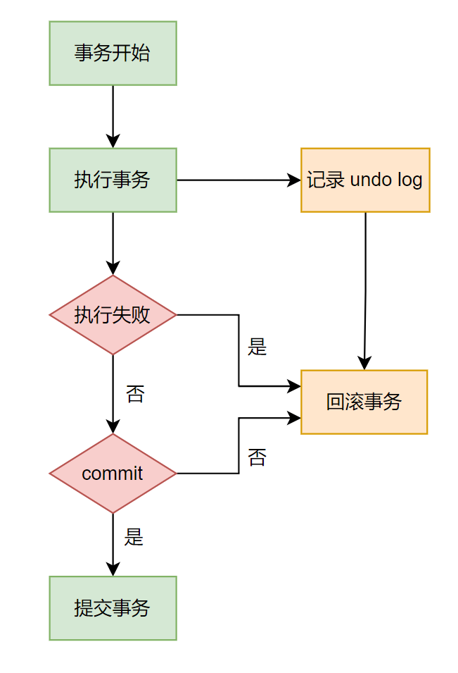
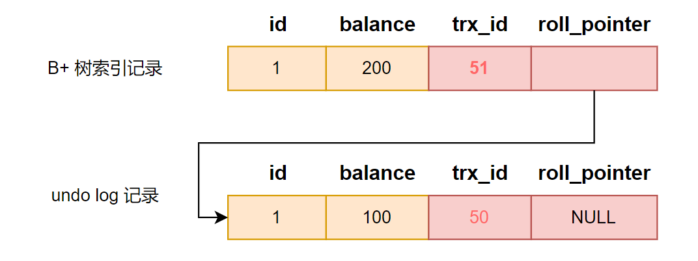

## 为什么需要 undo log

在执行「增删改」语句的时候，MySQL 会**隐式开启事务**来执行，执行完成后自动提交事务。该功能由 `autocommit`参数决定，默认开启。

undo log 是一种用于撤销回退的日志。在事务没提交之前，MySQL 会先记录更新前的数据到 undo log 日志文件里面，当事务回滚时，可以利用 undo log 来进行回滚。如下图：

下面是不同情况下需要记录的 undo log：

- **插入**一条记录时，要把这条记录的「主键」记下来，回滚时只需要删除这个主键对应的记录。
- **删除**一条记录时，要把这条记录的「内容」记下来，回滚时把这些内容组成记录插入即可。
- **更新**一条记录时，要把被更新的「列」记下来，回滚时把这些列更新为旧值即可。

一条记录的每一次更新产生的 undo log 格式都有一个 roll_pointer 指针和一个 trx_id 事务 id：

- 通过 trx_id 可以知道该记录是被哪个事务修改的。
- 通过 roll_pointer 指针可以将这些 undo log 串成一个链表，形成版本链。

通过上图可以看出，undo log 另一个作用是通过 **ReadView + undo log 实现 MVCC（多版本并发控制）**。

由此可见，undo log 两大作用：

- 实现事务回滚，保证事务原子性。
- 实现 MVCC。

## 为什么要 buffer pool

Innodb 引擎设计了缓冲池（ buffer pool ）来提高数据读写性能。

- 读取数据时：如果数据存在于 buffer pool 中，客户端会直接从 buffer pool 中获取数据，否则再去磁盘中获取。
- 修改数据时：如果数据存在于 buffer pool 中，直接修改 buffer pool 中数据所在的页，将其设置为**脏页**（表示该页内存数据和磁盘上的数据不一致），为了减少磁盘 I/O，不会立即将脏页写入磁盘，后续由后台线程选择一个合适时机再写入到磁盘。

InnoDB 会把存储的数据划分为若干个「页」，以页作为磁盘和内存交互的基本单位，一个页的默认大小为 16KB。因此，Buffer Pool 同样需要按「页」来划分。

在 MySQL 启动的时候，**InnoDB 会为 buffer pool 申请一片连续的内存空间，然后按照默认的`16KB`的大小划分出一个个的页， buffer pool 中的页就叫做缓存页**。此时这些缓存页都是空闲的，之后随着程序的运行，才会有磁盘上的页被缓存到 Buffer Pool 中。

buffer pool 除了缓存「索引页」和「数据页」，还包括了 undo 页，插入缓存、自适应哈希索引、锁信息等等。

开启事务后，更新记录之前，首先记录相应的 undo log，同时会写入 buffer pool 的 undo 页面。

当查询一条记录时，会把整个页的数据加载到 buffer pool 中，再通过「页目录」定位到某条具体的记录。

## 为什么要 redo log

buffer pool 虽然提高了读写效率，但是基于内存的，不可靠，如果未来的及落盘会造成数据丢失。**redo log 保证了事务四大特性中的持久性**。

为了防止数据丢失，当有一条记录更新时，InnoDB 会先更新内存（同时标记为脏页），然后将这个页的修改以 redo log 形式记录。

后续，InnoDB 引擎会在适当的时候，由后台线程将缓存在 buffer pool 的脏页刷新到磁盘里，这就是 **WAL （Write-Ahead Logging）技术**。

**WAL 技术指的是：MySQL 的写操作并不是立刻写到磁盘上，而是先写日志，然后在合适的时间再写到磁盘上**。

redo log 记录某个数据页做了什么修改，在事务提交时，只需要先将 redo log 持久化到磁盘即可，可以不需要等到将 buffer pool 里的脏页数据持久化到磁盘。

当系统崩溃时，虽然脏页数据没有持久化，但是 redo log 已经持久化，接着 MySQL 重启后，可以根据 redo log 的内容，将所有数据恢复到最新的状态。

【修改 undo 页面，也需要记录对应的 redo log】

开启事务后，InnoDB 层更新记录前，首先要记录相应的 undo log，如果是更新操作，需要把被更新的列的旧值记下来，也就是要生成一条 undo log，undo log 会写入 Buffer Pool 中的 undo 页面。**在内存修改该 Undo 页面后，需要记录对应的 redo log**。

【undo log 和 redo log 区别】

- redo log 记录事务「完成后」的数据状态，记录更新**之后**的值，防止数据丢失。
- undo log 记录事务「开始前」的数据状态，记录更新**之前**的值，事务崩溃可以进行回滚。

【**问题**】：数据也要写入磁盘，redo log 也要写入磁盘，为什么多此一举？

写入 redo log 使用了追加操作，对磁盘操作是**顺序写**；而写入数据需要先找到写入位置，再写磁盘，对磁盘操作是**随机写**。

磁盘的「顺序写 」比「随机写」 高效的多，因此 redo log 写入磁盘的开销更小。

从这个方面来说，WAL 技术提升了 SQL 的执行性能，因为 MySQL 写操作并不立即更新到磁盘上，而是先记录到 redo log 日志上，等到合适时间再更新到磁盘上。

综上，redo log 有两个作用，如下：

- **实现事务的持久性**，能够保证 MySQL 在任何时间段突然崩溃，重启后之前已提交的记录都不会丢失。
- **将写操作从「随机写」变成了「顺序写」**，提升 MySQL 写入磁盘的性能。