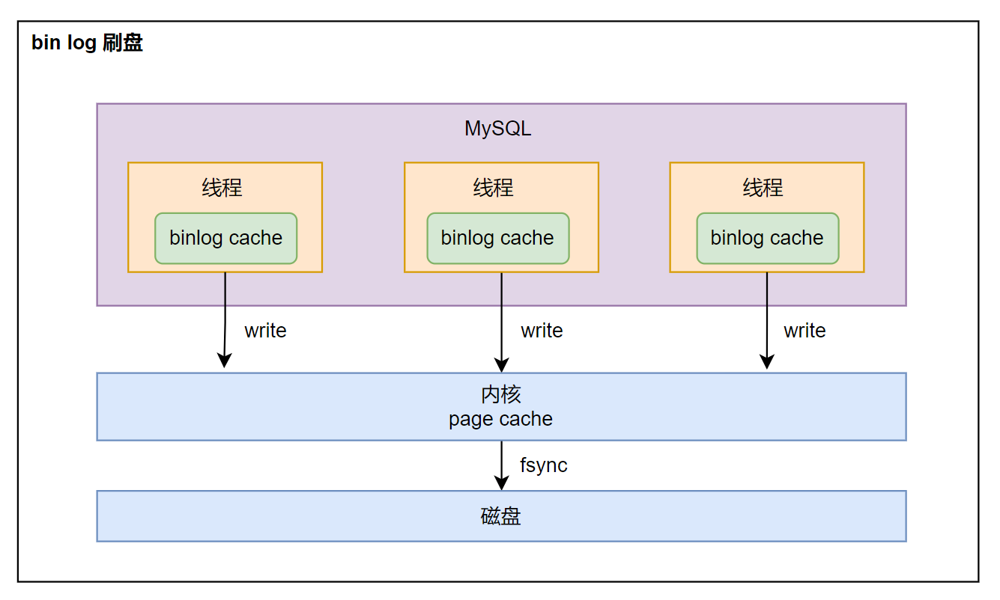

## 为什么要 undo log

在执行「增删改」语句的时候，MySQL 会**隐式开启事务**来执行，执行完成后自动提交事务。该功能由 `autocommit`参数决定，默认开启。

undo log 是一种用于撤销回退的日志。在事务没提交之前，MySQL 会先记录更新前的数据到 undo log 日志文件里面，当事务回滚时，可以利用 undo log 来进行回滚。如下图：

下面是不同情况下需要记录的 undo log：

- **插入**一条记录时，要把这条记录的「主键」记下来，回滚时只需要删除这个主键对应的记录。
- **删除**一条记录时，要把这条记录的「内容」记下来，回滚时把这些内容组成记录插入即可。
- **更新**一条记录时，要把被更新的「列」记下来，回滚时把这些列更新为旧值即可。

一条记录的每一次更新产生的 undo log 格式都有一个 roll_pointer 指针和一个 trx_id 事务 id：

- 通过 trx_id 可以知道该记录是被哪个事务修改的。
- 通过 roll_pointer 指针可以将这些 undo log 串成一个链表，形成版本链。

通过上图可以看出，undo log 另一个作用是通过 **ReadView + undo log 实现 MVCC（多版本并发控制）**。

由此可见，undo log 两大作用：

- 实现事务回滚，保证事务原子性。
- 实现 MVCC。

## 为什么要 buffer pool

Innodb 引擎设计了缓冲池（ buffer pool ）来提高数据读写性能。

- 读取数据时：如果数据存在于 buffer pool 中，客户端会直接从 buffer pool 中获取数据，否则再去磁盘中获取。
- 修改数据时：如果数据存在于 buffer pool 中，直接修改 buffer pool 中数据所在的页，将其设置为**脏页**（表示该页内存数据和磁盘上的数据不一致），为了减少磁盘 I/O，不会立即将脏页写入磁盘，后续由后台线程选择一个合适时机再写入到磁盘。

InnoDB 会把存储的数据划分为若干个「页」，以页作为磁盘和内存交互的基本单位，一个页的默认大小为 16KB。因此，Buffer Pool 同样需要按「页」来划分。

在 MySQL 启动的时候，**InnoDB 会为 buffer pool 申请一片连续的内存空间，然后按照默认的`16KB`的大小划分出一个个的页， buffer pool 中的页就叫做缓存页**。此时这些缓存页都是空闲的，之后随着程序的运行，才会有磁盘上的页被缓存到 Buffer Pool 中。

buffer pool 除了缓存「索引页」和「数据页」，还包括了 undo 页，插入缓存、自适应哈希索引、锁信息等等。

开启事务后，更新记录之前，首先记录相应的 undo log，同时会写入 buffer pool 的 undo 页面。

当查询一条记录时，会把整个页的数据加载到 buffer pool 中，再通过「页目录」定位到某条具体的记录。

## 为什么要 redo log

buffer pool 虽然提高了读写效率，但是基于内存的，不可靠，如果未来的及落盘会造成数据丢失。**redo log 保证了事务四大特性中的持久性**。

为了防止数据丢失，当有一条记录更新时，InnoDB 会先更新内存（同时标记为脏页），然后将这个页的修改以 redo log 形式记录。

后续，InnoDB 引擎会在适当的时候，由后台线程将缓存在 buffer pool 的脏页刷新到磁盘里，这就是 **WAL （Write-Ahead Logging）技术**。

**WAL 技术指的是：MySQL 的写操作并不是立刻写到磁盘上，而是先写日志，然后在合适的时间再写到磁盘上**。

redo log 记录某个数据页做了什么修改，在事务提交时，只需要先将 redo log 持久化到磁盘即可，可以不需要等到将 buffer pool 里的脏页数据持久化到磁盘。

当系统崩溃时，虽然脏页数据没有持久化，但是 redo log 已经持久化，接着 MySQL 重启后，可以根据 redo log 的内容，将所有数据恢复到最新的状态。

**修改 undo 页面，也需要记录对应的 redo log**：

开启事务后，InnoDB 层更新记录前，首先要记录相应的 undo log，如果是更新操作，需要把被更新的列的旧值记下来，也就是要生成一条 undo log，undo log 会写入 Buffer Pool 中的 undo 页面。**在内存修改该 Undo 页面后，需要记录对应的 redo log**。

**undo log 和 redo log 区别**：

- redo log 记录事务「完成后」的数据状态，记录更新**之后**的值，防止数据丢失。
- undo log 记录事务「开始前」的数据状态，记录更新**之前**的值，事务崩溃可以进行回滚。

---

【**问题**】：**数据也要写入磁盘，redo log 也要写入磁盘，为什么多此一举？**

写入 redo log 使用了追加操作，对磁盘操作是**顺序写**；而写入数据需要先找到写入位置，再写磁盘，对磁盘操作是**随机写**。

磁盘的「顺序写 」比「随机写」 高效的多，因此 redo log 写入磁盘的开销更小。

从这个方面来说，WAL 技术提升了 SQL 的执行性能，因为 MySQL 写操作并不立即更新到磁盘上，而是先记录到 redo log 日志上，等到合适时间再更新到磁盘上。

综上，redo log 有两个作用，如下：

- **实现事务的持久性**，能够保证 MySQL 在任何时间段突然崩溃，重启后之前已提交的记录都不会丢失。
- **将写操作从「随机写」变成了「顺序写」**，提升 MySQL 写入磁盘的性能。

---

【**问题**】：**redo log 是直接写入磁盘吗？**

> 一般都不会直接写入磁盘，都会有一个缓存区。

肯定不是。如果每次执行事务都直接写入磁盘，这样就会产生大量的磁盘 I/O。

所以，redo log 会先写入到缓存中：**redo log bufer**，每次产生一条 redo log 时，先写入缓存，再持久化到磁盘。

**redo log buffer** 默认大小 16 MB，可以通过 `innodb_log_Buffer_size` 参数动态调整大小。

---

### redo log 何时刷盘

既然 redo log 先存在缓存里，那么什么时候开始刷新到磁盘？时机如下：

- MySQL 正常关闭时。
- 当 redo log buffer 写入量超过设置 redo log buffer 内存空间一半，触发刷盘。
- 后台线程每隔 1 秒，将 redo log buffer 持久化到磁盘。
- 每次事务提交时，都会将 redo log buffer 里面的 redo log 直接持久化到磁盘。该功能由 `innodb_flush_log_at_trx_commit` 参数控制。

---

**`innodb_flush_log_at_trx_commit` 作用**

默认值为 1，可取的值有0、1、2，作用分别如下：

- 参数为 0 时：每次提交事务将 redo log 留在 redo log buffer 中，事务提交时不会触发写入磁盘操作。
- 参数为 1 时：每次提交事务都将 redo log buffer 中的 redo log 直接持久化到磁盘中，保证 MySQL 重启后数据不会丢失。
- 参数为 2 时：每次提交事务都将 redo log buffer 中的 redo log 写到 redo log 文件，但并没有持久化到磁盘中，而是操作系统 Page Cache 缓存中。

当参数为 0 或 2 时，**后台线程会每隔 1 秒将 redo log 写入磁盘**，但当 MySQL 崩溃时丢失数据情况不一样：

- 参数为 0 时：崩溃会导致上一秒所有事务数据的丢失。
- 参数为 2 时：MySQL 崩溃并不会丢失数据，只有在操作系统崩溃情况下，上一秒的数据才丢失。

### redo log 文件写满怎么办

默认情况下，Innodb 引擎有一个重做日志文件组 redo log group，由两个 redo log 文件组成：`ib_logfile0` 和 `ib_logfile1`。每个文件大小固定且一致。

InnoDB 引擎会先写 `ib_logfile0`，当 `ib_logfile0` 写满后，会切换到 `ib_logfile1` 文件，`ib_logfile1` 写满后，再切换到 `ib_logfile0` 文件。

redo log 是循环写的方式，相当于一个环形，InnoDB 用 `write pos` 表示 redo log 当前记录写到的位置，用 `checkpoint` 表示当前要擦除的位置，如下图：

图中的：

- `write pos` 和 `checkpoint` 的移动都是顺时针方向。
- `write pos - checkpoint` 之间的部分（图中的红色部分），用来记录新的更新操作。
- `check point - write pos` 之间的部分（图中蓝色部分），待落盘的脏数据页记录。

如果 `write pos` 追上了 `checkpoint` 意味着 redo log 文件满了，MySQL 不能再执行新的更新操作，**会被阻塞**。所以针对并发量大的系统，适当设置 redo log 大小很有必要。阻塞后，会将 buffer pool 中的脏页刷新到磁盘中，然后对 redo log 记录进行擦除，清理出旧的空间，这时 `check point` 会向后移动，MySQL 会恢复正常，继续执行更新操作。

## 为什么要 bin log

MySQL 完成一条更新语句后，会生成一条 bin log，事务提交后，会将该事务执行过程中的所有 bin log 统一写入 bin log 文件。

bin log 记录了所有数据库表结构变更和表数据修改的日志，不会记录查询类日志。

---

### bin log 和 redo log 区别

**区别一：作用对象不同**

- bin log 是 MySQL 的 Server 层实现的日志，所有存储引擎都可以使用。
- redo log 是 InnoDB 是存储引擎实现的日志。

**区别二：文件格式不同**

- bin log 有三种格式类型，分别如下：
  - STATEMENT（默认格式）：每一条修改数据的 SQL 都会被记录到 bin log 中（逻辑日志），主从复制中 slave 端再根据 SQL 语句重现。但会存在动态函数问题：比如 `now()` 这些函数，在主库执行的结果和从库执行结果不一致。
  - ROW：记录行数据最终被修改成什么样，不会出现动态函数问题。缺点是每行数据的变化结果都会记录，比如批量更新数据时，更新多少行就回产生多少条记录，使 bin log 文件过大。
  - MIXED：包含 STATEMENT 和 ROW 模式，根据不同情况使用 ROW 模式和 STATEMENT 模式。
- redo log 是物理日志，记录的是在某个数据页做了什么修改，比如对 XXX 表空间中的 YYY 数据页 ZZZ 偏移量的地方做了AAA 更新。

**区别三：写入方式不同**

- bin log 是追加写，写满一个文件，就创建一个新的文件继续写，保存的是全量日志。
- redo log 是循环写，日志空间大小是固定，全部写满就从头开始，保存未被刷入磁盘的脏页日志。

**区别四：用途不同**

- bin log 用于备份恢复、主从复制。
- redo log 用于故障恢复。

### 主从复制的实现

主从复制主要依赖于 bin log，复制过程就是将 bin log 的数据从主库传输到从库上。这过程是**异步**。

整个主从复制过程分为 3 个阶段：

- **写入 bin log**：主库写入 bin log，提交事务，更新本地存储数据。
- **同步 bin log**：将 bin log 复制到从库上，从库把 bin log 写到暂存日志中。
- **回放 bin log**：回放 bin log，更新存储引擎中的数据。

---

【问题】：**从库是不是越多越好？**

主从复制过程中，主库需要创建线程来处理从库复制 bin log 的请求，从库多了对主库资源消耗也就增多。

---

**主从复制模型**：

- **同步复制**：MySQL 提交事务的线程要等待所有从库的复制成功的响应，才返回成功结果。性能很差，可用性也很差。
- **异步复制（默认）**：主库提交事务的线程不会等待 bin log 同步到从库，就返回结果。主机宕机会导致数据丢失。
- **半同步复制**：5.7 版本后新增。事务线程不用等待所有从库都响应，只要一部分复制成功响应就行。

### bin log 何时落盘

MySQL 给每个线程分配了一片内存用于缓冲 bin log，叫做 binlog cache，参数 `binlog_cache_size` 用于控制单个线程内 binlog cache 所占内存的大小。如果超过这个大小，就会暂存到磁盘。

---

【问题】：binlog cache 何时写到 bin log 文件？

在事务提交时，执行器把 binlog cache 里面的完整事务写入到 bin log 文件中，清空 binlog cache。

虽然每个线程都有自己的 binlog cache，但最终都写到同一个 bin log 文件中。

参数 `sync_binlog` 控制数据库 bin log 刷到磁盘上的频率：

- 值为 0 时：每次提交事务都只 `write`，不进行 `fsync`，后续由操作系统决定何时落盘。性能最好，但主机宕机数据就会丢失。
- 值为 1 时：每次提交事务都 `write`，然后马上 `fsync`。最安全但性能低，最多丢失一个事务的 bin log。
- 值为 N（N > 1）时：每次事务都 `write`，累计 N 个事务后才 `fsync`。

---

**update 语句执行过程**

以 `UPDATE t_user SET name = 'aaa' WHERE id = 1;` 为例：

1. 执行器通过索引获取 id = 1 的这条记录：
   - 如果 id = 1 的记录所在数据页本来就在 buffer pool 中，直接返回给执行器更新。
   - 如果记录不在 buffer pool 中，将数据页从磁盘读取到 buffer pool，返回记录给执行器。

2. 执行器得到聚簇索引记录后，会检查更新前后的记录是否一样：
   - 如果一样，就不进行后续更新流程。
   - 如果不一样，就把更新前和更新后的记录都传给 InnoDB 层，让 InnoDB 执行更新记录的操作。

3. 开启事务，先记录相应的 undo log，需要把被更新的旧值记下来，undo log 会写入 buffer pool 中的 undo 页面，在内存修改 undo 页面后，需要记录对应的 redo log。
4. 开始更新记录，会先更新内存（同时标记为脏页），然后将记录写到 redo log 里面，这时就算更新完成。为了减少磁盘 I/O 不会立即将脏页写入磁盘，后续由后台线程将脏页写入到磁盘，即 WAL 技术。
5. 到此，该记录更新完成。
6. 更新语句执行完后，记录对应的 bin log，此时会先向 binlog cache 中保存记录，在事务提交时才会统一将所有 bin log 刷盘。
7. 事务「两阶段提交」

## 两阶段提交

事务提交后，redo log 和 undo log 都要持久化到磁盘，这是两个独立的过程，可能会导致两份日志不一致。

假设 id = 1 的记录 name 字段原来的值是 aaa，现在执行 SQL 将 name 改为 bbb，在两份日志持久化过程中，可能会出现下面情况：

- **redo log 成功刷盘，但 bin log 刷盘失败**：MySQL 重启后，通过 redo log 将 id = 1 的数据 name 字段恢复到 bbb，但 bin log 里面没有记录这条更新语句，所以在主从同步时，从库的这条记录的 name 仍然是 aaa，**导致主从不一致**。
- **bin log 成功刷盘，但 redo log 刷盘失败**：redo log 没写，MySQL 宕机恢复后这个事务无效，所以该记录的 name 值仍然是 aaa，但 bin log 记录了更新的语句，会被复制到从库，从库的这条记录的 name 是 bbb，**导致主从不一致**。

为了避免上面两种情况的出现，使用了「两阶段提交」来解决上面问题：分布式事务一致性协议，要不全部成功，要不全部失败。

两阶段提交将单个事务的提交拆分成了 2 个阶段，分别是「准备阶段」和「提交阶段」。

在 MySQL 的 InnoDB 存储引擎中，开启 binlog 的情况下，MySQL 会同时维护 binlog 日志与 InnoDB 的 redo log，为了保证这两个日志的一致性，MySQL 使用了**内部 XA 事务**，内部 XA 事务由 binlog 作为协调者，存储引擎是参与者。

- **准备阶段**：将 XA 事务的 ID 写入到 redo log，同时将 redo log 对应的事务状态设置为 prepare，然后将 redo log 持久化到磁盘（innodb_flush_log_at_trx_commit = 1 的作用）。
- **提交阶段**：将 XA 事务的 ID 写入到 binlog，然后将 binlog 持久化到磁盘（sync_binlog = 1的作用），接着将 redo log 状态设置为 commit，此时 redo log 并不需要持久化到磁盘，只需要写入操作系统的 page cache 中，因为只要 binlog 写入磁盘成功，redo log 状态还是 prepare 也没关系，一样会被认为事务执行成功。

### 两阶段提交过程异常会怎样

不管是时刻 A（redo log 已经写入磁盘， binlog 还没写入磁盘），还是时刻 B （redo log 和 binlog 都已经写入磁盘，还没写入 commit 标识）崩溃，**此时的 redo log 都处于 prepare 状态**。

在 MySQL 重启后会按顺序扫描 redo log 文件，碰到处于 prepare 状态的 redo log，就拿着 redo log 中的 XID 去 binlog 查看是否存在此 XID：

- 如果 bin log 中**没有**当前内部 XA 事务的 XID，说明 redo log 完成刷盘，但是 binlog 还没有刷盘，则回滚事务。对应时刻 A 崩溃恢复的情况。
- 如果 bin log 中**有**当前内部 XA 事务的 XID，说明 redo log 和 binlog 都已经完成了刷盘，则提交事务。对应时刻 B 崩溃恢复的情况。

**两阶段提交是以 binlog 写成功为事务提交成功的标识**，因为 binlog 写成功了，就意味着能在 bin log 中查找到与 redo log 相同的 XID。

---

【问题】：**事务没提交的时候，redo log 持久化到磁盘有影响吗？**

不会。因为事务没提交时 bin log 是还没有持久化到磁盘的，这种情况会进行回滚操作。

---

【问题】：**为什么处于 prepare 阶段的 redo log 加上完成的 bin log，重启就可以提交事务？**

因为 bin log 已经持久化了，之后就会同步到从库，为了保证主从一致性，主库也需要提交这个事务。

---

### 两阶段提交的问题

- **磁盘 I/O 次数高**：每个事务提交都会进行两次刷盘，一次是 redo log 刷盘，一次是 bin log 刷盘。
- **锁竞争激烈**：在多事务情况下，不能保证两阶段提交的顺序一致，所以需要加锁来保证提交的原子性。

### 组提交

当有多个事务提交的时候，会将多个 bin log 刷盘操作合成一个，从而减少 I/O 刷盘次数。

组提交机制将 commit 阶段拆分为三个过程，每个过程都有一个队列来保证事务顺序：

- **flush 阶段**：多个事务按照进入队列的顺序将 bin log 从 cache 写入文件（不刷盘）。
- **sync 阶段**：对 bin log 文件进行 fsync 操作（多个事务的 bin log 合并为一次刷盘）。
- **commit 阶段**：各个事务按照顺序进行 commit 操作。

锁只针对每个队列，不再锁住提交事务的整个过程，这样锁粒度就小，可以使多个阶段并发执行，从而提高效率。

---

【问题】：**有 redo log 组提交吗？**

在 MySQL 5.7 版本中，在 prepare 阶段不再让事务各自执行 redo log 刷盘操作，而是延迟到 flush 阶段之中，sync 阶段之前。

---

## 优化磁盘 I/O

如果出现 MySQL 磁盘 I/O 很高的现象，我们可以通过控制以下参数，来**延迟** binlog 和 redo log 刷盘的时机，从而降低磁盘 I/O 的频率：

- 设置组提交的两个参数： **`binlog_group_commit_sync_delay` 和 `binlog_group_commit_sync_no_delay_count` 参数**，延迟 binlog 刷盘的时机，即使 MySQL 进程中途挂了，也没有丢失数据的风险，因为 binlog 早被写入到 page cache 了，只要系统没有宕机，缓存在 page cache 里的 binlog 就会被持久化到磁盘。
- **将 `sync_binlog `设置为大于 1 的值**（比较常见是 100~1000），表示每次提交事务都 write，但累积 N 个事务后才 fsync，相当于延迟了 binlog 刷盘的时机。但是这样做的风险是，主机故障时会丢 N 个事务的 binlog 日志。
- **将 `innodb_flush_log_at_trx_commit `设置为 2**。表示每次事务提交时，都只是缓存在 redo log buffer 里的 redo log 写到 redo log 文件，注意写入到「 redo log 文件」并不意味着写入到了磁盘，因为操作系统的文件系统中有个 Page Cache，专门用来缓存文件数据的，所以写入「 redo log 文件」意味着写入到了操作系统的文件缓存，然后交由操作系统控制持久化到磁盘的时机。但是这样做的风险是，主机故障的时候会丢数据。
