## MySQL锁的类型

### 全局锁

使用全局锁：

```sql
flush tables with read lock
```

执行后，**整个数据库就处于只读状态了**，这时其他线程执行以下操作，都会被阻塞：

- 对数据的增删改操作，比如 `insert、delete、update`等语句。
- 对表结构的更改操作，比如 `alter table、drop table` 等语句。

如果要释放全局锁，则要执行这条命令：

```sql
unlock tables
```

【应用场景】

**全库逻辑备份**。这样在备份数据库期间，不会因为数据或表结构的更新，而出现备份文件的数据与预期的不一样。

【缺点】

全局锁意味着整个数据库都是**只读状态**。业务只能读数据，而不能更新数据，这样会造成业务停滞。

> 既然备份数据库数据的时候，使用全局锁会影响业务，那有什么其他方式可以避免？
>
> 在备份数据库之前先开启事务，会先创建 Read View，然后整个事务执行期间都在用这个 Read View，而且由于 MVCC 的支持，备份期间业务依然可以对数据进行更新操作。
>
> 备份数据库的工具是 mysqldump，在使用 mysqldump 时加上 `–single-transaction` 参数的时候，就会在备份数据库之前先开启事务。这种方法只适用于支持「可重复读隔离级别的事务」的存储引擎。


### 行锁与表锁

- 行锁就是锁定某行
- 表锁就是对整张表进行加锁

各引擎对锁的支持情况如下：

|        | 行锁 | 表锁 | 页锁 |
| :----: | :--: | :--: | :--: |
| MyISAM |      |  √   |      |
| InnoDB |  √   |  √   |      |
|  BDB   |      |  √   |  √   |

### 行级锁

通过二级索引查询数据时，加锁流程示意图：

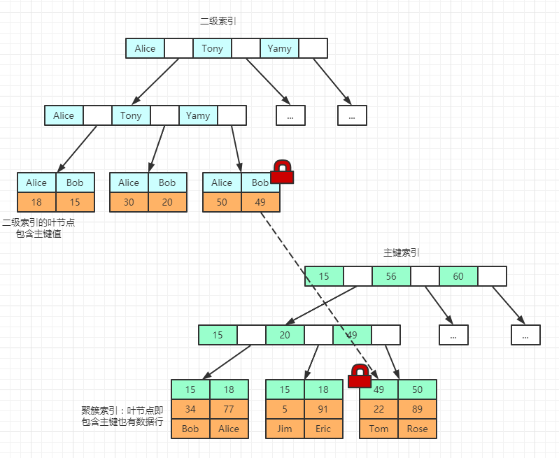

接下来以两条SQL的执行为例，讲解一下InnoDB对于单行数据的加锁原理：

```sql
update user set age = 10 where id = 49;
update user set age = 10 where name = 'Tom';
```

第一条SQL使用主键查询，只需要在 id = 49 这个主键索引上加上锁。第二条 SQL 使用二级索引来查询，那么首先在 name = Tom 这个索引上加写锁，然后由于使用 InnoDB 二级索引还需再次根据主键索引查询，所以还需要在 id = 49 这个主键索引上加锁。

也就是说使用主键索引需要加一把锁，使用二级索引需要在二级索引和主键索引上各加一把锁。

根据索引对单行数据进行更新的加锁原理了解了，那如果更新操作涉及多个行呢，比如下面 SQL 的执行场景。

```sql
update user set age = 10 where id > 49;
```

上述 SQL 的执行过程如下图所示。MySQL Server 会根据 WHERE 条件读取第一条满足条件的记录，然后 InnoDB 引擎会将第一条记录返回并加锁，接着 MySQL Server 发起更新改行记录的 UPDATE 请求，更新这条记录。一条记录操作完成，再读取下一条记录，直至没有匹配的记录为止。


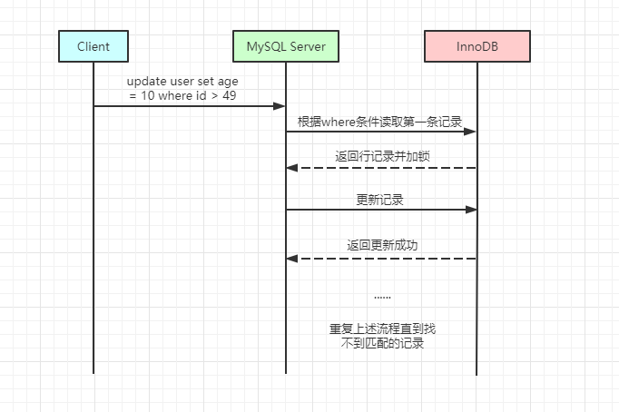

行级锁的类型主要有三类：

- **Record Lock**：记录锁，也就是仅仅把一条记录锁上。
- **Gap Lock**：间隙锁，锁定一个范围，但是不包含记录本身。
- **Next-Key Lock**：Record Lock + Gap Lock 的组合，锁定一个范围，并且锁定记录本身。


#### 记录锁 Record Lock

InnoDB实现了以下两种类型的行锁：

- **共享锁（S）**：加了锁的记录，所有事务都能去读取但不能修改。「S 锁」与「 X 锁」不兼容，「S 锁」与 「S 锁」兼容。
- **排他锁（X）**：允许已经获得排他锁的事务去更新数据。「X 锁」与「S 锁」和「X 锁」都不兼容。

**`select for update` 增加 X 锁** 

在执行这个 select 查询语句的时候，会将对应的索引访问条目加上排他锁（X锁），也就是说这个语句对应的锁就相当于 `update` 带来的效果。

**使用场景**：为了让确保自己查找到的数据一定是最新数据，并且查找到后的数据值允许自己来修改，此时就需要用到`select for update`语句。

**性能分析**：`select for update`语句相当于一个`update`语句。在业务繁忙的情况下，如果事务没有及时地`commit`或者`rollback`可能会造成事务长时间的等待，从而影响数据库的并发使用效率。

**`select lock in share mode` 增加 S 锁**

`in share mode` 子句的作用就是将查找的数据加上一个 `share` 锁，这个就是表示其他的事务只能对这些数据进行简单的 `select` 操作，而不能进行 DML 操作。

**使用场景**：为了确保自己查询的数据不会被其他事务正在修改，也就是确保自己查询到的数据是最新的数据，并且不允许其他事务来修改数据。与`select for update`不同的是，本事务在查找完之后不一定能去更新数据，因为有可能其他事务也对同数据集使用了` in share mode` 的方式加上了S锁；

**性能分析**：`select lock in share mode` 语句是一个给查找的数据上一个共享锁（S 锁）的功能，它允许其他的事务也对该数据上S锁，但是不能够允许对该数据进行修改。如果不及时的`commit `或者`rollback `也可能会造成大量的事务等待。

#### 间隙锁 Gap Lock

Gap Lock 称为间隙锁，只存在于可重复读隔离级别，目的是为了解决可重复读隔离级别下「幻读」的现象。

间隙锁是可以共存的，「共享间隙锁」与「独占间隙锁」之间是没有区别的，**两者之间并不冲突**。其存在的目的都是防止其他事务往间隙中插入新的纪录，故而一个事务所采取的间隙锁是不会去阻止另外一个事务在同一个间隙中加锁的。

**示例**：假设表中有一个范围 id 为 （3，5）的间隙锁，则其他事务就无法插入 id = 4 的记录，从而防止幻读。

#### 临建锁 Next-Key Lock

 Record Lock + Gap Lock 的组合，锁定一个范围，并且锁定记录本身。

**示例**：假设表中有一个范围 id 为（3，5] 的 next-key lock，那么其他事务即不能插入 id = 4 记录，也不能修改 id = 5 这条记录。

**next-key lock 是包含间隙锁 + 记录锁的，如果一个事务获取了 X 型的 next-key lock，那么另外一个事务在获取相同范围的 X 型的 next-key lock 时，是会被阻塞的**。

#### 插入意向锁

一个事务在插入一条记录的时候，需要判断插入位置是否已被其他事务加了间隙锁（next-key lock 也包含间隙锁）。

如果有的话，插入操作就会发生**阻塞**，直到拥有间隙锁的那个事务提交为止（释放间隙锁的时刻），在此期间会生成一个**插入意向锁**，表明有事务想在某个区间插入新记录，但是现在处于等待状态。

【**示例**】

假设事务 A 对表添加了 id 范围为 （3，5）的间隙锁，当事务 A 还未提交时，事务 B 向该表插入一条 id = 4 的记录，这时会判断插入位置已经有了间隙锁，事务 B 生成一个**插入意向锁**，将锁 的状态设置为等待状态，事务 B 被阻塞，直到事务 A 提交了事务。

「插入意向锁」与「间隙锁」的重要的差别是：尽管「插入意向锁」也属于间隙锁，但两个事务却不能在同一时间内，一个拥有间隙锁，另一个拥有该间隙区间内的插入意向锁（当然，插入意向锁如果不在间隙锁区间内则是可以的）。

#### 不同类型锁之间的兼容

不同类型的锁之间的兼容如下表所示（其中行表示已有的锁，列表示意图加上的锁）：

|          | RECORED | GAP  | NEXT-KEY | II GAP（插入意向锁） |
| -------- | ------- | ---- | -------- | -------------------- |
| RECORED  |         | 兼容 |          | 兼容                 |
| GAP      | 兼容    | 兼容 | 兼容     | 兼容                 |
| NEXT-KEY |         | 兼容 |          | 兼容                 |
| II GAP   | 兼容    |      |          | 兼容                 |


其中，第一行表示已有的锁，第一列表示要加的锁。插入意向锁较为特殊，所以我们先对插入意向锁做个总结，如下：

- 插入意向锁不影响其他事务加其他任何锁。也就是说，一个事务已经获取了插入意向锁，对其他事务是没有任何影响的；
- 插入意向锁与间隙锁和 Next-key 锁冲突。也就是说，一个事务想要获取插入意向锁，如果有其他事务已经加了间隙锁或 Next-key 锁，则会阻塞。

其他类型的锁的规则较为简单：

- 间隙锁不和其他锁（不包括插入意向锁）冲突；
- 记录锁和记录锁冲突，Next-key 锁和 Next-key 锁冲突，记录锁和 Next-key 锁冲突；

---

### 表级锁

MySQL 里面表级别的锁有这几种：

- 表锁。
- 元数据锁（MDL）。
- 意向锁。
- AUTO-INC 锁。

#### 表锁

在会话开始的地方使用 `lock `命令将后续需要用到的表都加上锁，在表释放前，只能访问这些加锁的表，不能访问其他表，直到最后通过 `unlock tables` 释放所有表锁。

除了使用 `unlock tables` 显示释放锁之外，会话持有其他表锁时执行`lock table` 语句会释放会话之前持有的锁；会话持有其他表锁时执行 `start transaction` 或者 `begin `开启事务时，也会释放之前持有的锁。

表锁由 MySQL Server 实现，行锁则是存储引擎实现，不同的引擎实现的不同。在 MySQL 的常用引擎中 InnoDB 支持行锁，而 MyISAM 则只能使用 MySQL Server 提供的表锁。

#### 元数据锁

对数据库表进行操作时，会自动给这个表加上 MDL：

- 对一张表进行 CRUD 操作时，加的是 **MDL 读锁**。
- 对一张表做结构变更操作的时候，加的是 **MDL 写锁**。

MDL 是为了保证当用户对表执行 CRUD 操作时，防止其他线程对这个表结构做了变更。

申请 MDL 锁的操作会形成一个队列，队列中**写锁获取优先级高于读锁**，一旦出现 MDL 写锁等待，会阻塞后续该表的所有 CRUD 操作。

#### 意向锁

- 在使用 InnoDB 引擎的表里对某些记录加上「共享锁」之前，需要先在表级别加上一个「意向共享锁」；
- 在使用 InnoDB 引擎的表里对某些纪录加上「独占锁」之前，需要先在表级别加上一个「意向独占锁」；

也就是，当执行插入、更新、删除操作，需要先对表加上「意向独占锁」，然后对该记录加独占锁。

而普通的 select 是不会加行级锁的，普通的 select 语句是利用 MVCC 实现一致性读，是无锁的。

不过，select 也是可以对记录加共享锁和独占锁的，具体方式如下：

```sql
//先在表上加上意向共享锁，然后对读取的记录加共享锁
select ... lock in share mode;

//先表上加上意向独占锁，然后对读取的记录加独占锁
select ... for update;
```

**意向共享锁和意向独占锁是表级锁，不会和行级的共享锁和独占锁发生冲突，而且意向锁之间也不会发生冲突，只会和共享表锁（`lock tables ... read`）和独占表锁（`lock tables ... write`）发生冲突。**

【为什么要有意向锁呢？】

如果没有「意向锁」，那么加「独占表锁」时，就需要遍历表里所有记录，查看是否有记录存在独占锁，这样效率会很慢。

那么有了「意向锁」，由于在对记录加独占锁前，先会加上表级别的意向独占锁，那么在加「独占表锁」时，直接查该表是否有意向独占锁，如果有就意味着表里已经有记录被加了独占锁，这样就不用去遍历表里的记录。

所以，**意向锁的目的是为了快速判断表里是否有记录被加锁**。

#### AUTO-INC 锁

表里的主键通常都会设置成自增的，这是通过对主键字段声明 `AUTO_INCREMENT` 属性实现的。

之后可以在插入数据时，可以不指定主键的值，数据库会自动给主键赋值递增的值，这主要是通过 **AUTO-INC 锁**实现的。

AUTO-INC 锁是特殊的表锁机制，锁**不是再一个事务提交后才释放，而是再执行完插入语句后就会立即释放**。

**在插入数据时，会加一个表级别的 AUTO-INC 锁**，然后为被 `AUTO_INCREMENT` 修饰的字段赋值递增的值，等插入语句执行完成后，才会把 AUTO-INC 锁释放掉。

所以，一个事务在持有 AUTO-INC 锁的过程中，其他事务的如果要向该表插入语句都会被阻塞，从而保证插入数据时，被 `AUTO_INCREMENT` 修饰的字段的值是连续递增的。

但是， AUTO-INC 锁再对大量数据进行插入的时候，会影响插入性能，因为另一个事务中的插入会被阻塞。

因此， 在 MySQL 5.1.22 版本开始，InnoDB 存储引擎提供了一种**轻量级的锁**来实现自增。

在插入数据的时候，会为被 `AUTO_INCREMENT` 修饰的字段加上轻量级锁，**然后给该字段赋值一个自增的值，就把这个轻量级锁释放了，而不需要等待整个插入语句执行完后才释放锁**。

InnoDB 存储引擎提供了个 `innodb_autoinc_lock_mode` 的系统变量，是用来控制选择用 AUTO-INC 锁，还是轻量级的锁。

- 当 `innodb_autoinc_lock_mode = 0`：就采用 AUTO-INC 锁，语句执行结束后才释放锁。
- 当 `innodb_autoinc_lock_mode = 2`：就采用轻量级锁，申请自增主键后就释放锁，并不需要等语句执行后才释放。
- 当 `innodb_autoinc_lock_mode = 1`：
  - 普通 `insert` 语句，自增锁在申请之后就马上释放。
  - 类似 `insert … select` 这样的批量插入数据的语句，自增锁还是要等语句结束后才被释放。

### 两种锁比较

表锁：加锁过程的开销小，加锁的速度快；不会出现死锁的情况；锁定的粒度大，发生锁冲突的几率大，并发度低。

- 一般在执行DDL语句时会对整个表进行加锁，比如说 ALTER TABLE 等操作；
- 如果对InnoDB的表使用行锁，被锁定字段不是主键，也没有针对它建立索引的话，那么将会锁整张表；
- 表级锁更适合于以查询为主，并发用户少，只有少量按索引条件更新数据的应用，如Web 应用。

行锁：加锁过程的开销大，加锁的速度慢；会出现死锁；锁定粒度最小，发生锁冲突的概率最低，并发度也最高；

- 最大程度的支持并发，同时也带来了最大的锁开销。
- 在 InnoDB 中，除单个 SQL 组成的事务外，锁是逐步获得的，这就决定了在 InnoDB 中发生死锁是可能的。
- 行级锁只在存储引擎层实现，而 MySQL 服务器层没有实现。 行级锁更适合于有大量按索引条件并发更新少量不同数据，同时又有并发查询的应用，如一些在线事务处理（OLTP）系统。

### 参考

- https://juejin.cn/post/6844903799534911496

- https://www.cnblogs.com/jojop/p/13982679.html#1383854867

## MySQL 如何添加行级锁

**加锁的对象是索引，加锁的基本单位是 next-key lock**，它是由记录锁和间隙锁组合而成的，**next-key lock 是前开后闭区间，而间隙锁是前开后开区间**。

但是，**在能使用「记录锁」或者「间隙锁」就能避免幻读现象的场景下， next-key lock 就会退化成「记录锁」或「间隙锁」**。

### 唯一索引等值查询

用唯一索引进行等值查询的时候，查询的记录存不存在，加锁的规则也会不同：

- 当查询的记录是「存在」的，在索引树上定位到这一条记录后，将该记录的索引中的 next-key lock 会**退化成「记录锁」**。
- 当查询的记录是「不存在」的，在索引树找到第一条大于该查询记录的记录后，将该记录的索引中的 next-key lock 会**退化成「间隙锁」**。

#### 记录存在的情况

【**问题**】：为什么唯一索引等值查询并且查询记录存在的场景下，该记录的索引中的 next-key lock 会退化成记录锁？

在唯一索引等值查询并且查询记录存在的场景下，仅靠记录锁也能避免幻读的问题。

- 由于主键具有唯一性，所以**其他事务插入 id = 1 的时候，会因为主键冲突，导致无法插入 id = 1 的新记录**。这样事务 A 在多次查询 id = 1 的记录的时候，不会出现前后两次查询的结果集不同，也就避免了幻读的问题。
- 由于对 id = 1 加了记录锁，**其他事务无法删除该记录**，这样事务 A 在多次查询 id = 1 的记录的时候，不会出现前后两次查询的结果集不同，也就避免了幻读的问题。

【示例】

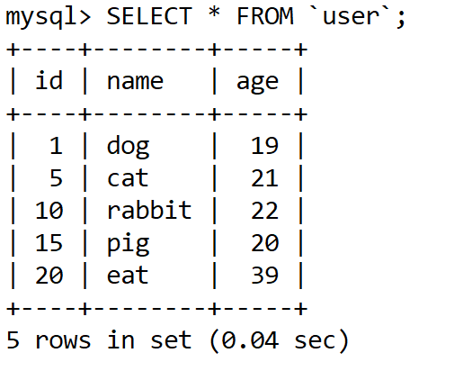

```sql
mysql> begin;
Query OK, 0 rows affected (0.00 sec)

mysql>
mysql>
mysql>
mysql> select * from user where id = 1 for update;
+----+------+-----+
| id | name | age |
+----+------+-----+
|  1 | dog  |  19 |
+----+------+-----+
1 row in set (0.00 sec)
```

查看加锁情况：

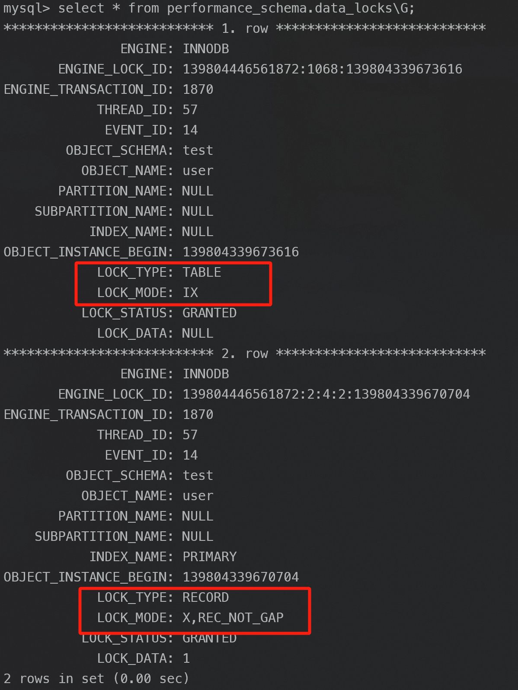

上图可以看到加了两个锁：

- 表锁：X 类型的意向锁。
- 行锁：X 类型的记录锁。

图中 LOCK_TYPE 中的 RECORD 表示行级锁，而不是记录锁的意思。

通过 LOCK_MODE 可以确认是 next-key 锁，还是间隙锁，还是记录锁：

- 如果 LOCK_MODE 为 `X`，说明是 next-key 锁；
- 如果 LOCK_MODE 为 `X, REC_NOT_GAP`，说明是记录锁；
- 如果 LOCK_MODE 为 `X, GAP`，说明是间隙锁；

#### 记录不存在的情况


```sql
mysql> begin;
Query OK, 0 rows affected (0.00 sec)

mysql> select * from user where id = 2 for update;
Empty set (0.00 sec)
```

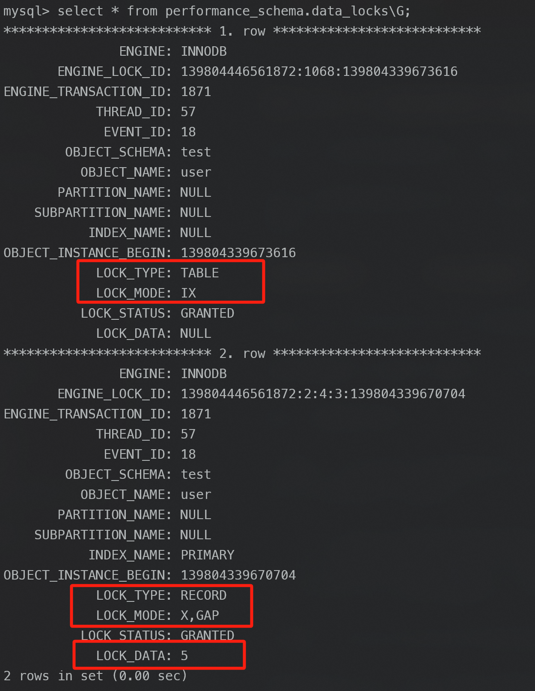

从上图可以看到，共加了两个锁，分别是：

- 表锁：X 类型的意向锁；
- 行锁：X 类型的间隙锁；

**事务 A 在 id = 5 记录的主键索引上加的是间隙锁，锁住的范围是 (1, 5)。**

接下来，如果有其他事务插入 id 值为 2、3、4 这一些记录的话，这些插入语句都会发生阻塞。

注意，如果其他事务插入的 id = 1 或者 id = 5 的记录话，并不会发生阻塞，而是报主键冲突的错误，因为表中已经存在 id = 1 和 id = 5 的记录了。

【**问题**】：**间隙锁的范围`(1, 5)` ，是怎么确定的？**

如果 LOCK_MODE 是 next-key 锁或者间隙锁，那么 LOCK_DATA 就表示锁的范围「右边界」，此次的事务 A 的 LOCK_DATA 是 5。

然后锁范围的「左边界」是表中 id 为 5 的上一条记录的 id 值，即 1。

因此，间隙锁的范围`(1, 5)`。

【**问题**】：为什么唯一索引查询记录「不存在」的场景下，在索引树找到第一条大于该查询记录的记录后，要将该记录的索引中的 next-key lock 会退化成「间隙锁」？

-  id = 5 记录上的主键索引的锁如果是 next-key lock，就意味着其他事务无法删除 id = 5 这条记录。但是这次的案例是查询 id = 2 的记录，只要保证前后两次查询 id = 2 的结果集相同，就能避免幻读的问题了。即使 id =5 被删除，也不会有什么影响，那就没必须加 next-key lock，因此只需要在 id = 5 加间隙锁，避免其他事务插入 id = 2 的新记录就行了。

【**问题**】：为什么不可以针对不存在的记录加记录锁？

锁是加在索引上的，而这个场景下查询的记录是不存在的，自然就没办法锁住这条不存在的记录。

### 唯一索引范围查询

当唯一索引进行范围查询时，**会对每一个扫描到的索引加 next-key 锁，然后如果遇到下面这些情况，会退化成记录锁或者间隙锁**：

- 针对「大于等于」的范围查询，因为存在等值查询的条件，那么如果等值查询的记录是存在于表中，那么该记录的索引中的 next-key 锁会**退化成记录锁**。
- 针对「小于或者小于等于」的范围查询，要看条件值的记录是否存在于表中：
  - 当条件值的记录「不在表」中，那么不管是「小于」还是「小于等于」条件的范围查询，**扫描到终止范围查询的记录时，该记录的索引的 next-key 锁会退化成间隙锁**，其他扫描到的记录，都是在这些记录的索引上加 next-key 锁。
  - 当条件值的记录「在表」中，如果是「小于」条件的范围查询，**扫描到终止范围查询的记录时，该记录的索引的 next-key 锁会退化成间隙锁**，其他扫描到的记录，都是在这些记录的索引上加 next-key 锁；如果「小于等于」条件的范围查询，扫描到终止范围查询的记录时，该记录的索引 next-key 锁不会退化成间隙锁。其他扫描到的记录，都是在这些记录的索引上加 next-key 锁。

#### 针对「大于或者大于等于」的范围查询


【示例一】：针对「大于」的范围查询

```sql
mysql> begin;
Query OK, 0 rows affected (0.00 sec)

mysql> select * from user where id > 15 for update;
+----+------+-----+
| id | name | age |
+----+------+-----+
| 20 | eat  |  39 |
+----+------+-----+
1 row in set (0.01 sec)
```

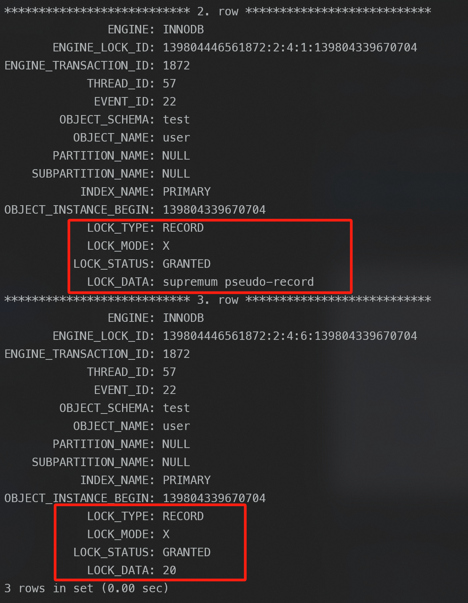

 加锁变化过程如下：

1. 最开始要找的第一行是 id = 20，由于查询该记录不是一个等值查询（不是大于等于条件查询），所以对该主键索引加的是范围为 (15, 20] 的 **next-key 锁**。

2. 由于是范围查找，就会继续往后找存在的记录，虽然表中最后一条记录是 id = 20 的记录，但是实际在 Innodb 存储引擎中，会用一个特殊的记录来标识最后一条记录，该特殊的记录的名字叫 「supremum pseudo-record」 ，所以扫描第二行的时候，也就扫描到了这个特殊记录的时候，会对该主键索引加的是范围为 (20, +∞] 的 **next-key 锁**。

- 在 id = 20 这条记录的主键索引上，加了范围为 (15, 20] 的 **next-key 锁**，意味着其他事务即无法更新或者删除 id = 20 的记录，同时无法插入 id 值为 16、17、18、19 的这一些新记录。
- 在特殊记录「supremum pseudo-record」的主键索引上，加了范围为 (20, +∞] 的 next-key 锁，意味着其他事务无法插入 id 值大于 20 的这一些新记录。

【示例二】：针对「大于等于」的范围查询

```sql
mysql> begin;
Query OK, 0 rows affected (0.00 sec)

mysql> select * from user where id >= 15 for update;
+----+------+-----+
| id | name | age |
+----+------+-----+
| 15 | pig  |  20 |
| 20 | eat  |  39 |
+----+------+-----+
2 rows in set (0.00 sec)
```

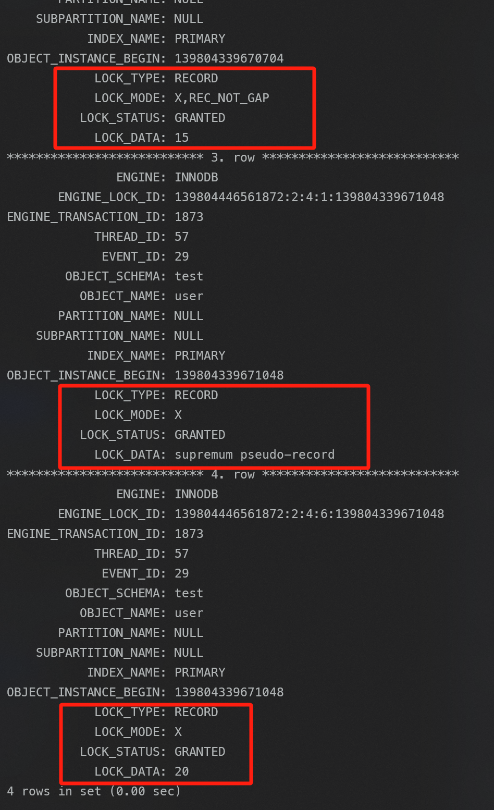

加锁变化过程如下：

1. 最开始要找的第一行是 id = 15，由于查询该记录是一个等值查询（等于 15），所以该主键索引的 next-key 锁会**退化成记录锁**，也就是仅锁住 id = 15 这一行记录。
2. 由于是范围查找，就会继续往后找存在的记录，扫描到的第二行是 id = 20，于是对该主键索引加的是范围为 (15, 20] 的 **next-key 锁**。
3. 接着扫描到第三行的时候，扫描到了特殊记录「supremum pseudo-record」 ，于是对该主键索引加的是范围为 (20, +∞] 的 **next-key 锁**。

- 在 id = 15 这条记录的主键索引上，加了记录锁，范围是 id = 15 这一行记录；意味着其他事务无法更新或者删除 id = 15 的这一条记录；
- 在 id = 20 这条记录的主键索引上，加了 next-key 锁，范围是 (15, 20] 。意味着其他事务即无法更新或者删除 id = 20 的记录，同时无法插入 id 值为 16、17、18、19 的这一些新记录。
- 在特殊记录「supremum pseudo-record」的主键索引上，加了 next-key 锁，范围是 (20, +∞] 。意味着其他事务无法插入 id 值大于 20 的这一些新记录。

#### 针对「小于或者小于等于」的范围查询

【示例一】：针对「小于」的范围查询时，查询条件值的记录「不存在」表中的情况。

```sql
mysql> begin;
Query OK, 0 rows affected (0.00 sec)

mysql> select * from user where id < 6 for update;
+----+------+-----+
| id | name | age |
+----+------+-----+
|  1 | dog  |  19 |
|  5 | cat  |  21 |
+----+------+-----+
2 rows in set (0.01 sec)
```

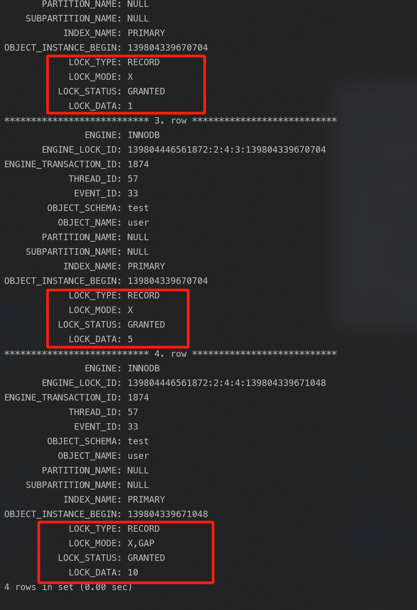

加锁变化过程如下：

1. 最开始要找的第一行是 id = 1，于是对该主键索引加的是范围为 (-∞, 1] 的 **next-key 锁**。意味着其他事务即无法更新或者删除 id = 1 的这一条记录，同时也无法插入 id 小于 1 的这一些新记录。
2. 由于是范围查找，就会继续往后找存在的记录，扫描到的第二行是 id = 5，所以对该主键索引加的是范围为 (1, 5] 的 **next-key 锁**。意味着其他事务即无法更新或者删除 id = 5 的这一条记录，同时也无法插入 id 值为 2、3、4 的这一些新记录。
3. 由于扫描到的第二行记录（id = 5），满足 id < 6 条件，而且也没有达到终止扫描的条件，接着会继续扫描。
4. 扫描到的第三行是 id = 10，该记录不满足 id < 6 条件的记录，所以 id = 10 这一行记录的锁会**退化成间隙锁**，于是对该主键索引加的是范围为 (5, 10) 的间隙锁。意味着其他事务无法插入 id 值为 6、7、8、9 的这一些新记录。
5. 由于扫描到的第三行记录（id = 10），不满足 id < 6 条件，达到了终止扫描的条件，于是停止扫描。

【示例二】：针对「小于等于」的范围查询时，查询条件值的记录「存在」表中的情况。

```sql
mysql> begin;
Query OK, 0 rows affected (0.00 sec)

mysql> select * from user where id <= 5 for update;
+----+------+-----+
| id | name | age |
+----+------+-----+
|  1 | dog  |  19 |
|  5 | cat  |  21 |
+----+------+-----+
2 rows in set (0.01 sec)
```

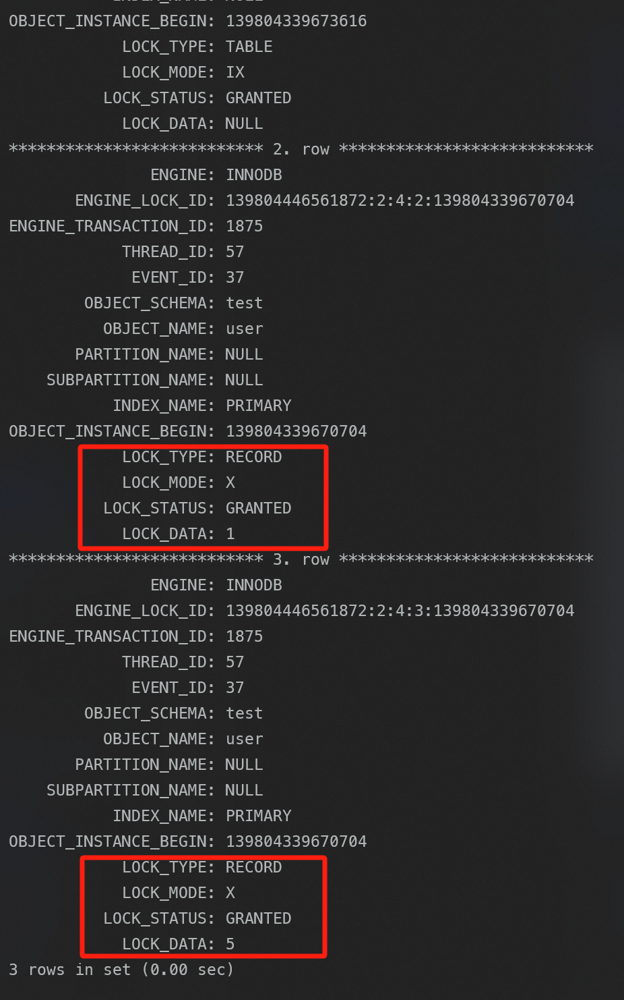

加锁变化过程如下：

1. 最开始要找的第一行是 id = 1，于是对该记录加的是范围为 (-∞, 1] 的 **next-key 锁**。意味着其他事务即无法更新或者删除 id = 1 的这一条记录，同时也无法插入 id 小于 1 的这一些新记录。
2. 由于是范围查找，就会继续往后找存在的记录，扫描到的第二行是 id = 5，于是对该记录加的是范围为 (1, 5] 的 **next-key 锁**。
3. 由于主键索引具有唯一性，不会存在两个 id = 5 的记录，所以不会再继续扫描，于是停止扫描。意味着其他事务即无法更新或者删除 id = 5 的这一条记录，同时也无法插入 id 值为 2、3、4 的这一些新记录。

【示例三】：针对「小于」的范围查询时，查询条件值的记录「存在」表中的情况。

```sql
mysql> begin;
Query OK, 0 rows affected (0.00 sec)

mysql> select * from user where id < 5 for update;
+----+------+-----+
| id | name | age |
+----+------+-----+
|  1 | dog  |  19 |
+----+------+-----+
1 row in set (0.00 sec)
```

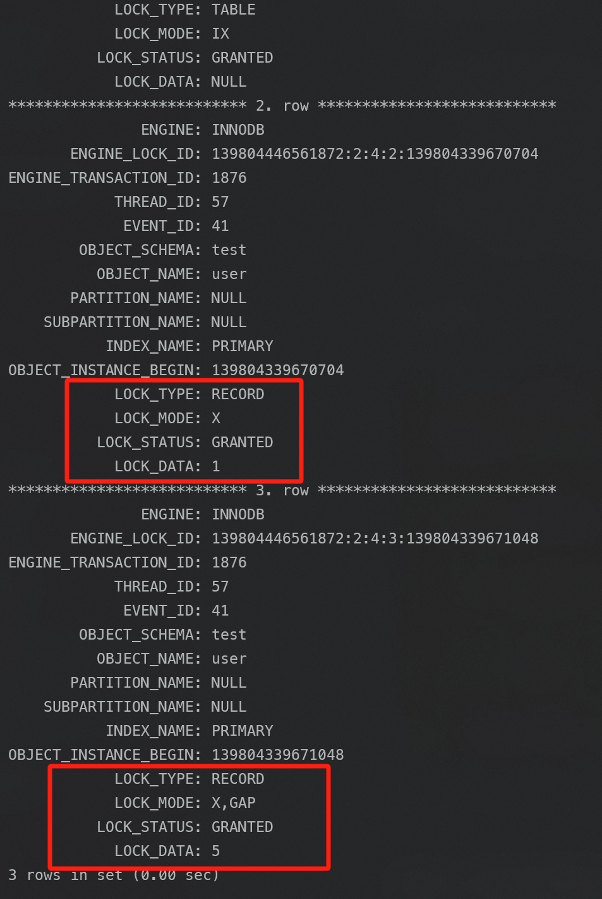

加锁变化过程如下：

1. 最开始要找的第一行是 id = 1，于是对该记录加的是范围为 (-∞, 1] 的 **next-key 锁**。意味着其他事务即无法更新或者删除 id = 1 的这一条记录，同时也无法插入 id 小于 1 的这一些新记录。
2. 由于是范围查找，就会继续往后找存在的记录，扫描到的第二行是 id = 5，该记录是第一条不满足 id < 5 条件的记录，于是**该记录的锁会退化为间隙锁，锁范围是 (1,5)**。意味着其他事务无法插入 id 值为 2、3、4 的这一些新记录。
3. 由于找到了第一条不满足 id < 5 条件的记录，于是停止扫描。

#### 小结

在针对「小于或者小于等于」的唯一索引（主键索引）范围查询时，存在这两种情况会将索引的 next-key 锁会退化成间隙锁的：

- 当条件值的记录「不在」表中时，那么不管是「小于」还是「小于等于」条件的范围查询，扫描到终止范围查询的记录时，该记录的主键索引中的 next-key 锁会**退化成间隙锁**，其他扫描到的记录，都是在这些记录的主键索引上加 next-key 锁。
- 当条件值的记录「在」表中时：
  - 如果是「小于」条件的范围查询，扫描到终止范围查询的记录时，该记录的主键索引中的 next-key 锁会**退化成间隙锁**，其他扫描到的记录，都是在这些记录的主键索引上，加 **next-key 锁**。
  - 如果是「小于等于」条件的范围查询，扫描到终止范围查询的记录时，该记录的主键索引中的 next-key 锁「不会」退化成间隙锁，其他扫描到的记录，都是在这些记录的主键索引上加 **next-key 锁**。

### 非唯一索引等值查询

**在加锁时，同时会对这两个索引都加锁，但是对主键索引加锁的时候，只有满足查询条件的记录才会对它们的主键索引加锁**。

针对非唯一索引等值查询时，查询的记录存不存在，加锁的规则也会不同：

- 当查询的记录「存在」时，由于不是唯一索引，所以肯定存在索引值相同的记录，于是**非唯一索引等值查询的过程是一个扫描的过程，直到扫描到第一个不符合条件的二级索引记录就停止扫描，然后在扫描的过程中，对扫描到的二级索引记录加的是 next-key 锁，而对于第一个不符合条件的二级索引记录，该二级索引的 next-key 锁会退化成间隙锁。同时，在符合查询条件的记录的主键索引上加记录锁**。
- 当查询的记录「不存在」时，**扫描到第一条不符合条件的二级索引记录，该二级索引的 next-key 锁会退化成间隙锁。因为不存在满足查询条件的记录，所以不会对主键索引加锁**。

#### 记录不存在的情况

```sql
mysql> begin;
Query OK, 0 rows affected (0.00 sec)

mysql> select * from user where age = 25 for update;
Empty set (0.00 sec)
```

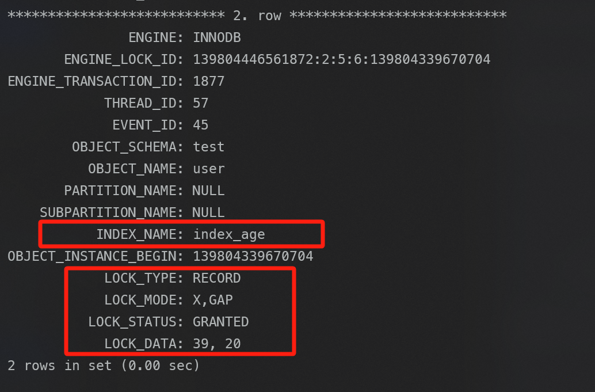

`LOCK_DATA：39，20` 是什么意思：

- LOCK_DATA 第一个数值，也就是 39， 它代表的是 age 值。LOCK_DATA 第一个数值是 next-key 锁和间隙锁**锁住的范围的右边界值**。
- LOCK_DATA 第二个数值，也就是 20， 它代表的是 id 值。

 加锁变化过程如下：

- 定位到第一条不符合查询条件的二级索引记录，即扫描到 age = 39，于是**该二级索引的 next-key 锁会退化成间隙锁，范围是 (22, 39)**。
- 停止查询。

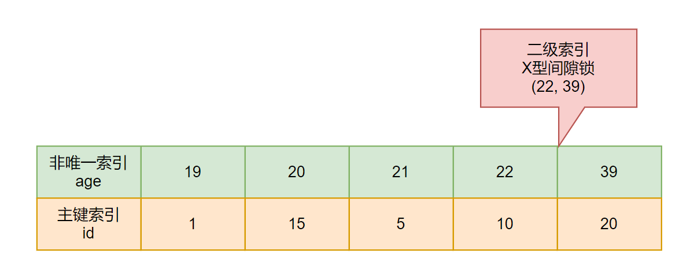

X 型的间隙锁范围是 (22, 39)。意味着其他事务无法插入 age 值为 23、24、25、26、....、38 这些新记录。不过对于插入 age = 22 和 age = 39 记录的语句，在一些情况是可以成功插入的，而一些情况则无法成功插入。

> :bulb: 什么情况下插入会发生阻塞？
>
> 插入语句在插入一条记录之前，需要先定位该记录在 B+ 树里面的位置，插入位置的下一条记录索引上有间隙锁，才会发生阻塞。
>
> :bulb: 二级索引如何存放记录？
>
> 二级索引树是按照二级索引值（age列）按顺序存放的，在相同的二级索引值情况下， 再按主键 id 的顺序存放。

- 当其他事务插入一条 age = 22，id = 3 的记录时，在二级索引上寻找插入位置，该位置的下一条是 **id = 10、age = 22** 的记录，该记录的二级索引上**没有间隙锁**，所以这条插入语句可以执行成功。
- 当其他事务插入一条 age = 22，id = 12 的记录的时候，在二级索引树上定位到插入的位置，该位置的下一条是 **id = 20、age = 39 **的记录，正好该记录的二级索引上**有间隙锁**，所以这条插入语句会被阻塞，无法插入成功。

所以，在插入一条数据时，是根据「二级索引值 + 主键值」共同确定插入位置，然后看插入位置是否有间隙锁。

#### 记录存在的情况

对非唯一索引（age）进行了等值查询，且表中存在 age = 22 的记录。

```sql
mysql> begin;
Query OK, 0 rows affected (0.00 sec)

mysql> select * from user where age = 22 for update;
+----+--------+-----+
| id | name   | age |
+----+--------+-----+
| 10 | rabbit |  22 |
+----+--------+-----+
1 row in set (0.02 sec)
```

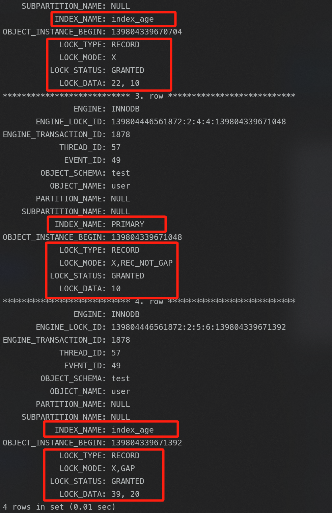

加锁变化过程如下：

- 最开始要找的第一行是 age = 22，于是对该二级索引记录加上范围为 (21, 22] 的 **next-key 锁**。同时，因为 age = 22 符合查询条件，于是对 age = 22 的记录的主键索引加上记录锁，即对 id = 10 这一行加**记录锁**。

- 接着继续扫描，扫描到的第二行是 age = 39，该记录是第一个不符合条件的二级索引记录，所以该二级索引的 next-key 锁会**退化成间隙锁**，范围是 (22, 39)。
- 停止查询。

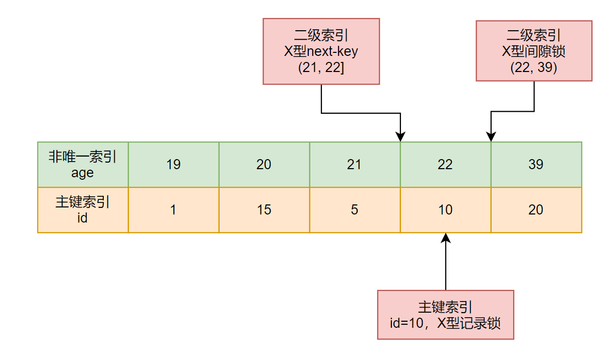

- 在 id = 10 这条记录的**主键索引**上，加了**记录锁**，意味着其他事务无法更新或者删除 id = 10 的这一行记录。
- 在 age = 22 这条记录的**二级索引**上，加了范围为 (21, 22] 的 **next-key 锁**，意味着其他事务无法更新或者删除 age = 22 的这一些新记录，不过对于插入 age = 20 和 age = 21 新记录的语句，在一些情况是可以成功插入的，而一些情况则无法成功插入。
- 在 age = 39 这条记录的**二级索引**上，加了范围 (22, 39) 的**间隙锁**。意味着其他事务无法插入 age 值为 23、24、..... 、38 的这一些新记录。不过对于插入 age = 22 和 age = 39 记录的语句，在一些情况是可以成功插入的，而一些情况则无法成功插入。

如果想插入 age = 21 的新记录，要看插入的新记录的 id 值，**如果插入 age = 21 新记录的 id 值小于 5，那么就可以插入成功**。因为此时插入的位置的下一条记录是 id = 5，age = 21 的记录，该记录的二级索引上没有间隙锁。其他场景同理。

### 非唯一索引范围查询

非唯一索引进行范围查询时，对二级索引记录加锁都是加 next-key 锁，并不会退化。

```sql
mysql> begin;
Query OK, 0 rows affected (0.00 sec)

mysql> select * from user where age >= 22 for update;
+----+--------+-----+
| id | name   | age |
+----+--------+-----+
| 10 | rabbit |  22 |
| 20 | eat    |  39 |
+----+--------+-----+
2 rows in set (0.00 sec)
```

加锁变化：

- 最开始要找的第一行是 age = 22，虽然范围查询语句包含等值查询，但是这里不是唯一索引范围查询，所以是不会发生退化锁的现象，因此对该二级索引记录加 **next-key 锁**，范围是 (21, 22]。同时，对 age = 22 这条记录的主键索引加记录锁，即对 id = 10 这一行记录的主键索引加**记录锁**。

- 由于是范围查询，接着继续扫描已经存在的二级索引记录。扫面的第二行是 age = 39 的二级索引记录，于是对该二级索引记录加 **next-key 锁**，范围是 (22, 39]，同时，对 age = 39 这条记录的主键索引加**记录锁**，即对 id = 20 这一行记录的主键索引加记录锁。

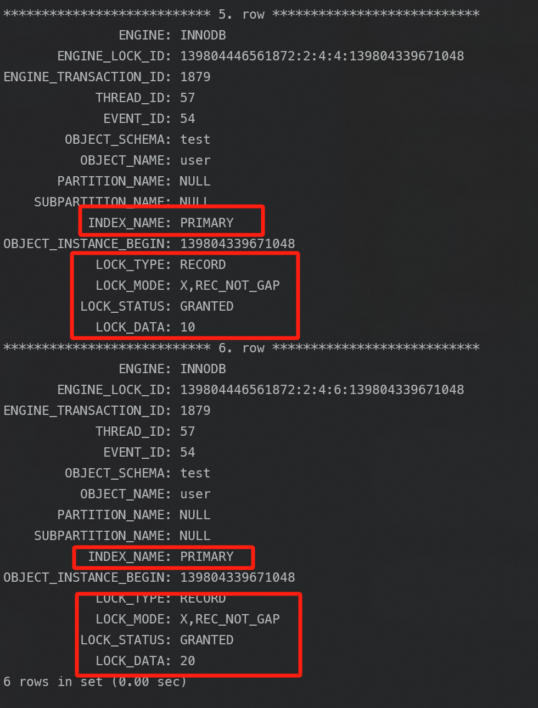

- 在 Innodb 存储引擎中，会用一个特殊的记录来标识最后一条记录，该特殊的记录的名字叫 supremum pseudo-record ，所以扫描第二行的时候，也就扫描到了这个特殊记录的时候，会对该二级索引记录加的是范围为 (39, +∞] 的 next-key 锁。

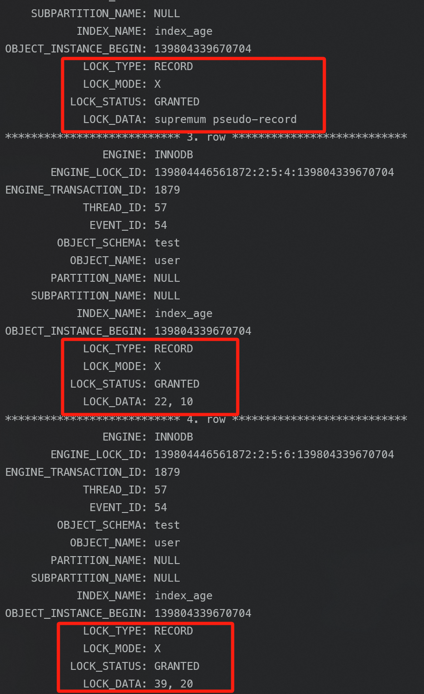

- 停止查询

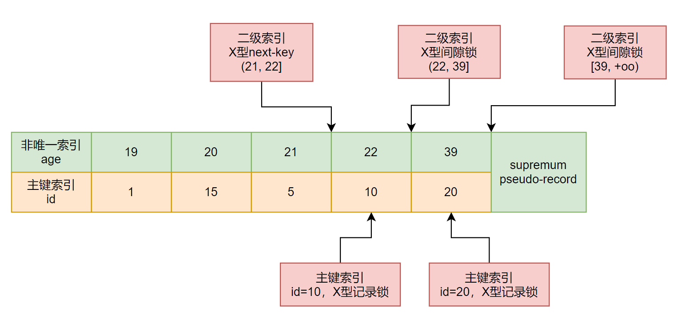

### 没有加索引的查询

查询语句没有走索引查询，导致扫描是全表扫描。那么，每一条记录的索引上都会加 **next-key 锁**，这样就相当于**锁住全表**，这时如果其他事务对该表进行增、删、改操作的时候，都会被阻塞。update 和 delete 语句查询条件不加索引，也会**锁住全表**。

### 参考

- https://www.xiaolincoding.com/mysql/lock/how_to_lock.html