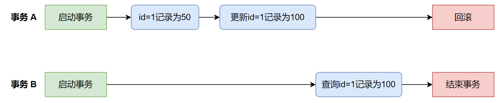
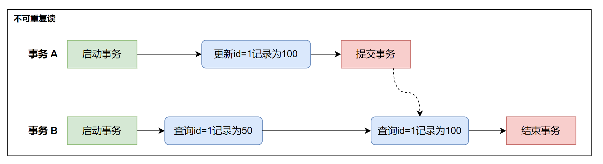
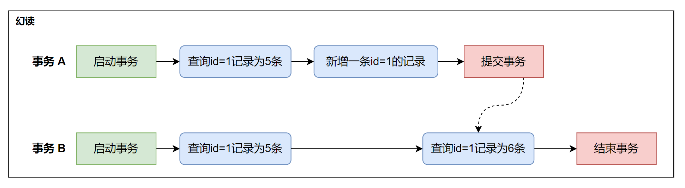
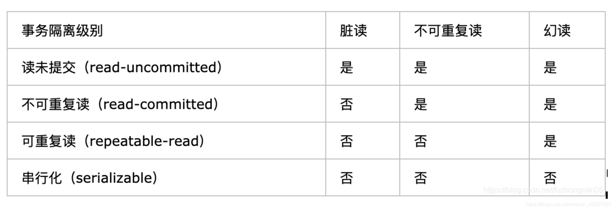
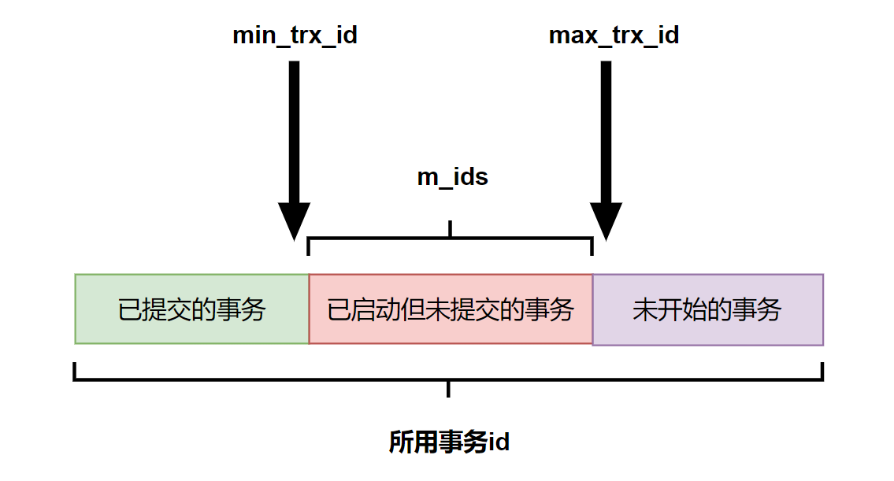
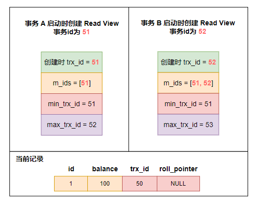
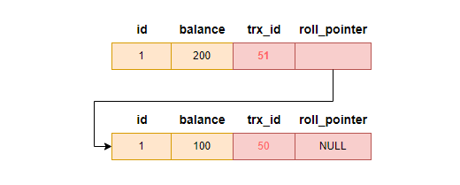
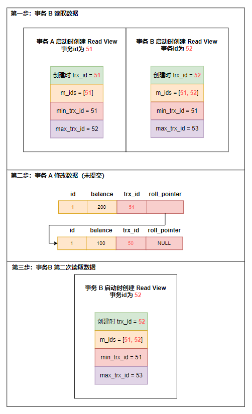
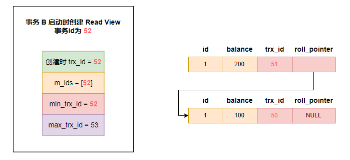
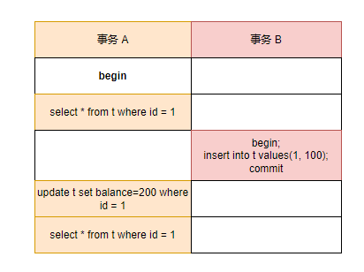

## 事务及四大特性

- 原子性（Atomicity）：指事务包含的所有操作要么全部成功，要么全部失败回滚。

- 一致性（Consistency）：事务必须使数据库**从一个一致性状态变换到另一个一致性状态**，也就是说一个事务执行之前和执行之后都必须处于一致性状态。

- 隔离性（Isolation）：当多个用户并发访问数据库时，比如操作同一张表时，**数据库为每一个用户开启的事务，不能被其他事务的操作所干扰，多个并发事务之间要相互隔离**。

- 持久性（Durability）：一个事务一旦被提交了，那么对数据库中的数据的改变就是永久性的，即便是在数据库系统遇到故障的情况下也不会丢失提交事务的操作。

事务的ACID是通过「InnoDB 日志和锁来保证」：
- **隔离性**通过「数据库锁的机制」或「MVCC」实现的。
- **持久性**通过「redo log（重做日志）」实现。
- **原子性**通过「undo log（日志回滚）」实现。
- **一致性**通过「持久性」+「原子性」+「隔离性」实现。

「 undo Log 」的原理很简单，为了满足事务的原子性，在操作任何数据之前，**首先将数据备份到一个地方**（这个存储数据备份的地方称为`Undo Log`）。然后进行数据的修改。如果出现了错误或者用户执行了`roll back`语句，系统可以利用`Undo Log`中的备份将数据恢复到事务开始之前的状态。 

和`undo Log`相反，「 redo Log 」记录的是新数据的备份。在事务提交前，只要将`redo Log`持久化即可，不需要将数据持久化。当系统崩溃时，虽然数据没有持久化，但是`redo Log`已经持久化。系统可以根据`redo Log`的内容，将所有数据恢复到最新的状态。

## 事务的隔离性及隔离级别

**事务的隔离性**：当多个线程都开启事务操作数据库中的数据时，数据库系统要能进行隔离操作，以保证各个线程获取数据的准确性。

不考虑**隔离性**会发生的问题：

### 脏读

事务 A 修改一条数据，但还未提交事务；此时事务 B 查询该条数据。但假如事务 A 未提交事务，进行了回滚，则事务 B 读取到的数据就是脏数据。

### 不可重复读

**在一个事务内多次读取同一个数据，出现前后两次读到的数据不一样的情况**。

### 幻读

**在一个事务内多次查询某个符合查询条件的「记录数量」，如果出现前后两次查询到的记录数量不一样的情况，就意味着发生了「幻读」现象。**

## 事务隔离级别

- `Read uncomitted (读未提交)`：最低级别，以上问题均无法解决。**事务中的修改即使没有提交，对其它事务也都是可见的。**
- `Read committed (读已提交)`：读已提交，可避免脏读情况发生。**一个事务从开始直到提交之前，所做的任何修改对其它事务都是不可见的。**也可以叫做不可重复读，因为两次执行同样的查询，可能会得到不一样的结果。
- `Repeatable Read（可重复读）`：保证了在同一个事务中多次读取同样记录的结果是一致的。可以避免脏读和不可重复读，仍会出现幻读问题。可重复读是MySQL默认的事务隔离级别。
- `Serializable （串行化）`：最严格的事务隔离级别，要求所有事务被串行执行，不能并发执行，可避免脏读、不可重复读、幻读情况的发生。	

## Read View 「MVCC」工作机制

> 对于「读提交」和「可重复读」隔离级别的事务来说，它们是通过 Read View 来实现的，它们的区别在于创建 Read View 的时机不同。「读提交」隔离级别是在「每个语句执行前」都会重新生成一个 Read View，而「可重复读」隔离级别是「启动事务时」生成一个 Read View，然后整个事务期间都在用这个 Read View。

### Read View 四个重要的字段：

- **m_ids**：在创建 Read View 时，当前数据库中「活跃事务」的**事务 id 列表**，注意是一个列表。「活跃事务」是指：启动了但还没提交的事务。
- **min_trx_id**：在创建 Read View 时，当前数据库中「活跃事务」中事务 **id 最小的事务**，也就是 m_ids 的最小值。
- **max_trx_id**：这个并不是 m_ids 的最大值，而是**创建 Read View 时当前数据库中应该给下一个事务的 id 值**，也就是全局事务中最大的事务 id 值 + 1。
- **creator_trx_id**：创建该 Read View 的事务的事务 id。

在创建 Read View 后，我们可以将记录中的 trx_id 划分这三种情况：

### 聚簇索引记录中的两个隐藏列

对于使用 InnoDB 存储引擎的数据库表，它的聚簇索引记录中都包含下面两个隐藏列：

- **trx_id**：当一个事务对某条聚簇索引记录进行改动时，就会**把该事务的事务 id 记录在 trx_id 隐藏列里**。
- **roll_pointer**：每次对某条聚簇索引记录进行改动时，都会把旧版本的记录写入到 undo 日志中，然后**这个隐藏列是个指针，指向每一个旧版本记录**，于是就可以通过它找到修改前的记录。

一个事务去访问记录的时候，会进行下面操作：

- 如果记录的 `trx_id `值小于 Read View 中的 `min_trx_id` 值，表示这个版本的记录是在创建 Read View **前**已经提交的事务生成的，所以该版本的记录对当前事务**可见**。
- 如果记录的 `trx_id `值大于等于 Read View 中的 `max_trx_id` 值，表示这个版本的记录是在创建 Read View **后**才启动的事务生成的，所以该版本的记录对当前事务**不可见**。
- 如果记录的 `trx_id `值在 Read View 的 `min_trx_id` 和 `max_trx_id` 之间，需要判断 `trx_id `是否在 `m_ids `列表中：
  - 如果记录的 `trx_id `**在** `m_ids` 列表中，表示生成该版本记录的活跃事务依然活跃着（还没提交事务），所以该版本的记录对当前事务**不可见**。
  - 如果记录的 `trx_id `**不在** `m_ids`列表中，表示生成该版本记录的活跃事务已经被提交，所以该版本的记录对当前事务**可见**。

**这种通过「版本链」来控制并发事务访问同一个记录时的行为就叫 MVCC（多版本并发控制）。**

## 可重复读的原理

**可重复读隔离级别是启动事务时生成一个 Read View，然后整个事务期间都在用这个 Read View**。

假设事务 A（事务 id 为 51 ）启动后，事务 B （事务 id 为 52 ）也启动，分别创建下面 Read View：

在可重复读隔离级别下，进行下面操作：

- 事务 B 读取 id = 1 的记录，得到 balance 为 100。
- 事务 A 将 id = 1 的记录的 balance 修改为 200，但还未提交事务。
- 事务 B 读取 id = 1 的记录，得到 balance 仍是 100。
- 事务 A 提交事务。
- 事务 B 读取 id = 1 的记录，得到 balance 仍是 100。

**分析一下上面过程：**

事务 B 第一次读取  id = 1 的记录时，在找到记录后，会查看该记录的 trx_id，发现是 50，比事务 B 的 Read View 中记录的 min_trx_id 值 51 还小，说明该记录的事务在事务 B 创建之前就已经提交了，该记录对事务 B 是可见的，事务 B 可以获取这条记录。

然后，事务 A 修改了这条记录，将 balance 改为 200（未提交事务），这时 MySQL 会记录 **undo log**，形成**版本链**：

然后事务 B 第二次去读取该记录，发现该记录的 「trx_id 」值为 51，在事务 B 的 Read View 的 「min_trx_id」和 「max_trx_id」之间，需要判断 「trx_id」 值是否在 「m_ids」 列表里面，判断的结果是在里面，说明这条记录是**还未被提交的事务**修改的，对事务 B 是不可见的，所以事务 B 不会读取这个版本的记录，而是沿着 「undo log」链条向下寻找旧版本的记录，直到找到「trx_id 小于」事务 B 的 Read View 中 「min_trx_id」值的第一条记录。

所以事务 B 第二次只能读取到 「trx_id」为 50 的 balance 值为 100 的这条记录。

最后，当事物 A 提交事务后，由于隔离级别是「可重复读」，所以事务 B 再次读取记录时，还是**基于启动事务时创建的 Read View** 来判断当前版本的记录是否可见。所以，即使事物 A 将 balance 修改为 200 并提交了事务， 事务 B 第三次读取记录时，读到的记录都是 balance 是 100 的这条记录。

## 读已提交的原理

**读提交隔离级别是在每次读取数据时，都会生成一个新的 Read View**。

也意味着，事务期间的多次读取同一条数据，前后两次读的数据可能会出现不一致，因为可能这期间另外一个事务修改了该记录，并提交了事务。

以上面例子继续：

假设事务 A （事务 id 为 51）启动后，紧接着事务 B （事务 id 为 52）也启动了，接着按顺序执行了以下操作：

- 事务 B 读取数据（创建 Read View），balance 为 100 。
- 事务 A 修改数据（还没提交事务），balance 从 100 修改为 200。
- 事务 B 读取数据（创建 Read View），balance 还是 100 。
- 事务 A 提交事务。
- 事务 B 读取数据（创建 Read View），balance 变成 200。

事务 B 第二次在找到这条记录时，会看这条记录的 trx_id 是 51，在事务 B 的 Read View 的 min_trx_id 和 max_trx_id 之间，接下来需要判断 trx_id 值是否在 m_ids 范围内，判断的结果是在的，那么说明**这条记录是被还未提交的事务修改的，这时事务 B 并不会读取这个版本的记录**。而是，沿着 undo log 链条往下找旧版本的记录，直到找到 trx_id 「小于」事务 B 的 Read View 中的 min_trx_id 值的第一条记录，所以事务 B 能读取到的是 trx_id 为 50 的记录，也就是 balance 为 100 的这条记录。

**接着，分析下为什么事务 A 提交后，事务 B 就可以读到事务 A 修改的数据？**

在事务 A 提交后，**由于隔离级别是「读提交」，所以事务 B 在每次读数据的时候，会重新创建 Read View**，此时事务 B 第三次读取数据时创建的 Read View 如下：

事务 B 在找到这条记录时，**会发现这条记录的 trx_id 是 51，比事务 B 的 Read View 中的 min_trx_id 值（52）还小，这意味着修改这条记录的事务早就在创建 Read View 前提交过了，所以该版本的记录对事务 B 是可见的**。

正是因为在**读提交隔离级别**下，**事务每次读数据时都重新创建 Read View**，那么在事务期间的多次读取同一条数据，前后两次读的数据可能会出现不一致，因为可能这期间另外一个事务修改了该记录，并提交了事务。

## 如何解决幻读

InnoDB 引擎的默认隔离级别虽然是「可重复读」，但是它很大程度上避免幻读现象（并不是完全解决了），解决的方案有两种：

- 针对**快照读**（普通 `select` 语句），是**通过 MVCC 方式解决了幻读**。因为可重复读隔离级别下，事务执行过程中看到的数据，一直跟这个事务启动时看到的数据是一致的，即使中途有其他事务插入了一条数据，是查询不出来这条数据的，所以就很好了避免幻读问题。
- 针对**当前读**（`select ... for update` 等语句），是**通过 next-key lock（记录锁+间隙锁）方式解决了幻读**，因为当执行 `select ... for update` 语句的时候，会加上 `next-key lock`，如果有其他事务在 `next-key lock` 锁范围内插入了一条记录，那么这个插入语句就会被阻塞，无法成功插入，所以就很好了避免幻读问题。

> 幻读定义：
>
> 当同一个查询在不同的时间产生不同的结果集时，事务中就会出现所谓的幻象问题。例如，如果 SELECT 执行了两次，但第二次返回了第一次没有返回的行，则该行是“幻读”行。

### 快照读如何避免幻读

可重复读隔离级是由 MVCC（多版本并发控制）实现的（具体实现可见上文），实现的方式是开始事务后（执行 begin 语句后），在执行第一个查询语句后，会创建一个 Read View，**后续的查询语句利用这个 Read View，通过这个 Read View 就可以在 undo log 版本链找到事务开始时的数据，所以事务过程中每次查询的数据都是一样的**，即使中途有其他事务插入了新纪录，是查询不出来这条数据的，所以就很好了避免幻读问题。

### 当前读如何避免幻读

MySQL 里除了普通查询是快照读，其他都是**当前读**，比如 `update`、`insert`、`delete`，这些语句执行前都会查询最新版本的数据，然后再做进一步的操作。

**Innodb 引擎为了解决「可重复读」隔离级别使用「当前读」而造成的幻读问题，就引出了间隙锁**。

假设，表中有一个范围 id 为（3，5）间隙锁，那么其他事务就无法插入 id = 4 这条记录了，这样就有效的防止幻读现象的发生。

【举一个例子】

事务 A 执行：`select * from t where id > 3 for update`

事务 B 执行：`insert into t values (5, .....)`

当事务 A 执行了语句后，就对表中的 id > 3 的记录，加上了 **next-key lock**。然后事务 B 在执行插入语句时，判断插入的位置被事务 A 加了 **next-key lock**，事务 B 会生成一个插入意向锁，进入等待状态，直到事务 A 提交了事务。

### 幻读场景1

在可重复读隔离级别下：事务 A 第一次执行普通的 select 语句时生成了一个 ReadView，之后事务 B 向表中新插入了一条 id = 1 的记录并提交。接着，事务 A 对 id = 1 这条记录进行了更新操作，在这个时刻，这条新记录的 trx_id 隐藏列的值就变成了事务 A 的事务 id，之后事务 A 再使用普通 select 语句去查询这条记录时就可以看到这条记录了，于是就发生了幻读。

### 幻读场景2

- T1 时刻：事务 A 先执行「快照读语句」：`select * from t_test where id > 100` 得到了 3 条记录。
- T2 时刻：事务 B 往插入一个 `id= 200` 的记录并提交；
- T3 时刻：事务 A 再执行「当前读语句」 `select * from t_test where id > 100 for update` 就会得到 4 条记录，此时也发生了幻读现象。

要避免这类特殊场景下发生幻读的现象的话：**就尽量在开启事务之后，马上执行 `select ... for update` 这类当前读的语句**。

## 参考

 - [MySQL可重复读解决了幻读吗](https://xiaolincoding.com/mysql/transaction/phantom.html)

