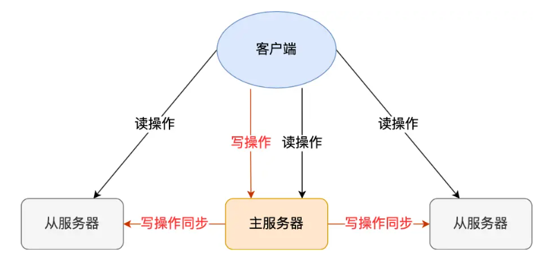
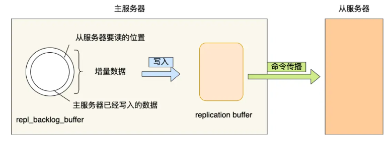

## 主从复制

主服务器：读写操作，当发生写操作时自动将写操作同步给从服务器。

从服务器：一般是只读，并接受主服务器同步过来写操作命令，然后执行这条命令。



主服务器：数据修改操作，同步数据到从服务器。**命令复制是异步的**。

主服务器收到新的写命令后，会发送给从服务器。但是，主服务器并不会等到从服务器实际执行完命令后，再把结果返回给客户端，而是主服务器自己在本地执行完命令后，就会向客户端返回结果了。如果从服务器还没有执行主服务器同步过来的命令，主从服务器间的数据就不一致了。

所以，无法实现强一致性保证（主从数据时时刻刻保持一致），数据不一致是难以避免的。

### 初次同步

**问题一： 如何确定主从关系？**

可以使用 `replicaof`（Redis 5.0 之前使用 `slaveof`）命令形成主服务器和从服务器的关系。

比如，现在有服务器 A 和 服务器 B，我们在服务器 B 上执行下面这条命令：

```text
# 服务器 B 执行这条命令
replicaof <服务器 A 的 IP 地址> <服务器 A 的 Redis 端口号>
```

接着，服务器 B 就会变成服务器 A 的「从服务器」，然后与主服务器进行第一次同步。

主从服务器间的第一次同步的过程可分为三个阶段：

- 第一阶段：建立链接、协商同步。
- 第二阶段：主服务器同步数据给从服务器。
- 第三阶段：主服务器发送新写操作命令给从服务器。


#### 第一阶段

> **建立链接，协商同步**

执行了 `replicaof` 命令后，从服务器就会给主服务器发送 `psync` 命令，表示要进行数据同步。

`psync` 命令包含两个参数，分别是**主服务器的 runID** 和**复制进度 offset**。

- runID：每个 Redis 服务器在启动时都会自动生产一个随机的 ID 来唯一标识自己。当从服务器和主服务器第一次同步时，因为不知道主服务器的 run ID，所以将其设置为 "?"。
- offset：表示复制的进度，第一次同步时，其值为 -1。

主服务器收到 psync 命令后，会用 `FULLRESYNC` 作为响应命令返回给对方。

并且这个响应命令会带上两个参数：主服务器的 runID 和主服务器目前的复制进度 offset。从服务器收到响应后，会记录这两个值。

FULLRESYNC 响应命令的意图是采用**全量复制**的方式，也就是主服务器会把所有的数据都同步给从服务器。

所以，第一阶段的工作时为了全量复制做准备。

#### 第二阶段

> **主服务器传递文件到从服务器**

接着，主服务器会执行 `bgsave` 命令来生成 RDB 文件，然后把文件发送给从服务器。

从服务器收到 RDB 文件后，会先清空当前的数据，然后载入 RDB 文件。

前面已经提到，主服务器生成 RDB 这个过程主线程不会阻塞，`bgsave`命令是产生了一个子进程来做生成 RDB 文件的工作，是异步工作的，这样 Redis 依然可以正常处理命令。但是这期间的写操作命令并没有记录到刚生成的 RDB 文件中，这时主从服务器数据就不一致了。

为了保证主从数据一致性，主服务器会将下面三个时间的写命令，写入到 **replication buffer** 缓冲区里：

- 主服务器生成 RDB 文件期间。
- 主服务器发送 RDB 文件给从服务器期间。
- 从服务器加载 RDB 文件期间。

#### 第三阶段

> **主服务器发送新写操作命令给从服务器**

接着，主服务器将 **replication buffer** 缓冲区里所记录的写操作命令发送给从服务器，从服务器执行来自主服务器 replication buffer 缓冲区里发来的命令，这时主从服务器的数据就一致了。

### 命令传播

> 主从服务器在完成第一次同步后，双方之间就会维护一个 TCP **长连接**。


后续主服务器可以通过这个连接继续将写操作命令传播给从服务器，然后从服务器执行该命令，使得与主服务器的数据库状态相同。

而且这个连接是长连接的，目的是避免频繁的 TCP 连接和断开带来的性能开销。

上面的这个过程被称为**基于长连接的命令传播**，通过这种方式来保证第一次同步后的主从服务器的数据一致性。

### 分摊主服务器压力

主服务器是可以有多个从服务器的，如果从服务器数量非常多，而且都与主服务器进行全量同步的话，就会带来两个问题：

- 由于是通过 bgsave 命令来生成 RDB 文件的，那么主服务器就会忙于创建子进程，如果主服务器的内存数据非常大，在s生成 RDB 文件时是会阻塞主线程的，从而使得 Redis 无法正常处理请求。
- 传输 RDB 文件会占用主服务器的网络带宽，会对主服务器响应命令请求产生影响。


通过这种方式，**主服务器生成 RDB 和传输 RDB 的压力可以分摊到充当经理角色的从服务器**。

在「从服务器」上执行下面这条命令，使其作为目标服务器的从服务器：

```text
replicaof <目标服务器的IP> 6379
```

此时如果目标服务器本身也是「从服务器」，那么该目标服务器就会成为「经理」的角色，不仅可以接受主服务器同步的数据，也会把数据同步给自己旗下的从服务器，从而减轻主服务器的负担。

### 增量复制

> 主从服务器在完成第一次同步后，就会基于长连接进行命令传播。但链接断开了怎么办呢？

在 Redis 2.8 之前，如果主从服务器在命令同步时出现了网络断开又恢复的情况，从服务器就会和主服务器重新进行一次**全量复制**，很明显这样的开销太大了，必须要改进一波。

所以，从 Redis 2.8 开始，网络断开又恢复后，从主从服务器会采用**增量复制**的方式继续同步，也就是只会把网络断开期间主服务器接收到的写操作命令，同步给从服务器。

网络恢复后的增量复制过程如下图：


主要有三个步骤：

- 从服务器在恢复网络后，会发送 `psync` 命令给主服务器，此时的 `psync` 命令里的 offset 参数不是 **-1**。
- 主服务器收到该命令后，然后用 `CONTINUE` 响应命令告诉从服务器接下来采用增量复制的方式同步数据。
- 然后主服务将主从服务器断线期间，所执行的写命令发送给从服务器，然后从服务器执行这些命令。

***

**问题：主服务器怎么知道要将哪些增量数据发送给从服务器呢？**

- **repl_backlog_buffer**：是一个「**环形**」缓冲区，用于主从服务器断连后，从中找到差异的数据。
- **replication offset**：标记上面那个缓冲区的同步进度，主从服务器都有各自的偏移量，主服务器使用 `master_repl_offset` 来记录自己「*写*」到的位置，从服务器使用 `slave_repl_offset` 来记录自己「*读*」到的位置。

***

**问题：repl_backlog_buffer 缓冲区是什么时候写入的呢？**

主服务器进行命令传播时，不仅会将写命令发送给从服务器，还会将写命令写入到 **repl_backlog_buffer** 缓冲区里，因此这个缓冲区里会保存着最近传播的写命令。

***

**【增量同步原理】**

网络断开后，当从服务器重新连上主服务器时，从服务器会通过 psync 命令将自己的复制偏移量 **slave_repl_offset** 发送给主服务器，主服务器根据自己的 **master_repl_offset** 和 **slave_repl_offset** 之间的差距，然后来决定对从服务器执行哪种同步操作：

- 如果判断出从服务器要读取的数据还在 **repl_backlog_buffer** 缓冲区里，那么主服务器将采用**增量同步**的方式；
- 相反，如果判断出从服务器要读取的数据已经不存在 **repl_backlog_buffer** 缓冲区里（缓存区可以覆盖），那么主服务器将采用**全量同步**的方式。

当主服务器在 **repl_backlog_buffer** 中找到主从服务器差异（增量）的数据后，就会将增量的数据写入到 **replication buffer** 缓冲区，这个缓冲区我们前面也提到过，它是缓存将要传播给从服务器的命令。



**repl_backlog_buffer** 缓行缓冲区的默认大小是 **1M**，并且由于它是一个环形缓冲区，所以当缓冲区写满后，主服务器继续写入的话，就会覆盖之前的数据。

因此，当主服务器的写入速度远超于从服务器的读取速度，缓冲区的数据一下就会被覆盖。

那么在网络恢复时，如果从服务器想读的数据已经被覆盖了，主服务器就会采用全量同步，这个方式比增量同步的性能损耗要大很多。

**为了避免在网络恢复时，主服务器频繁地使用全量同步的方式，可以调整下 repl_backlog_buffer 缓冲区大小，尽可能的大一些**，减少出现从服务器要读取的数据被覆盖的概率，从而使得主服务器采用增量同步的方式。

***

**问题：repl_backlog_buffer 缓冲区具体要调整到多大呢**

> 计算公司： repl_backlog_buffer  = second * write_size_per_second 

- second 为从服务器断线后重新连接上主服务器所需的平均 时间(以秒计算)。
- write_size_per_second 则是主服务器平均每秒产生的写命令数据量大小。

举个例子：如果主服务器平均每秒产生 1 MB 的写命令，而从服务器断线之后平均要 5 秒才能重新连接主服务器。

那么 repl_backlog_buffer 大小就不能低于 5 MB，否则新写地命令就会覆盖旧数据了。

当然，为了应对一些突发的情况，可以将 repl_backlog_buffer 的大小设置为此基础上的 2 倍，也就是 10 MB。

关于 repl_backlog_buffer 大小修改的方法，只需要修改配置文件里下面这个参数项的值就可以。

```shell
repl-backlog-size 1mb
```

### 小结

下面简单一张图总结一下主从复制过程：


### 主从异步复制丢失解决方案

对于 Redis 主节点与从节点之间的数据复制，是异步复制的，当客户端发送写请求给主节点的时候，客户端会返回 ok，接着主节点将写请求异步同步给各个从节点，但是如果此时主节点还没来得及同步给从节点时发生了断电，那么主节点内存中的数据会丢失。

【减少异步复制的数据丢失的方案】

通过配置下面两个参数，来减少同步异常情况下更多的数据丢失。

```bash
# 组合使用：主节点连接的从节点中至少有 N 个从节点，「并且」主节点进行数据复制时消息延迟不能超过 T 秒
min-slaves-to-write : 2   # 主节点必须要有至少 x 个从节点连接，如果小于这个数，主节点会禁止写数据。
min-slaves-max-lag: 10	# 主从数据复制和同步的延迟不能超过 x 秒，如果主从同步的延迟超过 x 秒，主节点会禁止写数据。
```

对于客户端，发现 master 不可写入后，可以采取降级措施，将该阶段数据写入本地缓存或者更可靠的消息队列，然后在主服务器可用后，将数据重新写入 master。

### 集群脑裂导致数据丢失

> 如果主节点的网络突然发生了问题，它与所有的从节点都失联了，但是此时的主节点和客户端的网络是正常的，这个客户端并不知道 Redis 内部已经出现了问题，还在照样的向这个失联的主节点写数据（过程A），此时这些数据被主节点缓存到了缓冲区里，因为主从节点之间的网络问题，这些数据都是无法同步给从节点的。
>
> 这时，哨兵也发现主节点失联了，它就认为主节点挂了（但实际上主节点正常运行，只是网络出问题了），于是哨兵就会在从节点中选举出一个 leeder 作为主节点，这时集群就有两个主节点了 —— **脑裂出现了**。

由于网络问题，集群节点之间失去联系。主从数据不同步；哨兵重新平衡选举，产生两个主服务。等网络恢复，旧主节点会降级为从节点，再与新主节点进行同步复制的时候，由于会从节点会清空自己的缓冲区，所以导致之前客户端写入的数据丢失了。

【减少脑裂的方案】

当主节点发现「从节点下线的数量太多（说明主节点与从节点失去联系）」，或者「网络延迟太大」的时候，那么主节点会禁止写操作，直接把错误返回给客户端。

可以配置下面两个参数：

```bash
# 组合使用：主节点连接的从节点中至少有 N 个从节点，「并且」主节点进行数据复制时消息延迟不能超过 T 秒
min-slaves-to-write : 2   # 主节点必须要有至少 x 个从节点连接，如果小于这个数，主节点会禁止写数据。
min-slaves-max-lag: 10	# 主从数据复制和同步的延迟不能超过 x 秒，如果主从同步的延迟超过 x 秒，主节点会禁止写数据。
```

即使主节点假故障，那么在假故障期间主节点也不能与从节点同步，这样就满足上面两个条件。原主节点就会被限制接收客户端写请求。等到新主节点上线后，就只有新节点能接受客户端写请求。这样即使原主节点被哨兵降为从节点数据在同步时被清空，也不会丢失新的数据。

### 面试题链接

参考一下文章：

- https://www.xiaolincoding.com/redis/cluster/master_slave_replication.html#%E9%9D%A2%E8%AF%95%E9%A2%98