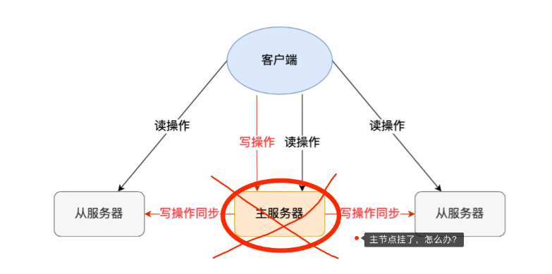
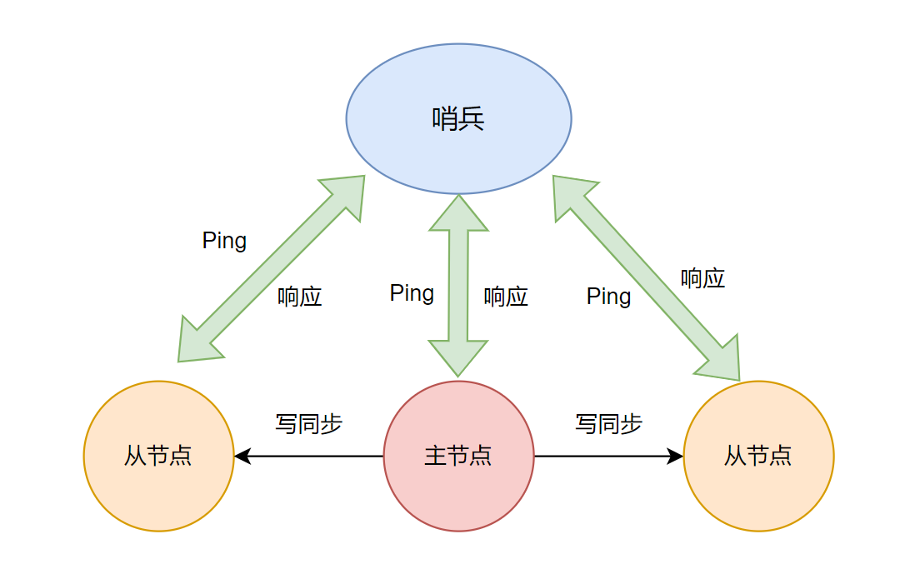
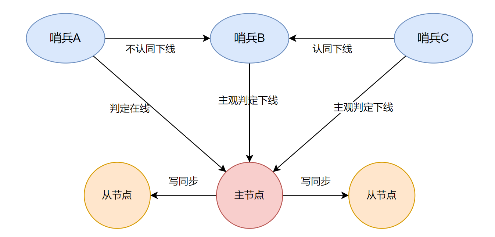
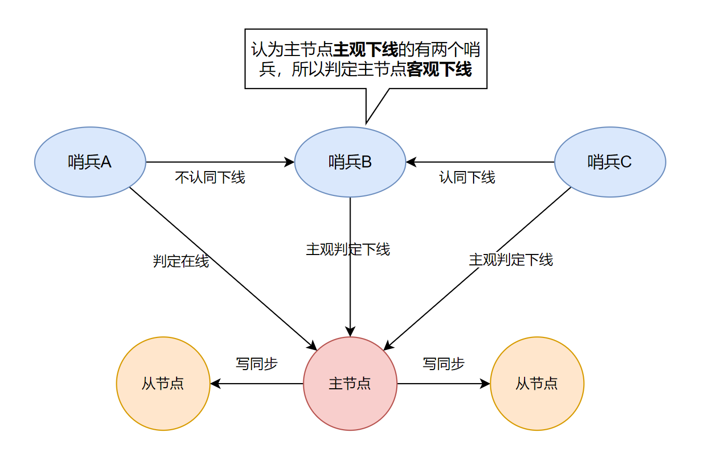
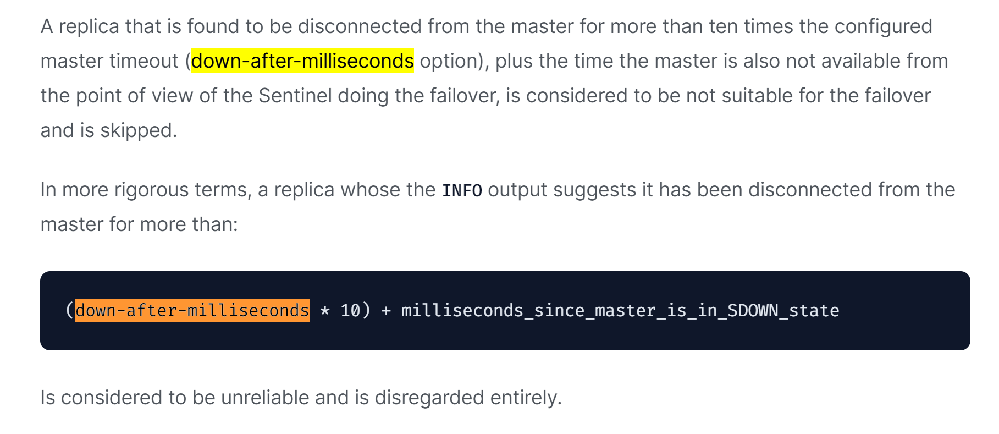
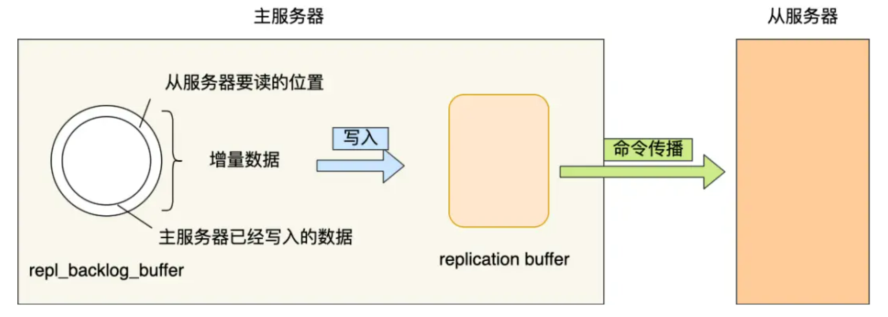
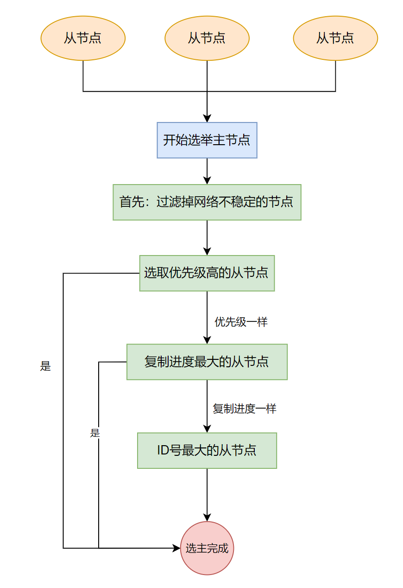

## 哨兵模式

在使用 Redis 主从服务的时候，会有一个问题，就是当 Redis 的主从服务器出现故障宕机时，需要手动进行恢复。

为了解决这个问题，Redis 增加了哨兵模式**Redis Sentinel**，因为哨兵模式做到了可以监控主从服务器，并且提供**主从节点故障转移的功能。**



### 哨兵机制

哨兵主要职责：

- **监控**：如何监控？如何判断主节点是否真的故障？
- **选主**：根据什么规则切换主节点？
- **通知**：如何把新主节点信息通知给从节点和客户端？

下面一个个来回答上面问题。

### 如何判断节点真的故障？



如果主节点或者从节点没有在规定的时间内响应哨兵的 PING 命令，哨兵就会将它们标记为「**主观下线**」。这个「规定的时间」是配置项 `down-after-milliseconds` 参数设定的，单位是毫秒。

【**客观下线呢？**】

**主观下线**：主节点可能并没有故障，有可能是因为压力大或者网络不稳定，导致在规定时间内没有响应哨兵的 PING 命令。

所以为了防止误杀主节点，哨兵就不能是一个节点，而是需要多个哨兵部署成**哨兵集群**（最少需要三台机器）。通过多个哨兵来判断主节点是否真的下线，就可以避免一个哨兵的误判断。

**客观下线**：

当一个哨兵判断主节点为「主观下线」后，就会向其他哨兵发起命令，其他哨兵收到这个命令后，就会根据自身和主节点的网络状况，做出赞成投票或者拒绝投票的响应。



当这个哨兵的赞同票数达到哨兵配置文件中的 **quorum** 配置项设定的值后，这时主节点就会被该哨兵标记为「客观下线」。

例如：现在有 3 个哨兵，**quorum** 配置的是 2，那么一个哨兵需要 2 张赞成票，就可以标记主节点为**客观下线**了。这 2 张赞成票包括自己的一票。

> :bulb: quorum 的值一般设置为哨兵个数的二分之一加 1，例如 3 个哨兵就设置 2。

哨兵判断完主节点客观下线后，哨兵就要开始在多个「从节点」中，选出一个从节点来做新主节点。

### 如何进行主从故障转移？

前面已经讲到哨兵是以集群方式存在，那么由哪个哨兵来进行主从故障转移呢？

所以需要在哨兵集群中选举一个 **Leader**，让 **Leader** 执行主从切换。

#### 如何选举哨兵 Leader

**第一步：先成为候选者：**

哪个哨兵节点判断主节点为「客观下线」，这个哨兵节点就是候选者，所谓的候选者就是想当 **Leader** 的哨兵。

【示例】：假设有三个哨兵。当哨兵 B 先判断到主节点「主观下线后」，就会给其他实例发送 **is-master-down-by-addr** 命令。接着，其他哨兵会根据自己和主节点的网络连接情况，做出赞成投票或者拒绝投票的响应。



当哨兵 B 收到赞成票数达到哨兵配置文件中的 **quorum** 配置项设定的值后，就会将主节点标记为「客观下线」，此时的哨兵 B 就是一个 Leader 候选者。

**第二步：成为 Leader**

候选者会向其他哨兵发送命令，表明希望成为 **Leader** 来执行主从切换，并让所有其他哨兵对它进行投票。

哨兵投票限制条件：

- 每个哨兵只有一次投票机会。
- 可以投给自己或投给别人，但是只有候选者才能把票投给自己。

在投票过程中，任何一个「候选者」，要满足两个条件：

- 拿到半数以上的赞成票。
- 拿到的票数同时还需要大于等于哨兵配置文件中的 **quorum** 值。

【示例】：假设哨兵节点有 3 个，**quorum** 设置为 2，那么任何一个想成为 **Leader** 的哨兵只要拿到 2 张赞成票，就可以选举成功了。如果没有满足条件，就需要重新进行选举。

> 问题：如果某个时间点，刚好有两个哨兵节点判断到主节点为客观下线，那这时不就有两个候选者了？这时该如何决定谁是 Leader 呢？
>
> 1. 每位候选者都会先给自己投一票，然后向其他哨兵发起投票请求。
>
> 2. 如果投票者先收到「候选者 A」的投票请求，就会先投票给它，如果投票者用完投票机会后，收到「候选者 B」的投票请求后，就会拒绝投票。
>
> 3. 这时，候选者 A 先满足了上面的那两个条件，所以「候选者 A」就会被选举为 Leader。

#### 为何哨兵至少要有3个

如果哨兵集群中只有 2 个哨兵节点，此时如果一个哨兵想要成功成为 Leader，必须获得 2 票，而不是 1 票。

所以，如果哨兵集群中有个哨兵挂掉了，那么就只剩一个哨兵了，如果这个哨兵想要成为 Leader，这时票数就没办法达到 2 票，就无法成功成为 Leader，这时是无法进行主从节点切换的。

因此，通常我们至少会配置 3 个哨兵节点。这时，如果哨兵集群中有个哨兵挂掉了，那么还剩下两个哨兵，如果这个哨兵想要成为 Leader，这时还是有机会达到 2 票的，所以还是可以选举成功的，不会导致无法进行主从节点切换。

如果 3 个哨兵节点，挂了 2 个怎么办？这个时候得人为介入了，或者增加多一点哨兵节点。

### 小结

- 判断主节点下线的票数只需要大于等于  **quorum** 即可。

- 哨兵选举为 Leader 的票数要超过半数，并且大于等于 **quorum**。

- **quorum 的值建议设置为哨兵个数的二分之一加 1**，例如 3 个哨兵就设置 2，5 个哨兵设置为 3，而且**哨兵节点的数量应该是奇数**。

### 主从故障转移的过程

在哨兵集群中通过投票的方式，选举出了哨兵 Leader 后，就可以进行主从故障转移。

主从故障转移操作包含以下四个步骤：

- 第一步：在已下线主节点（旧主节点）属下的所有「从节点」里面，挑选出一个从节点，并将其转换为主节点。
- 第二步：让已下线主节点属下的所有「从节点」修改复制目标，修改为复制「新主节点」。
- 第三步：将新主节点的 IP 地址和信息，通过「发布者/订阅者机制」通知给客户端。
- 第四步：继续监视旧主节点，当这个旧主节点重新上线时，将它设置为新主节点的从节点。

#### 步骤一：选出新主节点

【**问题：到底选择哪个从节点作为新主节点**】

随机方式：实现简单，但万一又选取到一个网络状态不好的节点，又得需要进行故障转移。

所以，在选举之前，需要先把网络状态不好的节点和音下线的节点过滤掉。

【**如何判断节点网络连接状态不好呢**】

根据 `down-after-milliseconds` 配置主从节点断连的最大超时时间，在规定毫秒内，主从节点没有连接上，就认为主从节点断开连接。如果断连发生超过**10** 次，就认为该从节点网络状况不好，不适合作为新主节点。



##### 选举优先级

从三个步骤进行选举主节点：**优先级**、**主从复制进度**、**Run ID号**

- 第一步：哨兵首先会根据从节点的优先级来进行排序，优先级越小排名越靠前。优先级由 `slave-priority` 配置。
- 第二步：如果优先级相同，则查看复制的下标，哪个从「主节点」接收的复制数据多，哪个就靠前。
- 第三步：如果优先级和下标都相同，就选择从节点 ID 较小的那个。

【**第一步：优先级高的节点胜出**】

Redis 有个叫 `slave-priority` 配置项，可以给从节点设置优先级。

每一台从节点的服务器配置不一定是相同的，可以根据服务器性能配置（内存、CPU等）来设置从节点的优先级。

【**第二步：复制进度靠前节点胜出**】

在第一步中，如果两个节点的优先级一致，则比较从主节点同步数据的进度。

在主从架构中，主节点会用 **master_repl_offset** 记录当前的最新写操作在 **repl_backlog_buffer** 中的位置（如下图中的「主服务器已经写入的数据」的位置），而从节点会用 **slave_repl_offset** 这个值记录当前的复制进度（如下图中的「从服务器要读的位置」的位置）。



如果某个从节点的 **slave_repl_offset** 最接近 **master_repl_offset**，说明它的复制进度是最靠前的，于是就可以将它选为新主节点。

【第三步：ID 号小的节点胜出】

在第二步中，如果两个节点的复制进度是一致的，则比较两个节点的 ID 号，小的 ID 号胜出。

ID 号就是每个从节点的编号。

【总结一下上述步骤】



在选举出从节点后，哨兵 leader 向被选中的从节点发送 `SLAVEOF no one` 命令，让这个从节点解除从节点的身份，将其变为新主节点。

在发送 `SLAVEOF no one` 命令之后，哨兵 leader 会以每秒一次的频率向被升级的从节点发送 `INFO` 命令（没进行故障转移之前，`INFO` 命令的频率是每十秒一次），并观察命令回复中的角色信息，当被升级节点的角色信息从原来的 slave 变为 master 时，哨兵 leader 就知道被选中的从节点已经顺利升级为主节点了。

#### 步骤二：将从节点指向新主节点

新主节点出现后，哨兵 Leader 下一步需要将「从节点」指向新的「主节点」。可以通过向「从节点」发送 `SLAVEOF` 命令实现。

#### 步骤三：通知客户端更换主节点

前面两步已经选举出主节点，并且已经将从节点指向新的主节点。下面如何将新节点的信息通知给客户端呢？

主要通过 Redis 的「发布者/订阅者」机制来实现。每个哨兵节点提供「发布者/订阅者」机制，客户端可以从哨兵订阅信息。

> :bulb: 具体可以订阅的信息可以参考官方文档： https://redis.io/docs/management/sentinel/#pubsub-messages

下面列举一些常见的信息：

- **+reset-master** ：重置主节点。
- **+slave** ： 新从节点被检测到。
- **+slave-reconf-sent**：哨兵 Leader 发送 `REPLICAOF` 命令配置从节点。
- **+slave-reconf-inprog**：从节点配置了新的主节点，但是还未同步。
- **+slave-reconf-done** ：从节点配置新节点，并已经同步完成。
- **+sdown**：实例进入『主观下线 』状态。
- **-sdown**：实例退出『 主观下线』状态。
- **+odown**：实例进入『 客观下线』状态。
- **-odown**：实例退出『 客观下线』状态。
- **switch-master**：主节点地址发生变化。

客户端和哨兵建立连接后，客户端会订阅哨兵提供的频道。**主从切换完成后，哨兵就会向 `+switch-master` 频道发布新主节点的 IP 地址和端口的消息，这个时候客户端就可以收到这条信息，然后用这里面的新主节点的 IP 地址和端口进行通信了**。

通过「发布者/订阅者」机制，客户端就可以监控到主从节点切换过程中发送的各个事件。

#### 步骤四：将旧主节点该为从节点

哨兵继续监视旧主节点，当旧主节点重新上线时，哨兵集群就会向它发送 `SLAVEOF` 命令，让它成为新主节点的从节点。

### 哨兵集群如何组成

> 官方文档：[Sentinels and replicas auto discovery](https://redis.io/docs/management/sentinel/#sentinels-and-replicas-auto-discovery)

设置哨兵的命令如下，并不需要设置其他哨兵的信息，那么哨兵集群之间是如何感知异常的呢？

```bash
sentinel monitor <master-name> <ip> <port> <quorum>
```

在「发布者/订阅者」机制中，有这个消息：`__sentinel__:hello`，每个新哨兵都会把自己的 IP 和端口信息发布到该频道上，其他的哨兵订阅这个频道，然后与新哨兵建立连接。

『 哨兵如何知道从节点信息？』

哨兵通过 `PING` 命令来探活主节点和其他哨兵节点。

通过 `INFO` 命令从主节点和其他哨兵中获取详细的节点信息：

- 对于主节点，`INFO` 命令的输出包括关于「主节点」自身的信息，以及关于连接到它的所有从节点的信息。
- 对于从节点，`INFO` 命令的输出包括有关「从节点」自身的信息，以及关于它的主节点的信息。

