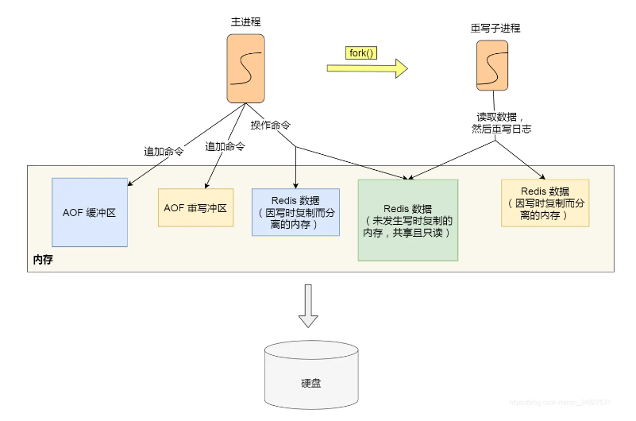

## Redis 持久化

### 如何实现数据不丢失

> Redis 的读写操作都是在内存中，所以 Redis 性能才会高，但是当 Redis 重启后，内存中的数据就会丢失，那为了保证内存中的数据不会丢失，Redis 实现了数据持久化的机制，这个机制会把数据存储到磁盘，这样在 Redis 重启就能够从磁盘中恢复原有的数据。

Redis 共有三种数据持久化的方式：

- **AOF 日志**：每执行一条写操作命令，就把该命令以追加的方式写入到一个文件里。
- **RDB 快照**：将某一时刻的内存数据，以二进制的方式写入磁盘。
- **混合持久化方式**：Redis 4.0 新增的方式，集成了 AOF 和 RBD 的优点。

### AOF 持久化

AOF持久化是通过保存Redis服务器所执行的写命令来记录数据库状态的。

> 优点：
>
> 1. 每一次修改都同步，文件完成性更好
> 2. 每秒同步一次，可能会丢失一秒数据
>
> 缺点：
>
> 1. 相对于文件大小，aof远远大于rdb，修复速度也比rdb慢
> 2. aof运行效率比rdb慢

#### AOF持久化的实现

 

**命令追加**

AOF打开后，服务器在写完一个命令之后，会以协议格式将被执行的写命令追加到服务器状态的 aof_buf 缓冲区末尾。

**先执行命令，再写入日志**

**好处**：

- **避免额外检查开销**。假如先写入 AOF 日志，再执行命令，如果该命令语法有问题，不进行语法检查的话，在使用日志恢复数据时就会出错。
- **不会因写入日志阻塞当前写操作命令的执行**：因为当写操作命令执行成功后，才会将命令记录到 AOF 日志。

**风险**：

- **数据可能会丢失：** 执行写操作命令和记录日志是两个过程，那当 Redis 在还没来得及将命令写入到硬盘时，服务器发生宕机了，这个数据就会有丢失的风险。
- **可能阻塞其他操作：** 由于写操作命令执行成功后才记录到 AOF 日志，所以不会阻塞当前命令的执行，但因为 AOF 日志也是在主线程中执行，所以当 Redis 把日志文件写入磁盘的时候，还是会阻塞后续的操作无法执行。

#### AOF 写回策略

Redis 写入 AOF 过程如下图：


通过配置`appendfsync`选项的值直接决定AOF持久化功能的效率和安全性。

- 值为`always`时，服务器每个事件循环都要将`aof_buf`缓冲区中的内容写入到AOF文件，并且同步AOF文件。`always`的效率最低，但是安全性最高。
- 值为`everysec`时，服务器在每个事件循环都将`aof_buf`缓冲区中所有内容写入到AOF文件，并且每隔一秒就要在子线程中对AOF文件进行一次同步。效率上足够快，就算故障，**最多会丢失2秒数据**。
- 值为`no`时，服务器在每个事件循环都将`aof_buf`缓冲区中所有内容写入到AOF文件，至于何时同步，就有操作系统控制。

**为什么最多会丢失2秒数据呢**

除了首次命令写入操作之外，后面所有写入操作，Redis 主线程会负责对比上次 AOF 同步时间：

- 如果距上次同步成功时间在 2 秒内：主线程直接返回。
- 如果距上次同步成功时间超过 2 秒：主线程将调用 AOF 磁盘同步线程进行阻塞，直到磁盘同步操作完成，此时 Redis 不可用。

按照上面规则，主线程在命令写入后会调用系统的`write`操作，`write`执行完成后主线程返回。然后文件同步`fsync`线程每秒调用一次将命令写入磁盘。

问题在于：如果硬盘负载过高，同步操作可能会超过 1 秒，这时如果主线程仍然继续向缓冲区写入命令，硬盘负载会越来越大（`fsync`线程处理不过来）。如果在第 2 秒时 Redis 停机，则最近两秒内的数据将不会写入磁盘，就会丢失。


#### AOF 文件过大重写

随着写操作命令越来越多，AOF 文件也会越来越大，就会带来性能问题，重启 Redis 恢复数据就会很慢。

为了避免 AOF 文件过大，使用了 AOF 重写机制：当 AOF 文件大小超过阈值，就会对 AOF 文件进行压缩。

**原理**：在重写时，读取当前数据库中所有键值对，将每个键值对用一条命令记录到**新 AOF 文件**，全部记录完成后，用新的 AOF 文件替换掉现有的 AOF 文件。

> 示例：
>
> 在没有重写前，假如执行：`set example a` 和 `set example b`这两个命令，就会将这两个命令写入到 AOF 文件。
>
> 重写后：AOF 文件中只有 `set example b` 这一条命令。由此可见进行了压缩。

重写过程是由**子进程**完成的，主进程可以继续处理命令请求。

> 为什么不用线程？
>
> 因为多线程会共享内存，修改数据时需要加锁保证数据安全，就会降低性能。
>
> 而父子进程是共享内存数据的，共享的内存只能以**只读**方式，当父子进程任意一方修改共享内存，就会发生**写时复制**，父子进行就有独立的数据副本，不需要加锁来保证数据安全。简记：**读时共享，写时复制**。

**重写过程中，主进程依然可以正常处理命令**。所以对于同一个 key ，可能会存在主进程和子进程内存数据不一致的情况。

Redis 通过设置 **AOF 重写缓冲区** 来解决上面问题，这个缓冲区在重写子进程创建后使用。

在重写 AOF 期间，当 Redis 执行完一个写命令之后，它会**同时将这个写命令写入到 「AOF 缓冲区」和 「AOF 重写缓冲区」**。



也就是说，在重写子进程执行 AOF 重写期间，主进程需要执行以下三个工作:

- 执行客户端发来的命令。
- 将执行后的写命令追加到 「AOF 缓冲区」。
- 将执行后的写命令追加到 「AOF 重写缓冲区」。

子进程完成 AOF 重写工作，会向主进程发送一条信号。**主进程**收到该信号后，会调用一个信号处理函数，该函数主要做以下工作：

- 将 **AOF 重写缓冲区**中的所有内容追加到新的 AOF 的文件中，使得新旧两个 AOF 文件所保存的数据库状态一致。
- 新的 AOF 的文件进行改名，覆盖现有的 AOF 文件。

> 参考：[AOF 持久化是怎么实现的](https://xiaolincoding.com/redis/storage/aof.html)

### RDB持久化

> 上面介绍的 AOF 持久化记录的是操作命令，在恢复数据时需要将命令再执行一遍，当命令量大时，很耗费时间，恢复数据就很慢。

RDB持久化是把**实际数据生成快照保存到硬盘的过程**，触发RDB持久化过程分为手动触发和自动触发。

在 Redis 恢复数据时， RDB 恢复数据的效率会比 AOF 高些，因为直接将 RDB 文件读入内存就可以，不需要像 AOF 那样还需要额外执行操作命令的步骤才能恢复数据。

#### RDB 快照会阻塞主线程吗

有两个 Redis 命令可以用于生成 RDB 文件，一个是 `SAVE`，另一个是 `BGSAVE`。**区别在于是否在主线程里面执行**。

- `SAVE` 命令会阻塞Redis服务器进程，直到 RDB 文件创建完毕为止，在服务器进程阻塞期间，服务器不能处理任何命令请求，**会阻塞主线程**。

- `BGSAVE `命令会派生出一个子进程，然后由子进程负责创建 RDB 文件。服务器进程（父进程）继续处理命令请求，**不会阻塞主线程**。

RDB 文件的载入工作是在服务器启动时自动执行的，Redis 没有专门用于载入 RDB 文件的命令，只要 Redis 服务器在启动时检测到 RDB 文件存在，它就会自动载入RDB 文件。

> 💡因为 AFO文件的更新频率通常比RDB文件更新频率更高，所以：
>
> - 如果服务器开启了 AOF 持久化功能，那么服务器会优先使用 AOF 文件来还原数据库状态。
> - 只有在 AOF 持久化功能处于关闭状态时，服务器才会使用 RDB 文件来还原数据库状态。


> Redis 的快照是**全量快照**，也就是说每次执行快照，都是把内存中的「所有数据」都记录到磁盘中。所以执行快照是一个比较重的操作，如果频率太频繁，可能会对 Redis 性能产生影响。如果频率太低，服务器故障时，丢失的数据会更多。

#### RDB 执行快照时，数据能修改吗

执行 `bgsave` 过程中，Redis 依然**可以继续处理操作命令**的，也就是数据是能被修改的，关键的技术就在于**写时复制技术（Copy-On-Write, COW）。**

执行 `bgsave` 命令的时候，会通过 `fork()` 创建子进程，此时子进程和父进程是共享同一片内存数据的，因为创建子进程的时候，会复制父进程的页表，但是页表指向的物理内存还是一个，此时如果主线程执行读操作，则主线程和 `bgsave` 子进程互相不影响。


如果主线程执行写操作，则被修改的数据会复制一份副本，然后 `bgsave` 子进程会把该副本数据写入 RDB 文件，在这个过程中，主线程仍然可以直接修改原来的数据。


#### `SAVE`命令执行时服务器状态

当`SAVE`命令执行时，Redis服务器会被阻塞，这时服务器不能处理任何命令请求。

#### `BGSAVE`命令执行时服务器状态

`BGSAVE`命令执行期间，服务器仍可以处理客户端的命令请求。但是，对`SAVE`、`BGSAVE`、`BGREWRITEAOF`这三个命令方式和平时有所不同。

在`BGSAVE`命令执行期间，`SAVE`命令会被服务器拒绝，这是为了避免父进程和子进程同时执行两个`rdbSave`调用，防止产生竞争条件。

在`BGSAVE`命令执行期间，`BGSAVE`命令也会被服务器拒绝，因为通知执行两个`BGSAVE`命令也会产生竞争条件。

最后，`BGREWRITEAOF`和`BGSAVE`两个命令不能同时运行：

- 如果`BGSAVE`命令正在执行，那么客户端发送的`BGREWRITEAOF`命令会被延迟到`BGSAVE`命令执行完毕之后执行。
- 如果`BGREWRITEAOF`命令正在执行，那么客户端发送的`BGSAVE`命令会被服务器拒绝。

#### RDB文件载入时服务器状态

服务器在载入RDB文件期间，会一直处于阻塞状态，直到载入工作完毕为止。

#### 自动间隔性保存

因为`BGSAVE`可以在不阻塞服务器进程下执行，所以允许设置`save`选项，让服务器每隔一段时间自动执行一次`BGSAVE`命令。

可以通过`save`选项设置多个保存条件，但只要其中一个条件被满足，服务器就会执行`BGSAVE`命令。

> 比如下面例子：
>
> - `save 900 1` ：服务器在900秒内，对数据库进行了至少1次修改

『`saveparams`属性 』

`saveparams` 属性是一个数组，数组中的每个元素都是一个 `saveparam` 结构，每个 `saveparam` 结构都保存了一个 `save` 选项设置的保存条件：

```c++
struct saveparam {
    time_t seconds; // 秒数
    int changes;  // 修改数
}
```

##### `dirty` 计数器和 `lastsave` 属性

- `dirty` 计数器记录距离上一次成功执行 `SAVE` 命令或者 `BGSAVE `命令后，服务器对数据库状态（所有数据库）进行了多少次修改（删除，更新，写入等）
- `lastsave` 属性是一个 `UNIX` 时间戳，记录了服务器上一次成功执行 `SAVE` 或者 `BGSAVE` 命令的时间。

```c++
struct redisServer {
    long long dirty;  // 修改计数器
    time_t lastsave;  // 上一次执行保存的时间
}
```

#### 检查保存条件是否满足

Redis周期性操作函数 `serverCron` 默认每隔100毫秒就会执行一次，该函数用于对正在允许的服务器进行维护，它的一项工作就是检查`save`选项所设置的保存条件是否已经满足，如果满足，就会执行 `BGSAVE` 命令。

#### RDB文件结构


- `REDIS` 部分长度为5个字节，保存着`REDIS`五个字符。通过这五个字符，程序在载入文件时，快速检查所载入的文件是否RDB文件。
- `db_version` 长度为4个字节，它的值是一个字符串表示的整数，这个整数记录了RDB文件的版本号。比如`0006`代表RDB文件版本为第六版。
- `database `部分包含零个或任意多个数据库，以及各个数据库中的键值对数据。
  - 如果服务器数据库状态为空，这个部分也为空，长度为0字节。
  - 如果服务器数据库状态为非空（有至少一个数据库非空），那么这个部分也为非空。根据数据库保存的键值对的数量、类型和内容的不同，这个部分长度也会有所不同。
- `EOF` 常量的长度为1字节，标志着RDB文件正文内容的结束，当读入程序遇到这个值的时候，表明所有数据库的所有键值对都已经载入完毕了。
- `check_sum` 是一个8字节长的无符号整数、保存着一个校验和，这个校验和是程序通过对`REDIS`、`db_version`、`databases`、`EOF`四个部分的内容进行计算得出的。服务器在载入RDB文件时，会将载入数据所计算出的校验和与`check_sum`所记录的校验和进行对比，以此来检查RDB文件是否有出错或者损坏的情况出现。

##### **`databases`部分**

一个RDB文件的`databases`部分可以保存任意多个非空数据库。

例如，如果服务器的0号和3号数据库非空，则将创建以下结构RDB文件：


每个`database`都包含数据库所有键值对。

每个非空数据库在RDB文件中都可以保存为`SELECTDB`、`db_number`、`key_value_pairs`三个部分。


- `SELECTDB`常量的长度为1字节，标示将要读入的数据库号码。
- `db_number`保存着一个数据库号码，根据号码大小不同，这个部分长度可以是1字节、2字节、5字节等。当程序读入`db_number`部分后，服务器会调用`SELECT`命令，根据读入的数据库号码进行数据库的切换，使得读入的键值对可以正确载入到数据库中。
- `key_value_pairs`部分保存了数据库中所有键值对数据，如果键值对带有过期时间，则过期时间也会和键值对保存在一起。根据键值对的数量、类型、内容以及是否有过期时间等条件的不同，`key_value_pairs`部分的长度也会有所不同。

##### `key_value_pairs`部分

RDB文件中的每个`key_value_pairs`部分都保存了一个或以上数量的键值对，如果键值对带有过期时间的话，那么键值对的过期时间也会被保存在内。

不带过期时间的键值对如下：


- `TYPE`记录了`value`类型，长度为1字节。
- `KEY`总是一个字符串对象。
- 根据`TYPE`类型不同，以及保存内容长度的不同，保存`value`的结构和长度也会有所不同

带有过期时间的键值对如下：


- `EXPIRETIME_MS`常量的长度为1字节，它告知读入程序，接下来要读入的是一个以毫秒为单位的过期时间。
- `ms`是一个8字节长的带符号整数，记录着一个以毫秒为单位的UNIX时间戳，这个时间戳就是键值对的过期时间。

### 混合持久化

先看看 AOF 和 RDB 各自优点：

RDB 优点是数据恢复速度快，但是快照的频率不好把握。频率太低，丢失的数据就会比较多，频率太高，就会影响性能。

AOF 优点是丢失数据少，但是数据恢复不快。

为了集成了两者的优点， Redis 4.0 提出了**混合使用 AOF 日志和内存快照**，也叫混合持久化，既保证了 Redis 重启速度，又降低数据丢失风险。

**思考**：AOF 恢复数据过程中导致性能慢的地方在于要重新执行一遍命令，那么在恢复数据时能不能不重新执行命令呢？

**混合持久化**发生在 AOF 重写过程中，由于重写过程由子进程执行，不会阻塞主进程，所以子进程现将与主进程共享的内存数据以 RDB 方式写入 AOF 文件，而不是执行命令。然后主进程在该阶段执行的命令会写到**重写缓冲区**，重写缓冲区里面的增量命令仍以 AOF 方式写入 AOF 文件，最后通知主进程将含有 RDB 格式和 AOF 格式的新 AOF 文件替换旧的 AOF 文件。

> 为什么增量命令仍以 AOF 方式写入呢？
>
> 因为增量命令写入 AOF 文件这一过程是主进程执行的，直接追加命令的效率比转为 RDB 快照效率更高。

混合持久化后，**AOF 文件前半部分是 RDB 格式的全量数据，后半部分是 AOF 格式的增量数据**。

**优点**：

- AOF 文件前半部分是 RDB 快照，所以恢复数据更快，Redis 启动更快。
- AOF 文件后半部分是命令，但这部分命令是子进程重写 AOF 期间主进程产生的，命令少，这样数据丢失也少。

**缺点：**

- AOF 文件可读性变差，前后部分内容格式不一样。
- 兼容性差， Redis 4.0 之前版本无法使用。

### 大 key 对持久化的影响

#### 对 AOF 持久化的影响

- **Always 策略**：主线程在执行完命令后，会把数据写入到 AOF 日志文件，如果写入是一个大 key，主线程执行 `fsync() `函数将内核缓冲区的数据直接写入到硬盘，等到硬盘写操作完成后，该函数才会返回，阻塞的时间会比较久，当写入的数据量很大的时候，数据同步到硬盘这个过程是很耗时的。
- **Everysec 策略**：由于是异步执行 `fsync() `函数，所以大 Key 持久化的过程（数据同步磁盘）不会影响主线程。
- **No 策略**：由于永不执行 `fsync() `函数，所以大 Key 持久化的过程不会影响主线程。

#### 对 AOF 文件重写和 RDB 的影响

AOF 文件在重写和 RDB 执行 `bgsave` 命令的时候时，子进程会和父进程共享内存数据，当大 key 越来越多时，就会占用更多内存，对应的页表就会很大。

在子进程 `fork()` 函数重写时，内核会把父进程的页表复制一份给子进程，如果页表很大，复制过程会很耗时，在进行重写时就会发生阻塞现象。这样就会阻塞 Redis 主进程，从而无法处理客户端发来的命令。

可以根据以下条件优化调整子进程耗时：

- 单个实例内存占用控制在 10GB 以下，这样子进程 `fork()` 函数能快速返回。
- 如果 Redis 只是当作纯缓存使用，不关心 Redis 数据安全性问题，可以考虑关闭 AOF 和 AOF 重写，这样就不会调用 `fork()` 函数。
- 在主从架构中，要适当调大 `repl-backlog-size`，避免因为 `repl_backlog_buffer` 不够大，导致主节点频繁地使用全量同步的方式，全量同步的时候，是会创建 RDB 文件的，也就是会调用 `fork()` 函数。

#### 其他影响

大 key 除了会影响持久化之外，还会有以下的影响。

- **客户端超时阻塞**。由于 Redis 执行命令是单线程处理，然后在操作大 key 时会比较耗时，那么就会阻塞 Redis，从客户端这一视角看，就是很久很久都没有响应。
- **引发网络阻塞**。每次获取大 key 产生的网络流量较大，如果一个 key 的大小是 1 MB，每秒访问量为 1000，那么每秒会产生 1000MB 的流量，这对于普通千兆网卡的服务器来说是灾难性的。
- **阻塞工作线程**。如果使用 del 删除大 key 时，会阻塞工作线程，这样就没办法处理后续的命令。
- **内存分布不均**。集群模型在 slot 分片均匀情况下，会出现数据和查询倾斜情况，部分有大 key 的 Redis 节点占用内存多，QPS 也会比较大。