## 概述

下图是 Redis 对象和数据结构的对应关系图，左侧是 Redis3.0 版本的，右侧是 Redis7.0 版本。


## 简单动态字符串（SDS）

### C语言字符串设计缺陷

- 获取字符串长度时间复杂度 **O(N)**
- 字符串里面不能含有 **\0** 字符，只能保存文本数据，**不能保存像图片、音频、视频文化这样的二进制数据**
- 字符串操作函数不高效且不安全，字符串是不会记录自身的缓冲区大小，发生缓冲区溢出将可能会造成程序运行终止

### SDS结构

> Redis 5.0 版本

```c++
struct __attribute__ ((__packed__)) sdshdr16 {
    uint16_t len;  // 字符串长度
    uint16_t alloc;  // 分配的空间长度
    unsigned char flags;  // sds类型
    char buf[];  // 字节数组
};
```

- **len**：字符串长度。获取字符串长度时间复杂度 **O(1)**。
- **alloc**：分配给字符数组的空间长度。修改字符串时通过`alloc - len`可计算出剩余的空间大小，不满足自动扩容。
- **flags**：表示不同类型的 SDS。分别是：sdshdr5、sdshdr8、sdshdr16、sdshdr32 和 sdshdr64 。
- **buf[]**：字符数组，用来保存实际数据。

#### O（1）复杂度获取字符串长度

len 成员变量来记录长度。

#### 二进制安全

len 成员变量来记录长度，所以可存储包含 **\0** 的数据。

#### 不会发生缓冲区溢出

**自动扩容**：

- 如果所需的 sds 长度 **小于 1 MB**，那么最后的扩容是按照**翻倍扩容**来执行的，即 2 倍的 newlen
- 如果所需的 sds 长度 **超过 1 MB**，那么最后的扩容长度应该是 newlen **+ 1MB**。

在扩容 SDS 空间之前，SDS API 会优先检查未使用空间是否足够，如果不够的话，API 不仅会为 SDS 分配修改所必须要的空间，还会给 SDS 分配额外的「未使用空间」。

这样的好处是，下次在操作 SDS 时，如果 SDS 空间够的话，API 就会直接使用「未使用空间」，而无须执行内存分配，**有效的减少内存分配次数**。

#### 节省内存空间

SDS 结构中有个 flags 成员变量，表示的是 SDS 类型。

Redis 一共设计了 5 种类型，分别是 sdshdr5、sdshdr8、sdshdr16、sdshdr32 和 sdshdr64。

这 5 种类型的主要**区别就在于，它们数据结构中的 len 和 alloc 成员变量的数据类型不同**。

```c
struct __attribute__ ((__packed__)) sdshdr16 {
    uint16_t len;
    uint16_t alloc; 
    unsigned char flags; 
    char buf[];
};


struct __attribute__ ((__packed__)) sdshdr32 {
    uint32_t len;
    uint32_t alloc; 
    unsigned char flags;
    char buf[];
};
```

## 链表

`adlist.h/listNode`结构如下：

```c
typedef struct listNode {
    struct listNode *prev;
    struct listNode *next;
    void *value;
} listNode;
```

`adlist.h/list`结构如下：

```c
typedef struct list {
    listNode *head;	// 表头节点
    listNode *tail;	// 表尾节点
    unsigned long len;	// 链表所包含的节点数量
    void *(*dup) (void *ptr);	// 节点值复制函数
    void (*free) (void *ptr);	// 节点释放函数
    int (*match) (void *ptr, void *key);	// 节点值对比函数
} list;
```


【优点】如下：

- **双端**：获取某个节点的前置节点和后置节点的复杂度都是 **O(1)** 。
- **无环**：表头指针和表尾指针都指向 NULL ，对链表的访问以 NULL 为终点。
- 带表头指针和表尾指针：获取表头或表尾节点时间复杂度 **O(1)**。
- 带链表长度计数器：获取链表中的节点数量的时间复杂度只需 **O(1)**。
- 多态：链表节点使用 `void*` 指针来保存节点值，并且可以通过 `list` 结构的 `dup、free、match` 三个属性为节点值设置类型特定函数，链表可以用于保存不同类型的值。

【缺点】如下：

- 链表每个节点之间的内存不连续，**无法很好利用 CPU 缓存**。而数组的内存是连续的，就可以充分利用 CPU 缓存来加速访问。
- 保存一个链表节点的值都需要一个链表节点结构头的分配，**内存开销较大**。

> **版本迭代历史**：
>
> Redis 3.0 的 List 对象在数据量比较少的情况下，会采用「压缩列表」作为底层数据结构的实现，它的优势是节省内存空间，并且是内存紧凑型的数据结构。
>
> Redis 3.2 版本设计了新的数据结构 quicklist，并将 List 对象的底层数据结构改由 quicklist 实现。
>
> Redis 5.0 设计了新的数据结构 listpack，沿用了压缩列表紧凑型的内存布局，最终在最新的 Redis 版本，将 Hash 对象和 Zset 对象的底层数据结构实现之一的压缩列表，替换成由 listpack 实现

## 压缩列表(ziplist)

为了节约内存，**由连续内存块组成的顺序型数据结构**，类似于数组。


- **zlbytes**：记录整个压缩列表占用对内存字节数。作用于内存重新分配或者计算 zlend。
- **zltail**：记录压缩列表「尾部」节点距离起始地址有多少字节。通过该值，无须遍历即可确定表尾节点地址。
- **zllen**：记录压缩列表包含的节点数量。值小于 65535 时即列表节点数量，等于 65535 时列表节点真实数量需要遍历计算。
- **zlend**：标记压缩列表的结束点，固定值 0xFF（十进制255）。
- **entryX**：压缩链表节点。

查询第一个元素和最后一个元素时间复杂度 **O(1)**。但查询其他元素需要遍历，时间复杂度 **O(N)**，所以压缩列表不适合存储过多元素。

**entryX** 节点构成如下：

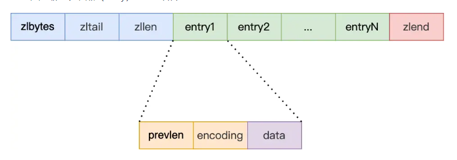

- **prevlen**：记录了「前一个节点」的长度，目的是为了实现从后向前遍历；
- **encoding**：记录了当前节点实际数据的「类型和长度」，类型主要有两种：字符串和整数。
- **data**：记录了当前节点的实际数据，类型和长度都由 `encoding` 决定；

当往压缩列表中插入数据时，压缩列表就会根据数据类型是字符串还是整数，以及数据的大小，会使用不同空间大小的 prevlen 和 encoding 这两个元素里保存的信息，**这种根据数据大小和类型进行不同的空间大小分配的设计思想，正是 Redis 为了节省内存而采用的**。

**如何分配？**

压缩列表里的每个节点中的 prevlen 属性都记录了「前一个节点的长度」，而且 prevlen 属性的空间大小跟前一个节点长度值有关，比如：

- 如果**前一个节点的长度小于 254 字节**，那么 prevlen 属性需要用 **1 字节的空间**来保存这个长度值；
- 如果**前一个节点的长度大于等于 254 字节**，那么 prevlen 属性需要用 **5 字节的空间**来保存这个长度值；

encoding 属性的空间大小跟数据是字符串还是整数，以及字符串的长度有关，如下图（下图中的 content 表示的是实际数据，即本文的 data 字段）：

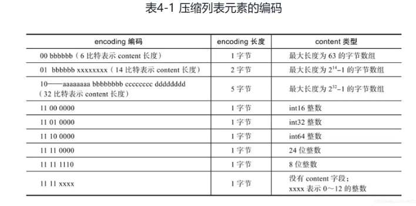

- 如果**当前节点的数据是整数**，则 encoding 会使用 **1 字节的空间**进行编码，也就是 encoding 长度为 1 字节。通过 encoding 确认了整数类型，就可以确认整数数据的实际大小了，比如如果 encoding 编码确认了数据是 int16 整数，那么 data 的长度就是 int16 的大小。
- 如果**当前节点的数据是字符串，根据字符串的长度大小**，encoding 会使用 **1 字节/2字节/5字节的空间**进行编码，encoding 编码的前两个 bit 表示数据的类型，后续的其他 bit 标识字符串数据的实际长度，即 data 的长度。

###  连锁更新问题

**问题描述**：压缩列表新增某个元素或修改某个元素时，如果空间不不够，压缩列表占用的内存空间就需要重新分配。而当新插入的元素较大时，可能会导致后续元素的 prevlen 占用空间都发生变化，从而引起「连锁更新」问题，导致每个元素的空间都要重新分配，造成访问压缩列表性能的下降。

> 前面提到，压缩列表节点的 prevlen 属性会根据前一个节点的长度进行不同的空间大小分配：
>
> - 如果前一个**节点的长度小于 254 字节**，那么 prevlen 属性需要用 **1 字节的空间**来保存这个长度值；
> - 如果前一个**节点的长度大于等于 254 字节**，那么 prevlen 属性需要用 **5 字节的空间**来保存这个长度值；

假设一个压缩列表中有多个连续的、长度在 250～253 之间的节点，如下图：


这些节点长度值小于 254 字节，所以 prevlen 属性需要用 1 字节的空间来保存这个长度值。

这时，如果将一个长度大于等于 254 字节的新节点加入到压缩列表的表头节点，即新节点将成为 e1 的前置节点，如下图：

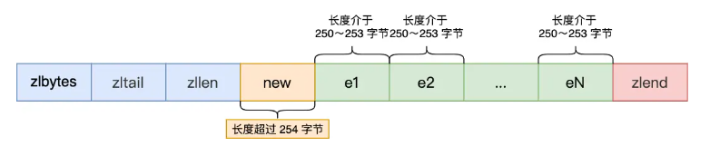

因为 e1 节点的 prevlen 属性只有 1 个字节大小，无法保存新节点的长度，此时就需要对压缩列表的空间重分配操作，并将 e1 节点的 prevlen 属性从原来的 1 字节大小扩展为 5 字节大小。

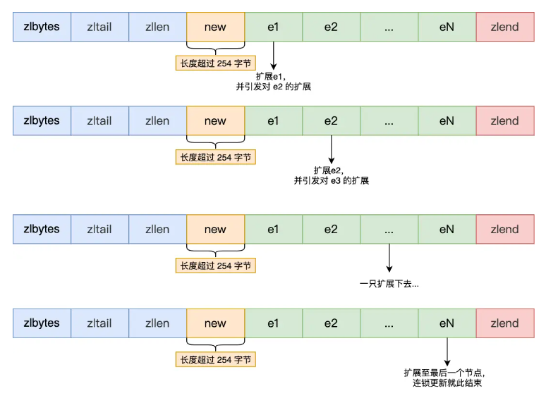

e1 原本的长度在 250～253 之间，因为刚才的扩展空间，此时 e1 的长度就大于等于 254 了，因此原本 e2 保存 e1 的 prevlen 属性也必须从 1 字节扩展至 5 字节大小。

### 缺陷

- 保存的元素数量增加了，或是元素变大了，会导致内存重新分配，最糟糕的是会有「连锁更新」的问题。

**压缩列表只会用于保存的节点数量不多的场景**，只要节点数量足够小，即使发生连锁更新，也是能接受的。

> Redis 针对压缩列表在设计上的不足，在后来的版本中，新增设计了两种数据结构：quicklist（Redis 3.2 引入） 和 listpack（Redis 5.0 引入）。

## 哈希表

### 结构设计

```c
typedef struct dictht {
    //哈希表数组
    dictEntry **table;
    //哈希表大小
    unsigned long size;  
    //哈希表大小掩码，用于计算索引值
    unsigned long sizemask;
    //该哈希表已有的节点数量
    unsigned long used;
} dictht;
```

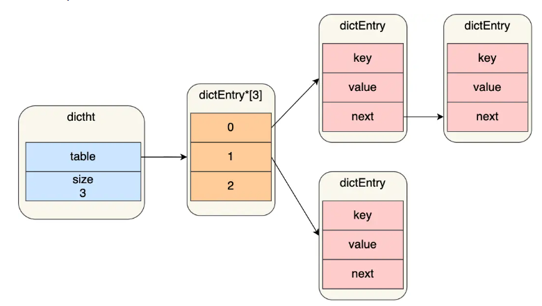


### 哈希冲突

Redis 采用**链式哈希**解决哈希冲突。

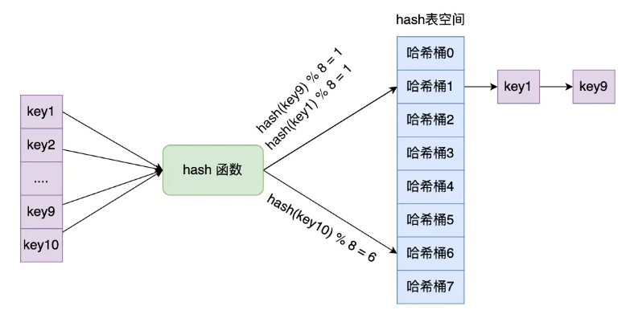

**链式哈希缺点**：随着链表长度增加，查询该位置上数据耗时也会增加，时间复杂度 **O(n)** 。

为了解决上面问题，Redis 会自动进行 rehash。

### rehash

Redis 定义一个 dict 结构体，这个结构体里定义了**两个哈希表（ht[2]）**。

```c
typedef struct dict {
    …
    //两个Hash表，交替使用，用于rehash操作
    dictht ht[2]; 
    …
} dict;
```

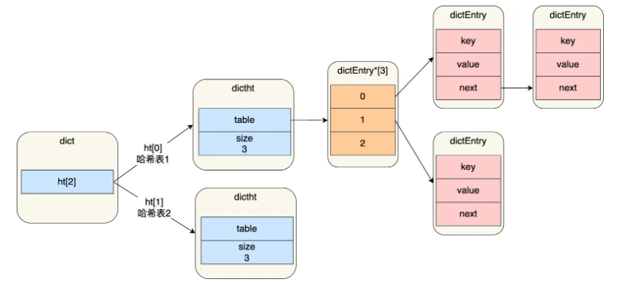

正常服务插入的数据，都会写入到「哈希表 1」，此时的「哈希表 2 」 并没有被分配空间。

随着数据逐步增多，触发了 rehash 操作，这个过程分为三步：

- 给「哈希表 2」 分配空间，一般会比「哈希表 1」 大 2 倍；
- 将「哈希表 1 」的数据迁移到「哈希表 2」 中；
- 迁移完成后，「哈希表 1 」的空间会被释放，并把「哈希表 2」 设置为「哈希表 1」，然后在「哈希表 2」 新创建一个空白的哈希表，为下次 rehash 做准备。

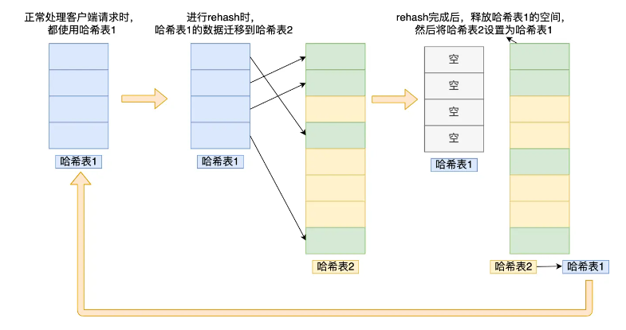

**问题**：如果「哈希表 1 」的数据量非常大，那么在迁移至「哈希表 2 」的时候，因为会涉及大量的数据拷贝，此时可能会对 Redis 造成阻塞，无法服务其他请求。

### 渐进式 rehash

数据的迁移的工作不再是一次性迁移完成，而是分多次迁移。

渐进式 rehash 步骤如下：

- 给「哈希表 2」 分配空间。
- **在 rehash 进行期间，每次哈希表元素进行新增、删除、查找或者更新操作时，Redis 除了会执行对应的操作之外，还会顺序将「哈希表 1 」中索引位置上的所有 key-value 迁移到「哈希表 2」 上**；
- 随着处理客户端发起的哈希表操作请求数量越多，最终在某个时间点会把「哈希表 1 」的所有 key-value 迁移到「哈希表 2」，从而完成 rehash 操作。

**核心思想**：把一次性大量数据迁移工作的开销，分摊到了多次处理请求的过程中，避免了一次性 rehash 的耗时操作。

### rehash 触发条件

> **负载因子** = 哈希表已保存节点数量 / 哈希表大小

触发 rehash 操作的条件，主要有两个：

- **当负载因子大于等于 1** ，并且 Redis 没有在执行 bgsave 命令或者 bgrewiteaof 命令，也就是没有执行 RDB 快照或没有进行 AOF 重写的时候，就会进行 rehash 操作。
- **当负载因子大于等于 5 时**，此时说明哈希冲突非常严重了，不管有没有有在执行 RDB 快照或 AOF 重写，都会强制进行 rehash 操作。


## 整数集合

### 结构设计

```c
typedef struct intset {
    //编码方式
    uint32_t encoding;
    //集合包含的元素数量
    uint32_t length;
    //保存元素的数组
    int8_t contents[];
} intset;
```

- 如果 encoding 属性值为 INTSET_ENC_INT16，那么 contents 就是一个 int16_t 类型的数组，数组中每一个元素的类型都是 int16_t 。
- 如果 encoding 属性值为 INTSET_ENC_INT32，那么 contents 就是一个 int32_t 类型的数组，数组中每一个元素的类型都是 int32_t 。
- 如果 encoding 属性值为 INTSET_ENC_INT64，那么 contents 就是一个 int64_t 类型的数组，数组中每一个元素的类型都是 int64_t 。

### 类型升级操作

将一个新元素加入到整数集合里面，如果新元素的类型（int32_t）比整数集合现有所有元素的类型（int16_t）都要长时，整数集合需要先进行升级，也就是按新元素的类型（int32_t）扩展 contents 数组的空间大小。升级的过程中，也要维持整数集合的有序性。

整数集合升级的过程不会重新分配一个新类型的数组，而是在原本的数组上扩展空间，然后在将每个元素按间隔类型大小分割，如果 encoding 属性值为 INTSET_ENC_INT16，则每个元素的间隔就是 16 位。

举个例子，假设有一个整数集合里有 3 个类型为 int16_t 的元素：

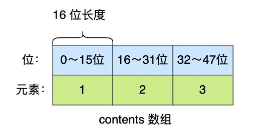

现在，往这个整数集合中加入一个新元素 65535，这个新元素需要用 int32_t 类型来保存，所以整数集合要进行升级操作，首先需要为 contents 数组扩容，**在原本空间的大小之上再扩容多 80 位（4x32-3x16=80），这样就能保存下 4 个类型为 int32_t 的元素**。

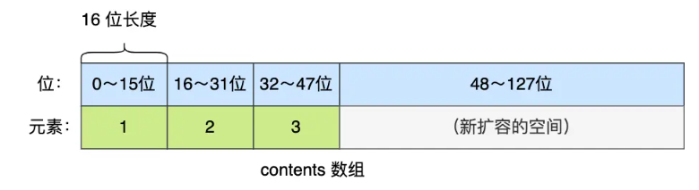

扩容完 contents 数组空间大小后，需要将之前的三个元素转换为 int32_t 类型，并将转换后的元素放置到正确的位上面，并且需要维持底层数组的有序性不变，整个转换过程如下：

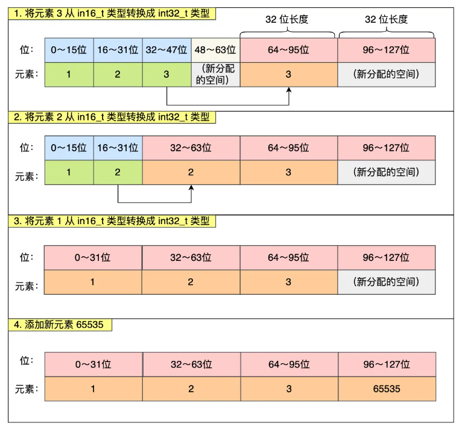

**优点**：

如果要让一个数组同时保存 int16_t、int32_t、int64_t 类型的元素，最简单做法就是直接使用 int64_t 类型的数组。不过这样的话，当如果元素都是 int16_t 类型的，就会造成内存浪费的情况。

> 整数集合**不支持降级操作**

## quicklist

> 在 Redis 3.0 之前，List 对象的底层数据结构是双向链表或者压缩列表。然后在 Redis 3.2 的时候，List 对象的底层改由 quicklist 数据结构实现。

quicklist 就是「双向链表 + 压缩列表」组合，因为一个 quicklist 就是一个链表，而链表中的每个元素又是一个压缩列表。\

**背景**：压缩列表元素增加或者变大会有**连锁更新**风险。

**解决方法**：通过控制每个链表节点中的压缩列表的大小或者元素个数，来规避连锁更新的问题。因为压缩列表元素越少或越小，连锁更新带来的影响就越小，从而提供了更好的访问性能。

### 结构设计

```c
typedef struct quicklist {
    //quicklist的链表头
    quicklistNode *head;      //quicklist的链表头
    //quicklist的链表尾
    quicklistNode *tail; 
    //所有压缩列表中的总元素个数
    unsigned long count;
    //quicklistNodes的个数
    unsigned long len;       
    ...
} quicklist;
```

```c
typedef struct quicklistNode {
    //前一个quicklistNode
    struct quicklistNode *prev;     //前一个quicklistNode
    //下一个quicklistNode
    struct quicklistNode *next;     //后一个quicklistNode
    //quicklistNode指向的压缩列表
    unsigned char *zl;              
    //压缩列表的的字节大小
    unsigned int sz;                
    //压缩列表的元素个数
    unsigned int count : 16;        //ziplist中的元素个数 
    ....
} quicklistNode;
```

每个 quicklistNode 形成了一个双向链表。但是链表节点的元素不再是单纯保存元素值，而是保存了一个压缩列表，所以 quicklistNode 结构体里有个指向压缩列表的指针 *zl。

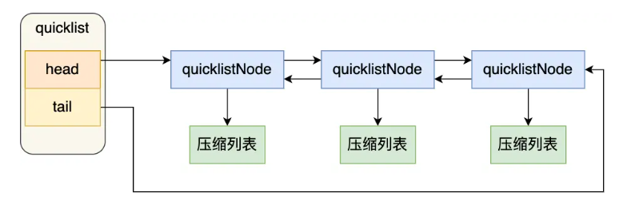

增加元素步骤：

1. 检查插入位置的压缩链表是否可以容纳该元素。
2. 上一步检查如果能容纳则直接保存到压缩链表中，否则会新建一个 quickListNode 结构

quicklist 会控制 quicklistNode 结构里的压缩列表的大小或者元素个数，来规避潜在的连锁更新的风险，但是这并没有完全解决连锁更新的问题。

## listpack

> 前言：
>
> quicklist 虽然通过控制 quicklistNode 结构里的压缩列表的大小或者元素个数，来减少连锁更新带来的性能影响，但是并没有完全解决连锁更新的问题。
>
> 因为 quicklistNode 还是用了压缩列表来保存元素，压缩列表连锁更新的问题，来源于它的结构设计，所以要想彻底解决这个问题，需要设计一个新的数据结构。

Redis 在 5.0 新设计一个数据结构叫 listpack，目的是替代压缩列表，它最大特点是 listpack 中每个节点不再包含前一个节点的长度了，压缩列表每个节点正因为需要保存前一个节点的长度字段，就会有连锁更新的隐患。

> Github在最新 6.2 发行版本中，Redis Hash 对象、ZSet 对象的底层数据结构的压缩列表还未被替换成 listpack，而 Redis 的最新代码（还未发布版本）已经将所有用到压缩列表底层数据结构的 Redis 对象替换成 listpack 数据结构来实现，估计不久将来，Redis 就会发布一个将压缩列表为 listpack 的发行版本。

### 结构设计

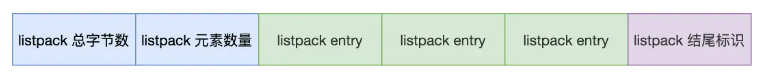

listpack 头包含两个属性，分别记录了 listpack 总字节数和元素数量，然后 listpack 末尾也有个结尾标识。图中的 listpack entry 就是 listpack 的节点了。

每个 listpack 节点结构如下：

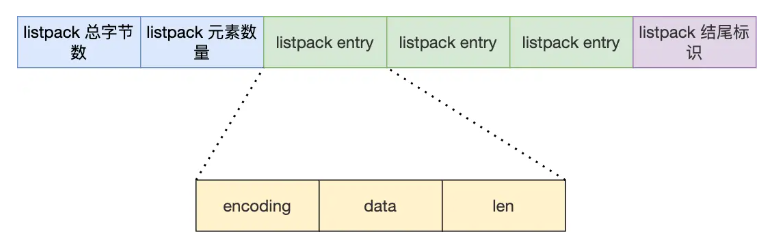

主要包含三个方面内容：

- encoding：定义该元素的编码类型，会对不同长度的整数和字符串进行编码；
- data：实际存放的数据；
- len：encoding + data的总长度；

listpack **没有压缩列表中记录前一个节点长度的字段**了，listpack 只记录当前节点的长度，向 listpack 加入一个新元素的时候，不会影响其他节点的长度字段的变化，从而避免了压缩列表的连锁更新问题。