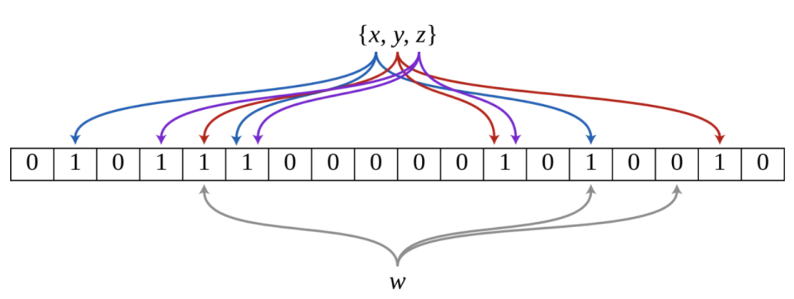
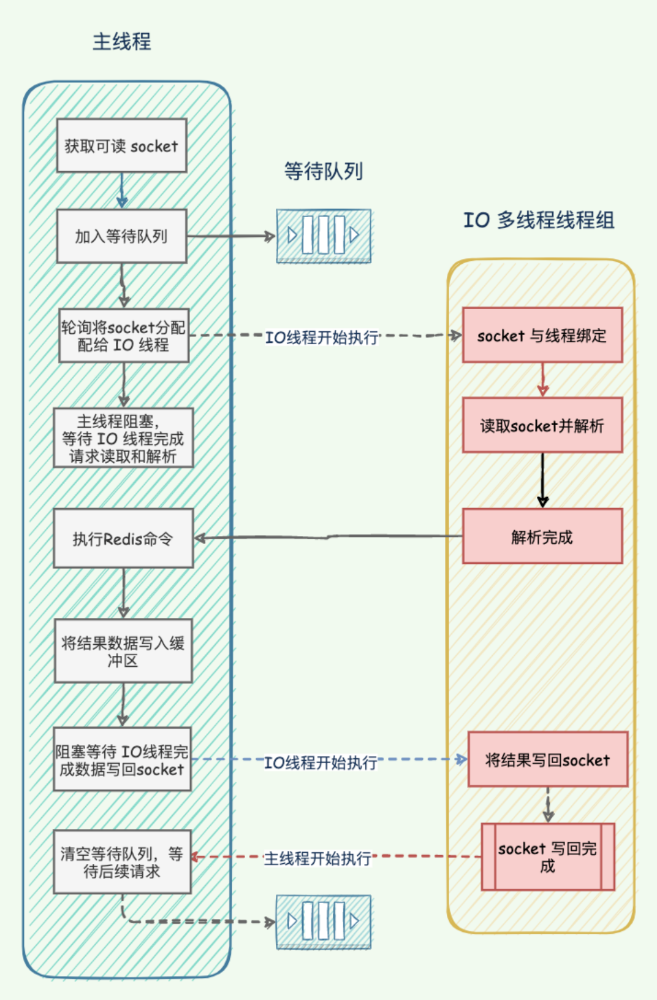
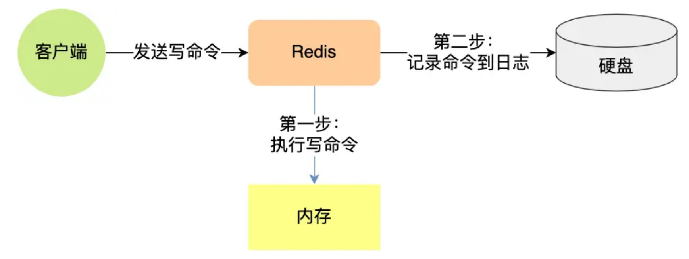
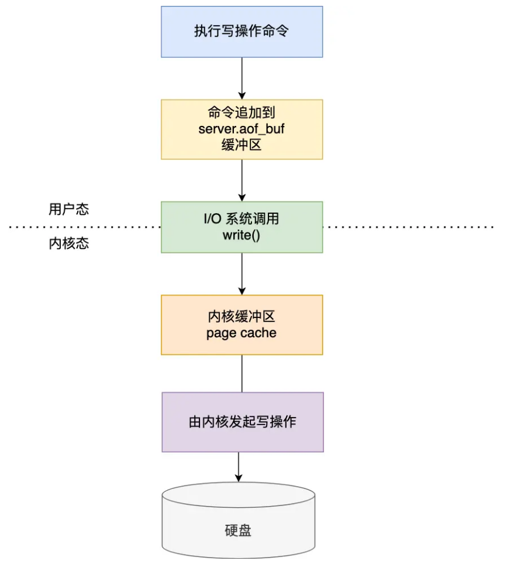
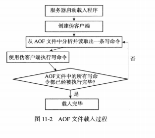
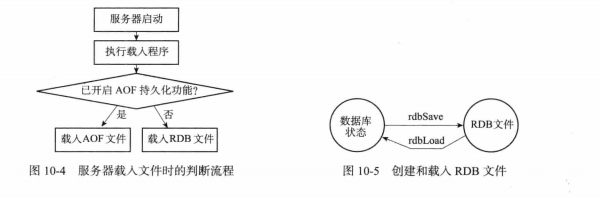
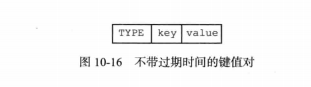

## 缓存击穿/缓存穿透/缓存雪崩

### 缓存穿透

缓存穿透是指用户请求的数据在缓存中不存在即没有命中，同时在数据库中也不存在，导致用户每次请求该数据都要去数据库中查询一遍，然后返回空。

如果有恶意攻击者不断请求系统中不存在的数据，会导致短时间大量请求落在数据库上，造成数据库压力过大，甚至击垮数据库系统。

#### 布隆过滤器

布隆过滤器（Bloom Filter，简称BF）由Burton Howard Bloom在1970年提出，是一种空间效率高的概率型数据结构。

布隆过滤器专门用来检测集合中是否存在特定的元素。

如果在平时我们要判断一个元素是否在一个集合中，通常会采用查找比较的方法，下面分析不同的数据结构查找效率：

- 采用线性表存储，查找时间复杂度为O(N)
- 采用平衡二叉排序树（AVL、红黑树）存储，查找时间复杂度为O(logN)
- 采用哈希表存储，考虑到哈希碰撞，整体时间复杂度也要O[log(n/m)]

当需要判断一个元素是否存在于海量数据集合中，不仅查找时间慢，还会占用大量存储空间。接下来看一下布隆过滤器如何解决这个问题。

**布隆过滤器设计思想**

布隆过滤器由一个长度为m比特的位数组（bit array）与k个哈希函数（hash function）组成的数据结构。位数组初始化均为0，所有的哈希函数都可以分别把输入数据尽量均匀地散列。

当要向布隆过滤器中插入一个元素时，该元素经过k个哈希函数计算产生k个哈希值，以哈希值作为位数组中的下标，将所有k个对应的比特值由0置为1。

当要查询一个元素时，同样将其经过哈希函数计算产生哈希值，然后检查对应的k个比特值：如果有任意一个比特为0，表明该元素一定不在集合中；如果所有比特均为1，表明该集合有可能性在集合中。

为什么不是一定在集合中呢？因为不同的元素计算的哈希值有可能一样，会出现哈希碰撞，导致一个不存在的元素有可能对应的比特位为1，这就是所谓“假阳性”（false positive）。相对地，“假阴性”（false negative）在BF中是绝不会出现的。

总结一下：**布隆过滤器认为不在的，一定不会在集合中；布隆过滤器认为在的，可能在也可能不在集合中。**

**例子** 

举个例子：下图是一个布隆过滤器，共有18个比特位，3个哈希函数。集合中三个元素x，y，z通过三个哈希函数散列到不同的比特位，并将比特位置为1。当查询元素w时，通过三个哈希函数计算，发现有一个比特位的值为0，可以肯定认为该元素不在集合中。



**布隆过滤器优缺点**

优点：

- 节省空间：不需要存储数据本身，只需要存储数据对应hash比特位
- 时间复杂度低：插入和查找的时间复杂度都为O(k)，k为哈希函数的个数

缺点：

- 存在假阳性：布隆过滤器判断存在，可能出现元素不在集合中；判断准确率取决于哈希函数的个数
- 不能删除元素：如果一个元素被删除，但是却不能从布隆过滤器中删除，这也是造成假阳性的原因了

布隆过滤器适用场景

- 爬虫系统url去重
- 垃圾邮件过滤
- 黑名单

#### 缓存空对象

当缓存未命中，查询持久层也为空，可以将返回的空对象写到缓存中，这样下次请求该key时直接从缓存中查询返回空对象，请求不会落到持久层数据库。为了避免存储过多空对象，通常会给空对象设置一个过期时间。

这种方法会存在两个问题：

- 如果有大量的key穿透，缓存空对象会占用宝贵的内存空间。
- 空对象的key设置了过期时间，在这段时间可能会存在缓存和持久层数据不一致的场景。可以参考这篇文章保证缓存和数据库的一致性: https://juejin.cn/post/7246365103783329847

### 缓存击穿

缓存击穿，是指一个key非常热点，在不停的扛着大并发，大并发集中对这一个点进行访问，当这个key在失效的瞬间，持续的大并发就穿破缓存，直接请求数据库，就像在一个屏障上凿开了一个洞。

**缓存击穿危害**：数据库瞬时压力骤增，造成大量请求阻塞。

#### 使用互斥锁（mutex key）

让一个线程回写缓存，其他线程等待回写缓存线程执行完，重新读缓存即可。

同一时间只有一个线程读数据库然后回写缓存，其他线程都处于阻塞状态。如果是高并发场景，大量线程阻塞势必会降低吞吐量。

#### 热点数据永不过期

永不过期实际包含两层意思：

- 物理不过期，针对热点key不设置过期时间
- 逻辑过期，把过期时间存在key对应的value里，如果发现要过期了，通过一个后台的异步线程进行缓存的构建

不足的就是构建缓存时候，其余线程(非构建缓存的线程)可能访问的是老数据，对于不追求严格强一致性的系统是可以接受的。

### 缓存雪崩

缓存雪崩是指缓存中数据大批量到过期时间，而查询数据量巨大，请求直接落到数据库上，引起数据库压力过大甚至宕机。

和缓存击穿不同的是，缓存击穿指并发查同一条数据，缓存雪崩是不同数据都过期了，很多数据都查不到从而查数据库。

#### 均匀过期

设置不同的过期时间，让缓存失效的时间点尽量均匀。通常可以为有效期增加随机值或者统一规划有效期。

#### 加互斥锁

跟缓存击穿解决思路一致，同一时间只让一个线程构建缓存，其他线程阻塞排队。

#### 缓存永不过期

跟缓存击穿解决思路一致，缓存在物理上永远不过期，用一个异步的线程更新缓存。

#### 双层缓存策略

使用主备两层缓存：

主缓存：有效期按照经验值设置，设置为主读取的缓存，主缓存失效后从数据库加载最新值。

备份缓存：有效期长，获取锁失败时读取的缓存，主缓存更新时需要同步更新备份缓存。

### 缓存预热

缓存预热就是系统上线后，将相关的缓存数据直接加载到缓存系统，这样就可以避免在用户请求的时候，先查询数据库，然后再将数据回写到缓存。

如果不进行预热， 那么 Redis 初始状态数据为空，系统上线初期，对于高并发的流量，都会访问到数据库中， 对数据库造成流量的压力。

#### 缓存预热的操作方法

- 数据量不大的时候，工程启动的时候进行加载缓存动作；
- 数据量大的时候，设置一个定时任务脚本，进行缓存的刷新；
- 数据量太大的时候，优先保证热点数据进行提前加载到缓存。

### 缓存降级

缓存降级是指缓存失效或缓存服务器挂掉的情况下，不去访问数据库，直接返回默认数据或访问服务的内存数据。

在项目实战中通常会将部分热点数据缓存到服务的内存中，这样一旦缓存出现异常，可以直接使用服务的内存数据，从而避免数据库遭受巨大压力。

降级一般是有损的操作，所以尽量减少降级对于业务的影响程度。

## Redis 线程模型

Redis 的单线程是指对**命令的执行**是单线程，而 Redis 程序并不是单线程的：

- **Redis 在 2.6 版本**：会启动 2 个后台线程，分别处理关闭文件、AOF 刷盘这两个任务。
- **Redis 在 4.0 版本之后**：新增了一个新的后台线程，用来异步释放 Redis 内存，也就是 lazyfree 线程。因此，当我们要删除一个大 key 的时候，不要使用 del 命令删除，因为 del 是在主线程处理的，这样会导致 Redis 主线程卡顿，因此我们应该使用 unlink 命令来异步删除大key。

### Redis 单线程为什么还这么快

- edis 的大部分操作**都在内存中完成**，因此 Redis 瓶颈可能是机器的内存或者网络带宽，而并非 CPU，既然 CPU 不是瓶颈，那么自然就采用单线程的解决方案了。
- Redis 采用单线程模型可以**避免了多线程之间的竞争**，省去了多线程切换带来的时间和性能上的开销，而且也不会导致死锁问题。
- Redis 采用了 **I/O 多路复用机制**处理大量的客户端 Socket 请求，IO 多路复用机制是指一个线程处理多个 IO 流，即 select/epoll 机制。简单来说，在 Redis 只运行单线程的情况下，该机制允许内核中，同时存在多个监听 Socket 和已连接 Socket。内核会一直监听这些 Socket 上的连接请求或数据请求。一旦有请求到达，就会交给 Redis 线程处理，这就实现了一个 Redis 线程处理多个 IO 流的效果。

### Redis 6.0 之后为什么引入了多线程

**随着网络硬件的性能提升，Redis 的性能瓶颈有时会出现在网络 I/O 的处理上**。

为了提高网络 I/O 的并行度，Redis 6.0 对于网络 I/O 采用多线程来处理。但是**对于命令的执行，Redis 仍然使用单线程来处理**，不要误解 Redis 有多线程同时执行命令。

多线程执行机制如下：



- 主线程负责接收建立连接请求，获取 socket 放入全局等待读处理队列
- 主线程处理完读事件之后，通过 RR(Round Robin) 将这些连接分配给这些 IO 线程
- 主线程阻塞等待 IO 线程读取 socket 完毕
- **主线程通过单线程的方式执行请求命令**，将结果写回缓冲区
- 主线程阻塞等待 IO 线程将数据回写 socket 完毕
- 解除绑定，清空等待队列

## Redis 持久化

### 如何实现数据不丢失

> Redis 的读写操作都是在内存中，所以 Redis 性能才会高，但是当 Redis 重启后，内存中的数据就会丢失，那为了保证内存中的数据不会丢失，Redis 实现了数据持久化的机制，这个机制会把数据存储到磁盘，这样在 Redis 重启就能够从磁盘中恢复原有的数据。

Redis 共有三种数据持久化的方式：

- **AOF 日志**：每执行一条写操作命令，就把该命令以追加的方式写入到一个文件里。
- **RDB 快照**：将某一时刻的内存数据，以二进制的方式写入磁盘。
- **混合持久化方式**：Redis 4.0 新增的方式，集成了 AOF 和 RBD 的优点。

### AOF 持久化

AOF持久化是通过保存Redis服务器所执行的写命令来记录数据库状态的。

> 优点：
>
> 1. 每一次修改都同步，文件完成性更好
> 2. 每秒同步一次，可能会丢失一秒数据
>
> 缺点：
>
> 1. 相对于文件大小，aof远远大于rdb，修复速度也比rdb慢
> 2. aof运行效率比rdb慢

#### AOF持久化的实现

 **命令追加****

AOF打开后，服务器在写完一个命令之后，会以协议格式将被执行的写命令追加到服务器状态的 aof_buf 缓冲区末尾。

**先执行命令，再写入日志**

**好处**：

- **避免额外检查开销**。假如先写入 AOF 日志，再执行命令，如果该命令语法有问题，不进行语法检查的话，在使用日志恢复数据时就会出错。
- **不会因写入日志阻塞当前写操作命令的执行**：因为当写操作命令执行成功后，才会将命令记录到 AOF 日志。

**风险**：

- **数据可能会丢失：** 执行写操作命令和记录日志是两个过程，那当 Redis 在还没来得及将命令写入到硬盘时，服务器发生宕机了，这个数据就会有丢失的风险。
- **可能阻塞其他操作：** 由于写操作命令执行成功后才记录到 AOF 日志，所以不会阻塞当前命令的执行，但因为 AOF 日志也是在主线程中执行，所以当 Redis 把日志文件写入磁盘的时候，还是会阻塞后续的操作无法执行。

#### AOF 写回策略

Redis 写入 AOF 过程如下图：



通过配置`appendfsync`选项的值直接决定AOF持久化功能的效率和安全性。

- 值为`always`时，服务器每个事件循环都要将`aof_buf`缓冲区中的内容写入到AOF文件，并且同步AOF文件。`always`的效率最低，但是安全性最高。
- 值为`everysec`时，服务器在每个事件循环都将`aof_buf`缓冲区中所有内容写入到AOF文件，并且每隔一秒就要在子线程中对AOF文件进行一次同步。效率上足够快，就算故障，**最多会丢失2秒数据**。
- 值为`no`时，服务器在每个事件循环都将`aof_buf`缓冲区中所有内容写入到AOF文件，至于何时同步，就有操作系统控制。

**为什么最多会丢失2秒数据呢**

除了首次命令写入操作之外，后面所有写入操作，Redis 主线程会负责对比上次 AOF 同步时间：

- 如果距上次同步成功时间在2秒内，主线程直接返回。
- 如果距上次同步成功时间超过2秒，主线程将调用AOF磁盘同步线程进行阻塞，直到磁盘同步操作完成，此时Redis不可用。

按照上面规则，主线程在命令写入后会调用系统的`write`操作，`write`执行完成后主线程返回。然后文件同步`fsync`线程每秒调用一次将命令写入磁盘。

问题在于：如果硬盘负载过高，同步操作可能会超过1秒，这时如果主线程仍然继续向缓冲区写入命令，硬盘负载会越来越大（`fsync`线程处理不过来）。如果在第2秒时 Redis 停机，则最近两秒内的数据将不会写入磁盘，就会丢失。

#### AOF文件的载入与数据还原

AOF文件如果出现错误，则redis不会正常启动，可以使用`redis-check-aof --fix`修复`appendonly.aof` 。




### AOF文件重写

AOF中的内容会随着时间越来越大，所以要对AOF文件进行重写整理。用新的AOF文件来替代现有的AOF文件。

**实现原理**：首先从数据库中读取键现在的值，然后用一条命令去记录键值对，代替之前记录这个键值对的多条命令。

```bash
auto-aof-rewrite-percentage 100
auto-aof-rewrite-min-size 64mb  # aof文件大于64mb会重写
```

AOF文件重写程序是在子进程中执行的：

- 子进程重写期间，服务器进程可以继续处理命令请求
- 子进程带有服务器进程的数据副本，使用子进程而不是线程，可以避免使用锁的情况下，保证数据的安全性。

# 1. RDB持久化

RDB持久化是**把当前进程数据生成快照保存到硬盘的过程**，触发RDB持久化过程分为手动触发和自动触发。

RDB持久化功能所生成的RDB文件是一个经过压缩的二进制文件，通过该文件可以还原生成RDB文件时的数据库状态。

## 1.1 RDB文件的创建与载入

有两个Redis命令可以用于生成RDB文件，一个是`SAVE`，另一个是`BGSAVE`.

`SAVE`命令会阻塞Redis服务器进程，直到RDB文件创建完毕为止，在服务器进程阻塞期间，服务器不能处理任何命令请求。

`BGSAVE`命令会派生出一个子进程，然后由子进程负责创建RDB文件，服务器进程（父进程）继续处理命令请求。

RDB文件的载入工作是在服务器启动时自动执行的，Redis没有专门用于载入RDB文件的命令，只要Redis服务器在启动时检测到RDB文件存在，它就会自动载入RDB文件。

> 💡因为AFO文件的更新频率通常比RDB文件更新频率更高，所以：
>
> - 如果服务器开启了AFO持久化功能，那么服务器会优先使用AFO文件来还原数据库状态。
> - 只有在AFO持久化功能处于关闭状态时，服务器才会使用RDB文件来还原数据库状态。



## 1.2 `SAVE`命令执行时服务器状态

当`SAVE`命令执行时，Redis服务器会被阻塞，这时服务器不能处理任何命令请求。

## 1.3 `BGSAVE`命令执行时服务器状态

`BGSAVE`命令执行期间，服务器仍可以处理客户端的命令请求。但是，对`SAVE`、`BGSAVE`、`BGREWRITEAOF`这三个命令方式和平时有所不同。

在`BGSAVE`命令执行期间，`SAVE`命令会被服务器拒绝，这是为了避免父进程和子进程同时执行两个`rdbSave`调用，防止产生竞争条件。

在`BGSAVE`命令执行期间，`BGSAVE`命令也会被服务器拒绝，因为通知执行两个`BGSAVE`命令也会产生竞争条件。

最后，`BGREWRITEAOF`和`BGSAVE`两个命令不能同时运行：

- 如果`BGSAVE`命令正在执行，那么客户端发送的`BGREWRITEAOF`命令会被延迟到`BGSAVE`命令执行完毕之后执行。
- 如果`BGREWRITEAOF`命令正在执行，那么客户端发送的`BGSAVE`命令会被服务器拒绝。

## 1.4 RDB文件载入时服务器状态

服务器在载入RDB文件期间，会一直处于阻塞状态，直到载入工作完毕为止。

## 1.5 自动间隔性保存

因为`BGSAVE`可以在不阻塞服务器进程下执行，所以允许设置`save`选项，让服务器每隔一段时间自动执行一次`BGSAVE`命令。

可以通过`save`选项设置多个保存条件，但只要其中一个条件被满足，服务器就会执行`BGSAVE`命令。

> 比如下面例子：
>
> - `save 900 1` ：服务器在900秒内，对数据库进行了至少1次修改

### `saveparams`属性

`saveparams`属性是一个数组，数组中的每个元素都是一个`saveparam`结构，每个`saveparam`结构都保存了一个`save`选项设置的保存条件：

```c++
struct saveparam {
    time_t seconds; // 秒数
    int changes;  // 修改数
}
```

### `dirty`计数器和`lastsave`属性

- `dirty`计数器记录距离上一次成功执行`SAVE`命令或者`BGSAVE`命令后，服务器对数据库状态（所有数据库）进行了多少次修改（删除，更新，写入等）
- `lastsave`属性是一个`UNIX`时间戳，记录了服务器上一次成功执行`SAVE`或者`BGSAVE`命令的时间。

```c++
struct redisServer {
    long long dirty;  // 修改计数器
    time_t lastsave;  // 上一次执行保存的时间
}
```

### 检查保存条件是否满足

Redis周期性操作函数`serverCron`默认每隔100毫秒就会执行一次，该函数用于对正在允许的服务器进行维护，它的一项工作就是检查`save`选项所设置的保存条件是否已经满足，如果满足，就会执行`BGSAVE`命令。

## 1.6 RDB文件结构


- `REDIS`部分长度为5个字节，保存着`REDIS`五个字符。通过这五个字符，程序在载入文件时，快速检查所载入的文件是否RDB文件。
- `db_version`长度为4个字节，它的值是一个字符串表示的整数，这个整数记录了RDB文件的版本号。比如`0006`代表RDB文件版本为第六版。
- `database`部分包含零个或任意多个数据库，以及各个数据库中的键值对数据。
  - 如果服务器数据库状态为空，这个部分也为空，长度为0字节。
  - 如果服务器数据库状态为非空（有至少一个数据库非空），那么这个部分也为非空。根据数据库保存的键值对的数量、类型和内容的不同，这个部分长度也会有所不同。
- `EOF`常量的长度为1字节，标志着RDB文件正文内容的结束，当读入程序遇到这个值的时候，表明所有数据库的所有键值对都已经载入完毕了。
- `check_sum`是一个8字节长的无符号整数、保存着一个校验和，这个校验和是程序通过对`REDIS`、`db_version`、`databases`、`EOF`四个部分的内容进行计算得出的。服务器在载入RDB文件时，会将载入数据所计算出的校验和与`check_sum`所记录的校验和进行对比，以此来检查RDB文件是否有出错或者损坏的情况出现。

### `databases`部分

一个RDB文件的`databases`部分可以保存任意多个非空数据库。

例如，如果服务器的0号和3号数据库非空，则将创建以下结构RDB文件：


每个`database`都包含数据库所有键值对。

每个非空数据库在RDB文件中都可以保存为`SELECTDB`、`db_number`、`key_value_pairs`三个部分。


- `SELECTDB`常量的长度为1字节，标示将要读入的数据库号码。
- `db_number`保存着一个数据库号码，根据号码大小不同，这个部分长度可以是1字节、2字节、5字节等。当程序读入`db_number`部分后，服务器会调用`SELECT`命令，根据读入的数据库号码进行数据库的切换，使得读入的键值对可以正确载入到数据库中。
- `key_value_pairs`部分保存了数据库中所有键值对数据，如果键值对带有过期时间，则过期时间也会和键值对保存在一起。根据键值对的数量、类型、内容以及是否有过期时间等条件的不同，`key_value_pairs`部分的长度也会有所不同。

### `key_value_pairs`部分

RDB文件中的每个`key_value_pairs`部分都保存了一个或以上数量的键值对，如果键值对带有过期时间的话，那么键值对的过期时间也会被保存在内。

不带过期时间的键值对如下：



- `TYPE`记录了`value`类型，长度为1字节。
- `KEY`总是一个字符串对象。
- 根据`TYPE`类型不同，以及保存内容长度的不同，保存`value`的结构和长度也会有所不同

带有过期时间的键值对如下：


- `EXPIRETIME_MS`常量的长度为1字节，它告知读入程序，接下来要读入的是一个以毫秒为单位的过期时间。
- `ms`是一个8字节长的带符号整数，记录着一个以毫秒为单位的UNIX时间戳，这个时间戳就是键值对的过期时间。

- 

# 3. 参考资料

- 《Redis设计与实现》
