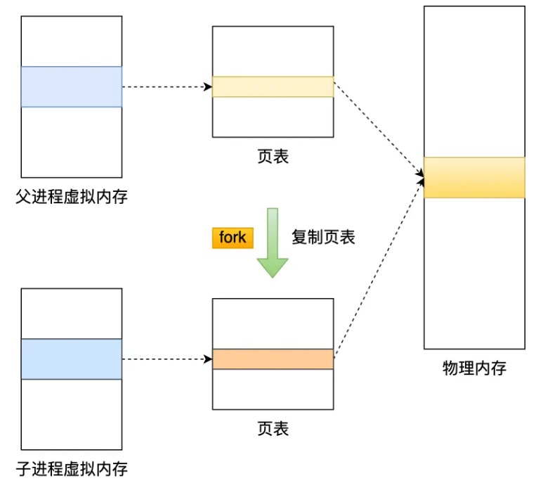
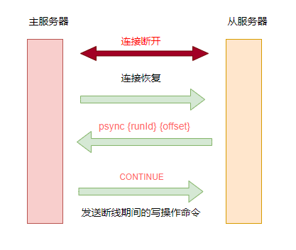
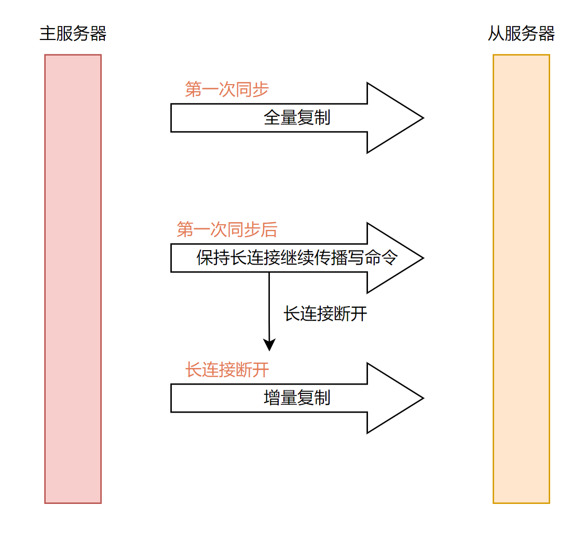
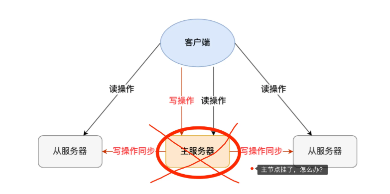
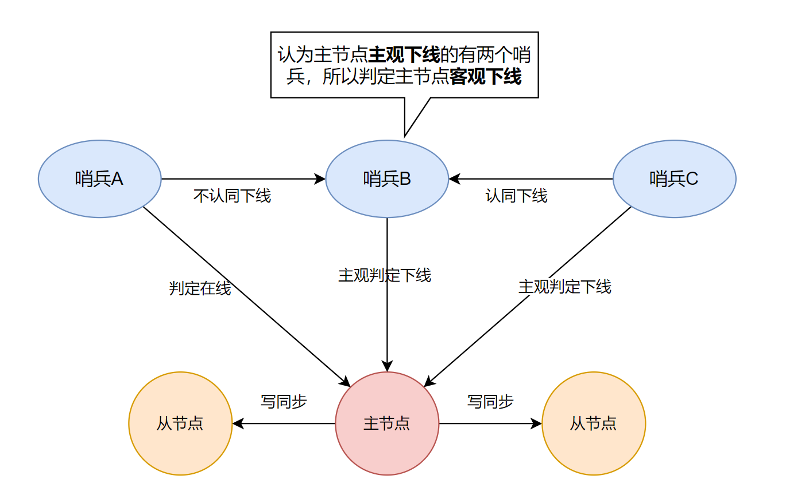
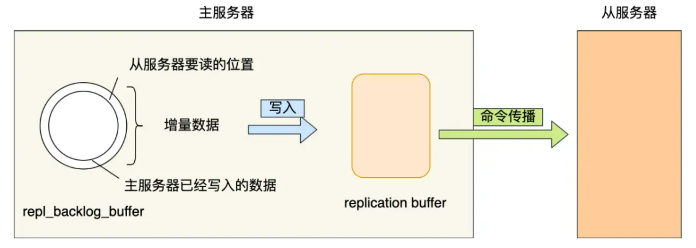

## 缓存击穿/缓存穿透/缓存雪崩

### 缓存穿透

缓存穿透是指用户请求的数据在缓存中不存在即没有命中，同时在数据库中也不存在，导致用户每次请求该数据都要去数据库中查询一遍，然后返回空。

如果有恶意攻击者不断请求系统中不存在的数据，会导致短时间大量请求落在数据库上，造成数据库压力过大，甚至击垮数据库系统。

#### 布隆过滤器

布隆过滤器（Bloom Filter，简称BF）由Burton Howard Bloom在1970年提出，是一种空间效率高的概率型数据结构。

布隆过滤器专门用来检测集合中是否存在特定的元素。

如果在平时我们要判断一个元素是否在一个集合中，通常会采用查找比较的方法，下面分析不同的数据结构查找效率：

- 采用线性表存储，查找时间复杂度为O(N)
- 采用平衡二叉排序树（AVL、红黑树）存储，查找时间复杂度为O(logN)
- 采用哈希表存储，考虑到哈希碰撞，整体时间复杂度也要O[log(n/m)]

当需要判断一个元素是否存在于海量数据集合中，不仅查找时间慢，还会占用大量存储空间。接下来看一下布隆过滤器如何解决这个问题。

**布隆过滤器设计思想**

布隆过滤器由一个长度为m比特的位数组（bit array）与k个哈希函数（hash function）组成的数据结构。位数组初始化均为0，所有的哈希函数都可以分别把输入数据尽量均匀地散列。

当要向布隆过滤器中插入一个元素时，该元素经过k个哈希函数计算产生k个哈希值，以哈希值作为位数组中的下标，将所有k个对应的比特值由0置为1。

当要查询一个元素时，同样将其经过哈希函数计算产生哈希值，然后检查对应的k个比特值：如果有任意一个比特为0，表明该元素一定不在集合中；如果所有比特均为1，表明该集合有可能性在集合中。

为什么不是一定在集合中呢？因为不同的元素计算的哈希值有可能一样，会出现哈希碰撞，导致一个不存在的元素有可能对应的比特位为1，这就是所谓“假阳性”（false positive）。相对地，“假阴性”（false negative）在BF中是绝不会出现的。

总结一下：**布隆过滤器认为不在的，一定不会在集合中；布隆过滤器认为在的，可能在也可能不在集合中。**

**例子** 

举个例子：下图是一个布隆过滤器，共有18个比特位，3个哈希函数。集合中三个元素x，y，z通过三个哈希函数散列到不同的比特位，并将比特位置为1。当查询元素w时，通过三个哈希函数计算，发现有一个比特位的值为0，可以肯定认为该元素不在集合中。


**布隆过滤器优缺点**

优点：

- 节省空间：不需要存储数据本身，只需要存储数据对应hash比特位
- 时间复杂度低：插入和查找的时间复杂度都为O(k)，k为哈希函数的个数

缺点：

- 存在假阳性：布隆过滤器判断存在，可能出现元素不在集合中；判断准确率取决于哈希函数的个数
- 不能删除元素：如果一个元素被删除，但是却不能从布隆过滤器中删除，这也是造成假阳性的原因了

布隆过滤器适用场景

- 爬虫系统url去重
- 垃圾邮件过滤
- 黑名单

#### 缓存空对象

当缓存未命中，查询持久层也为空，可以将返回的空对象写到缓存中，这样下次请求该key时直接从缓存中查询返回空对象，请求不会落到持久层数据库。为了避免存储过多空对象，通常会给空对象设置一个过期时间。

这种方法会存在两个问题：

- 如果有大量的key穿透，缓存空对象会占用宝贵的内存空间。
- 空对象的key设置了过期时间，在这段时间可能会存在缓存和持久层数据不一致的场景。可以参考这篇文章保证缓存和数据库的一致性: https://juejin.cn/post/7246365103783329847

### 缓存击穿

缓存击穿，是指一个key非常热点，在不停的扛着大并发，大并发集中对这一个点进行访问，当这个key在失效的瞬间，持续的大并发就穿破缓存，直接请求数据库，就像在一个屏障上凿开了一个洞。

**缓存击穿危害**：数据库瞬时压力骤增，造成大量请求阻塞。

#### 使用互斥锁（mutex key）

让一个线程回写缓存，其他线程等待回写缓存线程执行完，重新读缓存即可。

同一时间只有一个线程读数据库然后回写缓存，其他线程都处于阻塞状态。如果是高并发场景，大量线程阻塞势必会降低吞吐量。

#### 热点数据永不过期

永不过期实际包含两层意思：

- 物理不过期，针对热点key不设置过期时间
- 逻辑过期，把过期时间存在key对应的value里，如果发现要过期了，通过一个后台的异步线程进行缓存的构建

不足的就是构建缓存时候，其余线程(非构建缓存的线程)可能访问的是老数据，对于不追求严格强一致性的系统是可以接受的。

### 缓存雪崩

缓存雪崩是指缓存中数据大批量到过期时间，而查询数据量巨大，请求直接落到数据库上，引起数据库压力过大甚至宕机。

和缓存击穿不同的是，缓存击穿指并发查同一条数据，缓存雪崩是不同数据都过期了，很多数据都查不到从而查数据库。

#### 均匀过期

设置不同的过期时间，让缓存失效的时间点尽量均匀。通常可以为有效期增加随机值或者统一规划有效期。

#### 加互斥锁

跟缓存击穿解决思路一致，同一时间只让一个线程构建缓存，其他线程阻塞排队。

#### 缓存永不过期

跟缓存击穿解决思路一致，缓存在物理上永远不过期，用一个异步的线程更新缓存。

#### 双层缓存策略

使用主备两层缓存：

主缓存：有效期按照经验值设置，设置为主读取的缓存，主缓存失效后从数据库加载最新值。

备份缓存：有效期长，获取锁失败时读取的缓存，主缓存更新时需要同步更新备份缓存。

### 缓存预热

缓存预热就是系统上线后，将相关的缓存数据直接加载到缓存系统，这样就可以避免在用户请求的时候，先查询数据库，然后再将数据回写到缓存。

如果不进行预热， 那么 Redis 初始状态数据为空，系统上线初期，对于高并发的流量，都会访问到数据库中， 对数据库造成流量的压力。

#### 缓存预热的操作方法

- 数据量不大的时候，工程启动的时候进行加载缓存动作；
- 数据量大的时候，设置一个定时任务脚本，进行缓存的刷新；
- 数据量太大的时候，优先保证热点数据进行提前加载到缓存。

### 缓存降级

缓存降级是指缓存失效或缓存服务器挂掉的情况下，不去访问数据库，直接返回默认数据或访问服务的内存数据。

在项目实战中通常会将部分热点数据缓存到服务的内存中，这样一旦缓存出现异常，可以直接使用服务的内存数据，从而避免数据库遭受巨大压力。

降级一般是有损的操作，所以尽量减少降级对于业务的影响程度。

## Redis 线程模型

Redis 的单线程是指对**命令的执行**是单线程，而 Redis 程序并不是单线程的：

- **Redis 在 2.6 版本**：会启动 2 个后台线程，分别处理关闭文件、AOF 刷盘这两个任务。
- **Redis 在 4.0 版本之后**：新增了一个新的后台线程，用来异步释放 Redis 内存，也就是 lazyfree 线程。因此，当我们要删除一个大 key 的时候，不要使用 del 命令删除，因为 del 是在主线程处理的，这样会导致 Redis 主线程卡顿，因此我们应该使用 unlink 命令来异步删除大key。

### Redis 单线程为什么还这么快

- edis 的大部分操作**都在内存中完成**，因此 Redis 瓶颈可能是机器的内存或者网络带宽，而并非 CPU，既然 CPU 不是瓶颈，那么自然就采用单线程的解决方案了。
- Redis 采用单线程模型可以**避免了多线程之间的竞争**，省去了多线程切换带来的时间和性能上的开销，而且也不会导致死锁问题。
- Redis 采用了 **I/O 多路复用机制**处理大量的客户端 Socket 请求，IO 多路复用机制是指一个线程处理多个 IO 流，即 select/epoll 机制。简单来说，在 Redis 只运行单线程的情况下，该机制允许内核中，同时存在多个监听 Socket 和已连接 Socket。内核会一直监听这些 Socket 上的连接请求或数据请求。一旦有请求到达，就会交给 Redis 线程处理，这就实现了一个 Redis 线程处理多个 IO 流的效果。

### Redis 6.0 之后为什么引入了多线程

**随着网络硬件的性能提升，Redis 的性能瓶颈有时会出现在网络 I/O 的处理上**。

为了提高网络 I/O 的并行度，Redis 6.0 对于网络 I/O 采用多线程来处理。但是**对于命令的执行，Redis 仍然使用单线程来处理**，不要误解 Redis 有多线程同时执行命令。

多线程执行机制如下：


- 主线程负责接收建立连接请求，获取 socket 放入全局等待读处理队列
- 主线程处理完读事件之后，通过 RR(Round Robin) 将这些连接分配给这些 IO 线程
- 主线程阻塞等待 IO 线程读取 socket 完毕
- **主线程通过单线程的方式执行请求命令**，将结果写回缓冲区
- 主线程阻塞等待 IO 线程将数据回写 socket 完毕
- 解除绑定，清空等待队列

## Redis 持久化

### 如何实现数据不丢失

> Redis 的读写操作都是在内存中，所以 Redis 性能才会高，但是当 Redis 重启后，内存中的数据就会丢失，那为了保证内存中的数据不会丢失，Redis 实现了数据持久化的机制，这个机制会把数据存储到磁盘，这样在 Redis 重启就能够从磁盘中恢复原有的数据。

Redis 共有三种数据持久化的方式：

- **AOF 日志**：每执行一条写操作命令，就把该命令以追加的方式写入到一个文件里。
- **RDB 快照**：将某一时刻的内存数据，以二进制的方式写入磁盘。
- **混合持久化方式**：Redis 4.0 新增的方式，集成了 AOF 和 RBD 的优点。

### AOF 持久化

AOF持久化是通过保存Redis服务器所执行的写命令来记录数据库状态的。

> 优点：
>
> 1. 每一次修改都同步，文件完成性更好
> 2. 每秒同步一次，可能会丢失一秒数据
>
> 缺点：
>
> 1. 相对于文件大小，aof远远大于rdb，修复速度也比rdb慢
> 2. aof运行效率比rdb慢

#### AOF持久化的实现

 **命令追加****

AOF打开后，服务器在写完一个命令之后，会以协议格式将被执行的写命令追加到服务器状态的 aof_buf 缓冲区末尾。

**先执行命令，再写入日志**

**好处**：

- **避免额外检查开销**。假如先写入 AOF 日志，再执行命令，如果该命令语法有问题，不进行语法检查的话，在使用日志恢复数据时就会出错。
- **不会因写入日志阻塞当前写操作命令的执行**：因为当写操作命令执行成功后，才会将命令记录到 AOF 日志。

**风险**：

- **数据可能会丢失：** 执行写操作命令和记录日志是两个过程，那当 Redis 在还没来得及将命令写入到硬盘时，服务器发生宕机了，这个数据就会有丢失的风险。
- **可能阻塞其他操作：** 由于写操作命令执行成功后才记录到 AOF 日志，所以不会阻塞当前命令的执行，但因为 AOF 日志也是在主线程中执行，所以当 Redis 把日志文件写入磁盘的时候，还是会阻塞后续的操作无法执行。

#### AOF 写回策略

Redis 写入 AOF 过程如下图：


通过配置`appendfsync`选项的值直接决定AOF持久化功能的效率和安全性。

- 值为`always`时，服务器每个事件循环都要将`aof_buf`缓冲区中的内容写入到AOF文件，并且同步AOF文件。`always`的效率最低，但是安全性最高。
- 值为`everysec`时，服务器在每个事件循环都将`aof_buf`缓冲区中所有内容写入到AOF文件，并且每隔一秒就要在子线程中对AOF文件进行一次同步。效率上足够快，就算故障，**最多会丢失2秒数据**。
- 值为`no`时，服务器在每个事件循环都将`aof_buf`缓冲区中所有内容写入到AOF文件，至于何时同步，就有操作系统控制。

**为什么最多会丢失2秒数据呢**

除了首次命令写入操作之外，后面所有写入操作，Redis 主线程会负责对比上次 AOF 同步时间：

- 如果距上次同步成功时间在 2 秒内：主线程直接返回。
- 如果距上次同步成功时间超过 2 秒：主线程将调用 AOF 磁盘同步线程进行阻塞，直到磁盘同步操作完成，此时 Redis 不可用。

按照上面规则，主线程在命令写入后会调用系统的`write`操作，`write`执行完成后主线程返回。然后文件同步`fsync`线程每秒调用一次将命令写入磁盘。

问题在于：如果硬盘负载过高，同步操作可能会超过 1 秒，这时如果主线程仍然继续向缓冲区写入命令，硬盘负载会越来越大（`fsync`线程处理不过来）。如果在第 2 秒时 Redis 停机，则最近两秒内的数据将不会写入磁盘，就会丢失。


#### AOF 文件过大重写

随着写操作命令越来越多，AOF 文件也会越来越大，就会带来性能问题，重启 Redis 恢复数据就会很慢。

为了避免 AOF 文件过大，使用了 AOF 重写机制：当 AOF 文件大小超过阈值，就会对 AOF 文件进行压缩。

**原理**：在重写时，读取当前数据库中所有键值对，将每个键值对用一条命令记录到**新 AOF 文件**，全部记录完成后，用新的 AOF 文件替换掉现有的 AOF 文件。

> 示例：
>
> 在没有重写前，假如执行：`set example a` 和 `set example b`这两个命令，就会将这两个命令写入到 AOF 文件。
>
> 重写后：AOF 文件中只有 `set example b` 这一条命令。由此可见进行了压缩。

重写过程是由**子进程**完成的，主进程可以继续处理命令请求。

> 为什么不用线程？
>
> 因为多线程会共享内存，修改数据时需要加锁保证数据安全，就会降低性能。
>
> 而父子进程是共享内存数据的，共享的内存只能以**只读**方式，当父子进程任意一方修改共享内存，就会发生**写时复制**，父子进行就有独立的数据副本，不需要加锁来保证数据安全。简记：**读时共享，写时复制**。

**重写过程中，主进程依然可以正常处理命令**。所以对于同一个 key ，可能会存在主进程和子进程内存数据不一致的情况。

Redis 通过设置 **AOF 重写缓冲区** 来解决上面问题，这个缓冲区在重写子进程创建后使用。

在重写 AOF 期间，当 Redis 执行完一个写命令之后，它会**同时将这个写命令写入到 「AOF 缓冲区」和 「AOF 重写缓冲区」**。


也就是说，在重写子进程执行 AOF 重写期间，主进程需要执行以下三个工作:

- 执行客户端发来的命令。
- 将执行后的写命令追加到 「AOF 缓冲区」。
- 将执行后的写命令追加到 「AOF 重写缓冲区」。

子进程完成 AOF 重写工作，会向主进程发送一条信号。**主进程**收到该信号后，会调用一个信号处理函数，该函数主要做以下工作：

- 将 **AOF 重写缓冲区**中的所有内容追加到新的 AOF 的文件中，使得新旧两个 AOF 文件所保存的数据库状态一致。
- 新的 AOF 的文件进行改名，覆盖现有的 AOF 文件。

> 参考：[AOF 持久化是怎么实现的](https://xiaolincoding.com/redis/storage/aof.html)

### RDB持久化

> 上面介绍的 AOF 持久化记录的是操作命令，在恢复数据时需要将命令再执行一遍，当命令量大时，很耗费时间，恢复数据就很慢。

RDB持久化是把**实际数据生成快照保存到硬盘的过程**，触发RDB持久化过程分为手动触发和自动触发。

在 Redis 恢复数据时， RDB 恢复数据的效率会比 AOF 高些，因为直接将 RDB 文件读入内存就可以，不需要像 AOF 那样还需要额外执行操作命令的步骤才能恢复数据。

#### RDB 快照会阻塞主线程吗

有两个 Redis 命令可以用于生成 RDB 文件，一个是 `SAVE`，另一个是 `BGSAVE`。**区别在于是否在主线程里面执行**。

- `SAVE` 命令会阻塞Redis服务器进程，直到 RDB 文件创建完毕为止，在服务器进程阻塞期间，服务器不能处理任何命令请求，**会阻塞主线程**。

- `BGSAVE `命令会派生出一个子进程，然后由子进程负责创建 RDB 文件。服务器进程（父进程）继续处理命令请求，**不会阻塞主线程**。

RDB 文件的载入工作是在服务器启动时自动执行的，Redis 没有专门用于载入 RDB 文件的命令，只要 Redis 服务器在启动时检测到 RDB 文件存在，它就会自动载入RDB 文件。

> 💡因为 AFO文件的更新频率通常比RDB文件更新频率更高，所以：
>
> - 如果服务器开启了 AOF 持久化功能，那么服务器会优先使用 AOF 文件来还原数据库状态。
> - 只有在 AOF 持久化功能处于关闭状态时，服务器才会使用 RDB 文件来还原数据库状态。


> Redis 的快照是**全量快照**，也就是说每次执行快照，都是把内存中的「所有数据」都记录到磁盘中。所以执行快照是一个比较重的操作，如果频率太频繁，可能会对 Redis 性能产生影响。如果频率太低，服务器故障时，丢失的数据会更多。

#### RDB 执行快照时，数据能修改吗

执行 `bgsave` 过程中，Redis 依然**可以继续处理操作命令**的，也就是数据是能被修改的，关键的技术就在于**写时复制技术（Copy-On-Write, COW）。**

执行 `bgsave` 命令的时候，会通过 `fork()` 创建子进程，此时子进程和父进程是共享同一片内存数据的，因为创建子进程的时候，会复制父进程的页表，但是页表指向的物理内存还是一个，此时如果主线程执行读操作，则主线程和 `bgsave` 子进程互相不影响。



如果主线程执行写操作，则被修改的数据会复制一份副本，然后 `bgsave` 子进程会把该副本数据写入 RDB 文件，在这个过程中，主线程仍然可以直接修改原来的数据。


#### `SAVE`命令执行时服务器状态

当`SAVE`命令执行时，Redis服务器会被阻塞，这时服务器不能处理任何命令请求。

#### `BGSAVE`命令执行时服务器状态

`BGSAVE`命令执行期间，服务器仍可以处理客户端的命令请求。但是，对`SAVE`、`BGSAVE`、`BGREWRITEAOF`这三个命令方式和平时有所不同。

在`BGSAVE`命令执行期间，`SAVE`命令会被服务器拒绝，这是为了避免父进程和子进程同时执行两个`rdbSave`调用，防止产生竞争条件。

在`BGSAVE`命令执行期间，`BGSAVE`命令也会被服务器拒绝，因为通知执行两个`BGSAVE`命令也会产生竞争条件。

最后，`BGREWRITEAOF`和`BGSAVE`两个命令不能同时运行：

- 如果`BGSAVE`命令正在执行，那么客户端发送的`BGREWRITEAOF`命令会被延迟到`BGSAVE`命令执行完毕之后执行。
- 如果`BGREWRITEAOF`命令正在执行，那么客户端发送的`BGSAVE`命令会被服务器拒绝。

#### RDB文件载入时服务器状态

服务器在载入RDB文件期间，会一直处于阻塞状态，直到载入工作完毕为止。

#### 自动间隔性保存

因为`BGSAVE`可以在不阻塞服务器进程下执行，所以允许设置`save`选项，让服务器每隔一段时间自动执行一次`BGSAVE`命令。

可以通过`save`选项设置多个保存条件，但只要其中一个条件被满足，服务器就会执行`BGSAVE`命令。

> 比如下面例子：
>
> - `save 900 1` ：服务器在900秒内，对数据库进行了至少1次修改

#####`saveparams`属性**：

`saveparams` 属性是一个数组，数组中的每个元素都是一个 `saveparam` 结构，每个 `saveparam` 结构都保存了一个 `save` 选项设置的保存条件：

```c++
struct saveparam {
    time_t seconds; // 秒数
    int changes;  // 修改数
}
```

##### `dirty` 计数器和 `lastsave` 属性

- `dirty` 计数器记录距离上一次成功执行 `SAVE` 命令或者 `BGSAVE `命令后，服务器对数据库状态（所有数据库）进行了多少次修改（删除，更新，写入等）
- `lastsave` 属性是一个 `UNIX` 时间戳，记录了服务器上一次成功执行 `SAVE` 或者 `BGSAVE` 命令的时间。

```c++
struct redisServer {
    long long dirty;  // 修改计数器
    time_t lastsave;  // 上一次执行保存的时间
}
```

#### 检查保存条件是否满足

Redis周期性操作函数 `serverCron` 默认每隔100毫秒就会执行一次，该函数用于对正在允许的服务器进行维护，它的一项工作就是检查`save`选项所设置的保存条件是否已经满足，如果满足，就会执行 `BGSAVE` 命令。

#### RDB文件结构


- `REDIS` 部分长度为5个字节，保存着`REDIS`五个字符。通过这五个字符，程序在载入文件时，快速检查所载入的文件是否RDB文件。
- `db_version` 长度为4个字节，它的值是一个字符串表示的整数，这个整数记录了RDB文件的版本号。比如`0006`代表RDB文件版本为第六版。
- `database `部分包含零个或任意多个数据库，以及各个数据库中的键值对数据。
  - 如果服务器数据库状态为空，这个部分也为空，长度为0字节。
  - 如果服务器数据库状态为非空（有至少一个数据库非空），那么这个部分也为非空。根据数据库保存的键值对的数量、类型和内容的不同，这个部分长度也会有所不同。
- `EOF` 常量的长度为1字节，标志着RDB文件正文内容的结束，当读入程序遇到这个值的时候，表明所有数据库的所有键值对都已经载入完毕了。
- `check_sum` 是一个8字节长的无符号整数、保存着一个校验和，这个校验和是程序通过对`REDIS`、`db_version`、`databases`、`EOF`四个部分的内容进行计算得出的。服务器在载入RDB文件时，会将载入数据所计算出的校验和与`check_sum`所记录的校验和进行对比，以此来检查RDB文件是否有出错或者损坏的情况出现。

##### **`databases`部分**

一个RDB文件的`databases`部分可以保存任意多个非空数据库。

例如，如果服务器的0号和3号数据库非空，则将创建以下结构RDB文件：


每个`database`都包含数据库所有键值对。

每个非空数据库在RDB文件中都可以保存为`SELECTDB`、`db_number`、`key_value_pairs`三个部分。


- `SELECTDB`常量的长度为1字节，标示将要读入的数据库号码。
- `db_number`保存着一个数据库号码，根据号码大小不同，这个部分长度可以是1字节、2字节、5字节等。当程序读入`db_number`部分后，服务器会调用`SELECT`命令，根据读入的数据库号码进行数据库的切换，使得读入的键值对可以正确载入到数据库中。
- `key_value_pairs`部分保存了数据库中所有键值对数据，如果键值对带有过期时间，则过期时间也会和键值对保存在一起。根据键值对的数量、类型、内容以及是否有过期时间等条件的不同，`key_value_pairs`部分的长度也会有所不同。

##### `key_value_pairs`部分

RDB文件中的每个`key_value_pairs`部分都保存了一个或以上数量的键值对，如果键值对带有过期时间的话，那么键值对的过期时间也会被保存在内。

不带过期时间的键值对如下：


- `TYPE`记录了`value`类型，长度为1字节。
- `KEY`总是一个字符串对象。
- 根据`TYPE`类型不同，以及保存内容长度的不同，保存`value`的结构和长度也会有所不同

带有过期时间的键值对如下：


- `EXPIRETIME_MS`常量的长度为1字节，它告知读入程序，接下来要读入的是一个以毫秒为单位的过期时间。
- `ms`是一个8字节长的带符号整数，记录着一个以毫秒为单位的UNIX时间戳，这个时间戳就是键值对的过期时间。

### 混合持久化

先看看 AOF 和 RDB 各自优点：

RDB 优点是数据恢复速度快，但是快照的频率不好把握。频率太低，丢失的数据就会比较多，频率太高，就会影响性能。

AOF 优点是丢失数据少，但是数据恢复不快。

为了集成了两者的优点， Redis 4.0 提出了**混合使用 AOF 日志和内存快照**，也叫混合持久化，既保证了 Redis 重启速度，又降低数据丢失风险。

**思考**：AOF 恢复数据过程中导致性能慢的地方在于要重新执行一遍命令，那么在恢复数据时能不能不重新执行命令呢？

**混合持久化**发生在 AOF 重写过程中，由于重写过程由子进程执行，不会阻塞主进程，所以子进程现将与主进程共享的内存数据以 RDB 方式写入 AOF 文件，而不是执行命令。然后主进程在该阶段执行的命令会写到**重写缓冲区**，重写缓冲区里面的增量命令仍以 AOF 方式写入 AOF 文件，最后通知主进程将含有 RDB 格式和 AOF 格式的新 AOF 文件替换旧的 AOF 文件。

> 为什么增量命令仍以 AOF 方式写入呢？
>
> 因为增量命令写入 AOF 文件这一过程是主进程执行的，直接追加命令的效率比转为 RDB 快照效率更高。

混合持久化后，**AOF 文件前半部分是 RDB 格式的全量数据，后半部分是 AOF 格式的增量数据**。

**优点**：

- AOF 文件前半部分是 RDB 快照，所以恢复数据更快，Redis 启动更快。
- AOF 文件后半部分是命令，但这部分命令是子进程重写 AOF 期间主进程产生的，命令少，这样数据丢失也少。

缺点：

- AOF 文件可读性变差，前后部分内容格式不一样。
- 兼容性差， Redis 4.0 之前版本无法使用。

## 主从复制

主服务器：读写操作，当发生写操作时自动将写操作同步给从服务器。

从服务器：一般是只读，并接受主服务器同步过来写操作命令，然后执行这条命令。


主服务器：数据修改操作，同步数据到从服务器。**命令复制是异步的**。

主服务器收到新的写命令后，会发送给从服务器。但是，主服务器并不会等到从服务器实际执行完命令后，再把结果返回给客户端，而是主服务器自己在本地执行完命令后，就会向客户端返回结果了。如果从服务器还没有执行主服务器同步过来的命令，主从服务器间的数据就不一致了。

所以，无法实现强一致性保证（主从数据时时刻刻保持一致），数据不一致是难以避免的。

### 初次同步

**问题一： 如何确定主从关系？**

可以使用 `replicaof`（Redis 5.0 之前使用 `slaveof`）命令形成主服务器和从服务器的关系。

比如，现在有服务器 A 和 服务器 B，我们在服务器 B 上执行下面这条命令：

```text
# 服务器 B 执行这条命令
replicaof <服务器 A 的 IP 地址> <服务器 A 的 Redis 端口号>
```

接着，服务器 B 就会变成服务器 A 的「从服务器」，然后与主服务器进行第一次同步。

主从服务器间的第一次同步的过程可分为三个阶段：

- 第一阶段：建立链接、协商同步。
- 第二阶段：主服务器同步数据给从服务器。
- 第三阶段：主服务器发送新写操作命令给从服务器。


#### 第一阶段

> **建立链接，协商同步**

执行了 `replicaof` 命令后，从服务器就会给主服务器发送 `psync` 命令，表示要进行数据同步。

`psync` 命令包含两个参数，分别是**主服务器的 runID** 和**复制进度 offset**。

- runID：每个 Redis 服务器在启动时都会自动生产一个随机的 ID 来唯一标识自己。当从服务器和主服务器第一次同步时，因为不知道主服务器的 run ID，所以将其设置为 "?"。
- offset：表示复制的进度，第一次同步时，其值为 -1。

主服务器收到 psync 命令后，会用 `FULLRESYNC` 作为响应命令返回给对方。

并且这个响应命令会带上两个参数：主服务器的 runID 和主服务器目前的复制进度 offset。从服务器收到响应后，会记录这两个值。

FULLRESYNC 响应命令的意图是采用**全量复制**的方式，也就是主服务器会把所有的数据都同步给从服务器。

所以，第一阶段的工作时为了全量复制做准备。

#### 第二阶段

> **主服务器传递文件到从服务器**

接着，主服务器会执行 `bgsave` 命令来生成 RDB 文件，然后把文件发送给从服务器。

从服务器收到 RDB 文件后，会先清空当前的数据，然后载入 RDB 文件。

前面已经提到，主服务器生成 RDB 这个过程主线程不会阻塞，`bgsave`命令是产生了一个子进程来做生成 RDB 文件的工作，是异步工作的，这样 Redis 依然可以正常处理命令。但是这期间的写操作命令并没有记录到刚生成的 RDB 文件中，这时主从服务器数据就不一致了。

为了保证主从数据一致性，主服务器会将下面三个时间的写命令，写入到 **replication buffer** 缓冲区里：

- 主服务器生成 RDB 文件期间。
- 主服务器发送 RDB 文件给从服务器期间。
- 从服务器加载 RDB 文件期间。

#### 第三阶段

> **主服务器发送新写操作命令给从服务器**

接着，主服务器将 **replication buffer** 缓冲区里所记录的写操作命令发送给从服务器，从服务器执行来自主服务器 replication buffer 缓冲区里发来的命令，这时主从服务器的数据就一致了。

### 命令传播

> 主从服务器在完成第一次同步后，双方之间就会维护一个 TCP **长连接**。


后续主服务器可以通过这个连接继续将写操作命令传播给从服务器，然后从服务器执行该命令，使得与主服务器的数据库状态相同。

而且这个连接是长连接的，目的是避免频繁的 TCP 连接和断开带来的性能开销。

上面的这个过程被称为**基于长连接的命令传播**，通过这种方式来保证第一次同步后的主从服务器的数据一致性。

### 分摊主服务器压力

主服务器是可以有多个从服务器的，如果从服务器数量非常多，而且都与主服务器进行全量同步的话，就会带来两个问题：

- 由于是通过 bgsave 命令来生成 RDB 文件的，那么主服务器就会忙于创建子进程，如果主服务器的内存数据非常大，在s生成 RDB 文件时是会阻塞主线程的，从而使得 Redis 无法正常处理请求。
- 传输 RDB 文件会占用主服务器的网络带宽，会对主服务器响应命令请求产生影响。


通过这种方式，**主服务器生成 RDB 和传输 RDB 的压力可以分摊到充当经理角色的从服务器**。

在「从服务器」上执行下面这条命令，使其作为目标服务器的从服务器：

```text
replicaof <目标服务器的IP> 6379
```

此时如果目标服务器本身也是「从服务器」，那么该目标服务器就会成为「经理」的角色，不仅可以接受主服务器同步的数据，也会把数据同步给自己旗下的从服务器，从而减轻主服务器的负担。

### 增量复制

> 主从服务器在完成第一次同步后，就会基于长连接进行命令传播。但链接断开了怎么办呢？

在 Redis 2.8 之前，如果主从服务器在命令同步时出现了网络断开又恢复的情况，从服务器就会和主服务器重新进行一次**全量复制**，很明显这样的开销太大了，必须要改进一波。

所以，从 Redis 2.8 开始，网络断开又恢复后，从主从服务器会采用**增量复制**的方式继续同步，也就是只会把网络断开期间主服务器接收到的写操作命令，同步给从服务器。

网络恢复后的增量复制过程如下图：



主要有三个步骤：

- 从服务器在恢复网络后，会发送 `psync` 命令给主服务器，此时的 `psync` 命令里的 offset 参数不是 **-1**。
- 主服务器收到该命令后，然后用 `CONTINUE` 响应命令告诉从服务器接下来采用增量复制的方式同步数据。
- 然后主服务将主从服务器断线期间，所执行的写命令发送给从服务器，然后从服务器执行这些命令。

***

**问题：主服务器怎么知道要将哪些增量数据发送给从服务器呢？**

- **repl_backlog_buffer**：是一个「**环形**」缓冲区，用于主从服务器断连后，从中找到差异的数据。
- **replication offset**：标记上面那个缓冲区的同步进度，主从服务器都有各自的偏移量，主服务器使用 `master_repl_offset` 来记录自己「*写*」到的位置，从服务器使用 `slave_repl_offset` 来记录自己「*读*」到的位置。

***

**问题：repl_backlog_buffer 缓冲区是什么时候写入的呢？**

主服务器进行命令传播时，不仅会将写命令发送给从服务器，还会将写命令写入到 **repl_backlog_buffer** 缓冲区里，因此这个缓冲区里会保存着最近传播的写命令。

***

**【增量同步原理】**

网络断开后，当从服务器重新连上主服务器时，从服务器会通过 psync 命令将自己的复制偏移量 **slave_repl_offset** 发送给主服务器，主服务器根据自己的 **master_repl_offset** 和 **slave_repl_offset** 之间的差距，然后来决定对从服务器执行哪种同步操作：

- 如果判断出从服务器要读取的数据还在 **repl_backlog_buffer** 缓冲区里，那么主服务器将采用**增量同步**的方式；
- 相反，如果判断出从服务器要读取的数据已经不存在 **repl_backlog_buffer** 缓冲区里（缓存区可以覆盖），那么主服务器将采用**全量同步**的方式。

当主服务器在 **repl_backlog_buffer** 中找到主从服务器差异（增量）的数据后，就会将增量的数据写入到 **replication buffer** 缓冲区，这个缓冲区我们前面也提到过，它是缓存将要传播给从服务器的命令。


**repl_backlog_buffer** 缓行缓冲区的默认大小是 **1M**，并且由于它是一个环形缓冲区，所以当缓冲区写满后，主服务器继续写入的话，就会覆盖之前的数据。

因此，当主服务器的写入速度远超于从服务器的读取速度，缓冲区的数据一下就会被覆盖。

那么在网络恢复时，如果从服务器想读的数据已经被覆盖了，主服务器就会采用全量同步，这个方式比增量同步的性能损耗要大很多。

**为了避免在网络恢复时，主服务器频繁地使用全量同步的方式，可以调整下 repl_backlog_buffer 缓冲区大小，尽可能的大一些**，减少出现从服务器要读取的数据被覆盖的概率，从而使得主服务器采用增量同步的方式。

***

**问题：repl_backlog_buffer 缓冲区具体要调整到多大呢**

> 计算公司： repl_backlog_buffer  = second * write_size_per_second 

- second 为从服务器断线后重新连接上主服务器所需的平均 时间(以秒计算)。
- write_size_per_second 则是主服务器平均每秒产生的写命令数据量大小。

举个例子：如果主服务器平均每秒产生 1 MB 的写命令，而从服务器断线之后平均要 5 秒才能重新连接主服务器。

那么 repl_backlog_buffer 大小就不能低于 5 MB，否则新写地命令就会覆盖旧数据了。

当然，为了应对一些突发的情况，可以将 repl_backlog_buffer 的大小设置为此基础上的 2 倍，也就是 10 MB。

关于 repl_backlog_buffer 大小修改的方法，只需要修改配置文件里下面这个参数项的值就可以。

```shell
repl-backlog-size 1mb
```

### 小结

下面简单一张图总结一下主从复制过程：



### 主从异步复制丢失解决方案

对于 Redis 主节点与从节点之间的数据复制，是异步复制的，当客户端发送写请求给主节点的时候，客户端会返回 ok，接着主节点将写请求异步同步给各个从节点，但是如果此时主节点还没来得及同步给从节点时发生了断电，那么主节点内存中的数据会丢失。

【减少异步复制的数据丢失的方案】

通过配置下面两个参数，来减少同步异常情况下更多的数据丢失。

```bash
# 组合使用：主节点连接的从节点中至少有 N 个从节点，「并且」主节点进行数据复制时消息延迟不能超过 T 秒
min-slaves-to-write : 2   # 主节点必须要有至少 x 个从节点连接，如果小于这个数，主节点会禁止写数据。
min-slaves-max-lag: 10	# 主从数据复制和同步的延迟不能超过 x 秒，如果主从同步的延迟超过 x 秒，主节点会禁止写数据。
```

对于客户端，发现 master 不可写入后，可以采取降级措施，将该阶段数据写入本地缓存或者更可靠的消息队列，然后在主服务器可用后，将数据重新写入 master。

### 集群脑裂导致数据丢失

> 如果主节点的网络突然发生了问题，它与所有的从节点都失联了，但是此时的主节点和客户端的网络是正常的，这个客户端并不知道 Redis 内部已经出现了问题，还在照样的向这个失联的主节点写数据（过程A），此时这些数据被主节点缓存到了缓冲区里，因为主从节点之间的网络问题，这些数据都是无法同步给从节点的。
>
> 这时，哨兵也发现主节点失联了，它就认为主节点挂了（但实际上主节点正常运行，只是网络出问题了），于是哨兵就会在从节点中选举出一个 leeder 作为主节点，这时集群就有两个主节点了 —— **脑裂出现了**。

由于网络问题，集群节点之间失去联系。主从数据不同步；哨兵重新平衡选举，产生两个主服务。等网络恢复，旧主节点会降级为从节点，再与新主节点进行同步复制的时候，由于会从节点会清空自己的缓冲区，所以导致之前客户端写入的数据丢失了。

【减少脑裂的方案】

当主节点发现「从节点下线的数量太多（说明主节点与从节点失去联系）」，或者「网络延迟太大」的时候，那么主节点会禁止写操作，直接把错误返回给客户端。

可以配置下面两个参数：

```bash
# 组合使用：主节点连接的从节点中至少有 N 个从节点，「并且」主节点进行数据复制时消息延迟不能超过 T 秒
min-slaves-to-write : 2   # 主节点必须要有至少 x 个从节点连接，如果小于这个数，主节点会禁止写数据。
min-slaves-max-lag: 10	# 主从数据复制和同步的延迟不能超过 x 秒，如果主从同步的延迟超过 x 秒，主节点会禁止写数据。
```

即使主节点假故障，那么在假故障期间主节点也不能与从节点同步，这样就满足上面两个条件。原主节点就会被限制接收客户端写请求。等到新主节点上线后，就只有新节点能接受客户端写请求。这样即使原主节点被哨兵降为从节点数据在同步时被清空，也不会丢失新的数据。

### 面试题链接

参考一下文章：

- https://www.xiaolincoding.com/redis/cluster/master_slave_replication.html#%E9%9D%A2%E8%AF%95%E9%A2%98

## 哨兵模式

在使用 Redis 主从服务的时候，会有一个问题，就是当 Redis 的主从服务器出现故障宕机时，需要手动进行恢复。

为了解决这个问题，Redis 增加了哨兵模式**Redis Sentinel**，因为哨兵模式做到了可以监控主从服务器，并且提供**主从节点故障转移的功能。**



### 哨兵机制

哨兵主要职责：

- **监控**：如何监控？如何判断主节点是否真的故障？
- **选主**：根据什么规则切换主节点？
- **通知**：如何把新主节点信息通知给从节点和客户端？

下面一个个来回答上面问题。

### 如何判断节点真的故障？


如果主节点或者从节点没有在规定的时间内响应哨兵的 PING 命令，哨兵就会将它们标记为「**主观下线**」。这个「规定的时间」是配置项 `down-after-milliseconds` 参数设定的，单位是毫秒。

【**客观下线呢？**】

**主观下线**：主节点可能并没有故障，有可能是因为压力大或者网络不稳定，导致在规定时间内没有响应哨兵的 PING 命令。

所以为了防止误杀主节点，哨兵就不能是一个节点，而是需要多个哨兵部署成**哨兵集群**（最少需要三台机器）。通过多个哨兵来判断主节点是否真的下线，就可以避免一个哨兵的误判断。

**客观下线**：

当一个哨兵判断主节点为「主观下线」后，就会向其他哨兵发起命令，其他哨兵收到这个命令后，就会根据自身和主节点的网络状况，做出赞成投票或者拒绝投票的响应。


当这个哨兵的赞同票数达到哨兵配置文件中的 **quorum** 配置项设定的值后，这时主节点就会被该哨兵标记为「客观下线」。

例如：现在有 3 个哨兵，**quorum** 配置的是 2，那么一个哨兵需要 2 张赞成票，就可以标记主节点为**客观下线**了。这 2 张赞成票包括自己的一票。

> :bulb: quorum 的值一般设置为哨兵个数的二分之一加 1，例如 3 个哨兵就设置 2。

哨兵判断完主节点客观下线后，哨兵就要开始在多个「从节点」中，选出一个从节点来做新主节点。

### 如何进行主从故障转移？

前面已经讲到哨兵是以集群方式存在，那么由哪个哨兵来进行主从故障转移呢？

所以需要在哨兵集群中选举一个 **Leader**，让 **Leader** 执行主从切换。

#### 如何选举哨兵 Leader

**第一步：先成为候选者：**

哪个哨兵节点判断主节点为「客观下线」，这个哨兵节点就是候选者，所谓的候选者就是想当 **Leader** 的哨兵。

【示例】：假设有三个哨兵。当哨兵 B 先判断到主节点「主观下线后」，就会给其他实例发送 **is-master-down-by-addr** 命令。接着，其他哨兵会根据自己和主节点的网络连接情况，做出赞成投票或者拒绝投票的响应。



当哨兵 B 收到赞成票数达到哨兵配置文件中的 **quorum** 配置项设定的值后，就会将主节点标记为「客观下线」，此时的哨兵 B 就是一个 Leader 候选者。

**第二步：成为 Leader**

候选者会向其他哨兵发送命令，表明希望成为 **Leader** 来执行主从切换，并让所有其他哨兵对它进行投票。

哨兵投票限制条件：

- 每个哨兵只有一次投票机会。
- 可以投给自己或投给别人，但是只有候选者才能把票投给自己。

在投票过程中，任何一个「候选者」，要满足两个条件：

- 拿到半数以上的赞成票。
- 拿到的票数同时还需要大于等于哨兵配置文件中的 **quorum** 值。

【示例】：假设哨兵节点有 3 个，**quorum** 设置为 2，那么任何一个想成为 **Leader** 的哨兵只要拿到 2 张赞成票，就可以选举成功了。如果没有满足条件，就需要重新进行选举。

> 问题：如果某个时间点，刚好有两个哨兵节点判断到主节点为客观下线，那这时不就有两个候选者了？这时该如何决定谁是 Leader 呢？
>
> 1. 每位候选者都会先给自己投一票，然后向其他哨兵发起投票请求。
>
> 2. 如果投票者先收到「候选者 A」的投票请求，就会先投票给它，如果投票者用完投票机会后，收到「候选者 B」的投票请求后，就会拒绝投票。
>
> 3. 这时，候选者 A 先满足了上面的那两个条件，所以「候选者 A」就会被选举为 Leader。

#### 为何哨兵至少要有3个

如果哨兵集群中只有 2 个哨兵节点，此时如果一个哨兵想要成功成为 Leader，必须获得 2 票，而不是 1 票。

所以，如果哨兵集群中有个哨兵挂掉了，那么就只剩一个哨兵了，如果这个哨兵想要成为 Leader，这时票数就没办法达到 2 票，就无法成功成为 Leader，这时是无法进行主从节点切换的。

因此，通常我们至少会配置 3 个哨兵节点。这时，如果哨兵集群中有个哨兵挂掉了，那么还剩下两个哨兵，如果这个哨兵想要成为 Leader，这时还是有机会达到 2 票的，所以还是可以选举成功的，不会导致无法进行主从节点切换。

如果 3 个哨兵节点，挂了 2 个怎么办？这个时候得人为介入了，或者增加多一点哨兵节点。

### 小结

- 判断主节点下线的票数只需要大于等于  **quorum** 即可。

- 哨兵选举为 Leader 的票数要超过半数，并且大于等于 **quorum**。

- **quorum 的值建议设置为哨兵个数的二分之一加 1**，例如 3 个哨兵就设置 2，5 个哨兵设置为 3，而且**哨兵节点的数量应该是奇数**。

### 主从故障转移的过程

在哨兵集群中通过投票的方式，选举出了哨兵 Leader 后，就可以进行主从故障转移。

主从故障转移操作包含以下四个步骤：

- 第一步：在已下线主节点（旧主节点）属下的所有「从节点」里面，挑选出一个从节点，并将其转换为主节点。
- 第二步：让已下线主节点属下的所有「从节点」修改复制目标，修改为复制「新主节点」。
- 第三步：将新主节点的 IP 地址和信息，通过「发布者/订阅者机制」通知给客户端。
- 第四步：继续监视旧主节点，当这个旧主节点重新上线时，将它设置为新主节点的从节点。

#### 步骤一：选出新主节点

【**问题：到底选择哪个从节点作为新主节点**】

随机方式：实现简单，但万一又选取到一个网络状态不好的节点，又得需要进行故障转移。

所以，在选举之前，需要先把网络状态不好的节点和音下线的节点过滤掉。

【**如何判断节点网络连接状态不好呢**】

根据 `down-after-milliseconds` 配置主从节点断连的最大超时时间，在规定毫秒内，主从节点没有连接上，就认为主从节点断开连接。如果断连发生超过**10** 次，就认为该从节点网络状况不好，不适合作为新主节点。


##### 选举优先级

从三个步骤进行选举主节点：**优先级**、**主从复制进度**、**Run ID号**

- 第一步：哨兵首先会根据从节点的优先级来进行排序，优先级越小排名越靠前。优先级由 `slave-priority` 配置。
- 第二步：如果优先级相同，则查看复制的下标，哪个从「主节点」接收的复制数据多，哪个就靠前。
- 第三步：如果优先级和下标都相同，就选择从节点 ID 较小的那个。

【**第一步：优先级高的节点胜出**】

Redis 有个叫 `slave-priority` 配置项，可以给从节点设置优先级。

每一台从节点的服务器配置不一定是相同的，可以根据服务器性能配置（内存、CPU等）来设置从节点的优先级。

【**第二步：复制进度靠前节点胜出**】

在第一步中，如果两个节点的优先级一致，则比较从主节点同步数据的进度。

在主从架构中，主节点会用 **master_repl_offset** 记录当前的最新写操作在 **repl_backlog_buffer** 中的位置（如下图中的「主服务器已经写入的数据」的位置），而从节点会用 **slave_repl_offset** 这个值记录当前的复制进度（如下图中的「从服务器要读的位置」的位置）。



如果某个从节点的 **slave_repl_offset** 最接近 **master_repl_offset**，说明它的复制进度是最靠前的，于是就可以将它选为新主节点。

【第三步：ID 号小的节点胜出】

在第二步中，如果两个节点的复制进度是一致的，则比较两个节点的 ID 号，小的 ID 号胜出。

ID 号就是每个从节点的编号。

