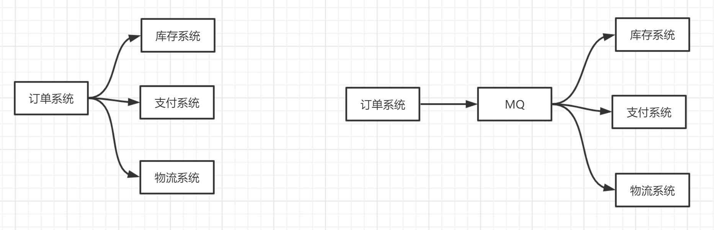
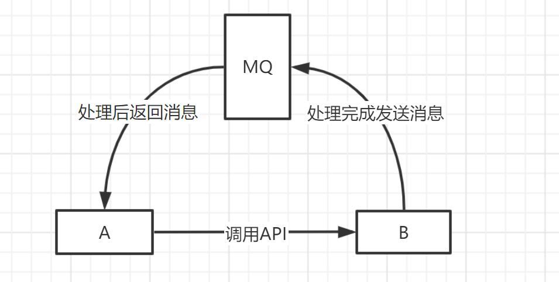

## 1. 为什么要使用MQ

### 1.1 流量削峰

使用消息队列做缓冲。假设一个订单系统最多能处理一万个订单，当订单数量超过一万个后，只能限制超过一万后不允许用户下单。这时可以用MQ做缓冲，把一秒内下的订单分散成一段时间来处理，可能用户在下单后几十秒后才收到下单成功的操作，但是比不能下单要好。

### 1.2 应用解耦

用户创建完成订单后，后面会调用库存系统、物流系统、支付系统，任何一个系统出现异常，都会造成下单操作异常。

可以使用消息队列对调用的系统进行解耦，这样系统之间调用的问题就会减少很多，比如，物流系统发生故障，需要几分钟来进行修复，在这几分钟的时间里，物流系统要处理的数据被缓存在消息队列中，用户下单的操作可以正常完成。当物流系统恢复后，继续处理订单信息即可。中间用户再下单就感受不到物流系统的障碍，提高系统的可用性。

### 1.3 异步处理

A调用B的API，只需要监听B处理完后的信息，B处理完成后会发送一条信息给MQ，MQ会将此信息转发给A服务。

这样A服务不同循环调用B的查询，也不用提供`callback api`。

## 2. RocketMQ与Kafka对比

### 存储形式

**Kafka**：
- 采用partition，每个topic的每个partition对应一个文件。
- 单个broker的partition过多，则顺序写将退化为随机写，Page Cache脏页过多，频繁触发缺页中断，性能大幅下降。

**RocketMQ**：
- 采用CommitLog+ConsumeQueue，同一个broker所有topic在同一个CommitLog中顺序写。
- 每个topic下的每个queue都有一个对应的ConsumeQueue文件作为索引。
- 写入pagecache之后被触发刷盘频率相对较低

### 存储可靠性

**Kafka**：
- 多副本机制：每个Partition都有多个副本，当某个Broker节点失效时，可以通过其他副本来保证数据的可用性。

**RocketMQ**：
- 主从复制机制：当主节点失效时，需要进行主节点选举才能保证数据的可用性，这可能会导致一定的延迟。
