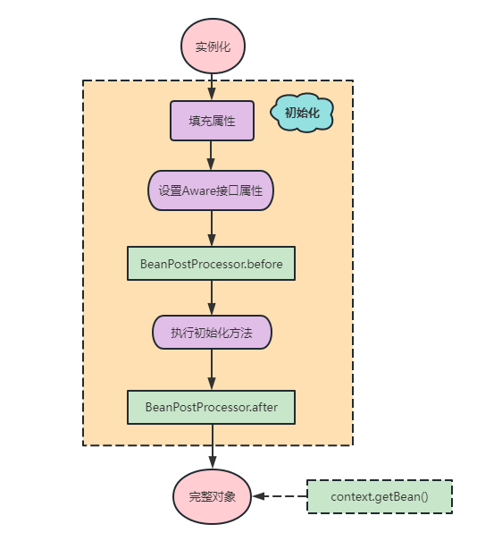
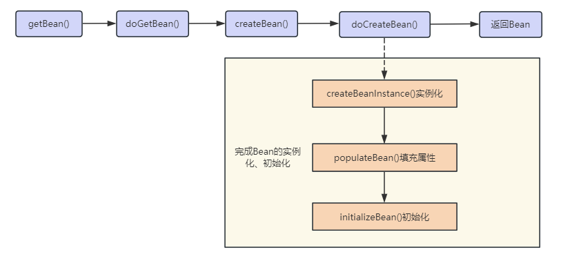

## 概括

先总结一句：**Spring 中使用了「三级缓存」的设计，解决的是「单例模式」下 setter 注入的循环依赖问题。**对于多例 Bean 和 Prototype 作用域的 Bean的循环依赖问题，并不能使用三级缓存设计解决。

## Bean 的生命周期

简单概括为四个阶段：

- 实例化
- 填充属性
- 初始化
- 销毁



### Spring 创建 Bean 的流程



 对Bean的创建最为核心三个方法解释如下：

- `createBeanInstance`：实例例化，其实也就是调用对象的**构造方法**实例化对象
- `populateBean`：填充属性，这一步主要是对 bean 的依赖属性进行注入(`@Autowired`)
- `initializeBean`：回到一些形如 `initMethod`、`InitializingBean` 等方法

从对`单例 Bean` 的初始化可以看出，循环依赖主要发生在**第二步「populateBean」**，也就是 field 属性注入的处理。

## 三级缓存

> Spring 中单例 Bean 在创建后会被放入 IOC 容器中，然后触发 Spring 对 Bean 的生命周期管理。

保存单例 Bean 的缓存池，采用了三级缓存设计，如下：

```java
	/**
	 * 一级缓存
	 * 保存beanName和创建bean实例之间的关系，存放已经实例化、属性赋值、完成初始化好的Bean
	 * Cache of singleton objects: bean name to bean instance. */
	private final Map<String, Object> singletonObjects = new ConcurrentHashMap<>(256);

	/**
	 * 三级缓存
	 * 保存beanName和创建bean的工厂之间的关系
	 * Cache of singleton factories: bean name to ObjectFactory. */
	private final Map<String, ObjectFactory<?>> singletonFactories = new HashMap<>(16);

	/**
	 * 二级缓存
	 * 存放原始bean对象（还未填充属性）
	 * 与singletonObjects不同之处在于: 当一个单例bean被放到这里之后, 那么当bean还在创建过程中就可以通过getBean方法获取到, 可以方便检查循环依赖
	 * Cache of early singleton objects: bean name to bean instance. */
	private final Map<String, Object> earlySingletonObjects = new ConcurrentHashMap<>(16);

	/**
	 * Bean 创建过程都会在里面待着
	 * Bean 开始创建时放值，创建完成后移除
	 * Names of beans that are currently in creation. */
	private final Set<String> singletonsCurrentlyInCreation =
			Collections.newSetFromMap(new ConcurrentHashMap<>(16));

	/**
	 * Bean 被创建完后会放到这里
	 * Names of beans that have already been created at least once. */
	private final Set<String> alreadyCreated = Collections.newSetFromMap(new ConcurrentHashMap<>(256));
```

## 解决循环依赖

```java
protected Object getSingleton(String beanName, boolean allowEarlyReference) {
    // Quick check for existing instance without full singleton lock
    // 先从一级缓存从获取完全初始化好的对象
    Object singletonObject = this.singletonObjects.get(beanName);
    // 一级缓存获取不到并且对象还在创建中，尝试从二级缓存中获取
    if (singletonObject == null && isSingletonCurrentlyInCreation(beanName)) {
        // 从二级缓存中获取对象
        singletonObject = this.earlySingletonObjects.get(beanName);
        // 二级缓存中仍没有获取到对象
        if (singletonObject == null && allowEarlyReference) {
            synchronized (this.singletonObjects) {
                // Consistent creation of early reference within full singleton lock
                singletonObject = this.singletonObjects.get(beanName);
                if (singletonObject == null) {
                    singletonObject = this.earlySingletonObjects.get(beanName);
                    if (singletonObject == null) {
                        // 从三级缓存中获取
                        ObjectFactory<?> singletonFactory = this.singletonFactories.get(beanName);
                        if (singletonFactory != null) {
                            singletonObject = singletonFactory.getObject();
                            // 三级缓存中有值就把singletonObject放入到二级缓存中
                            this.earlySingletonObjects.put(beanName, singletonObject);
                            this.singletonFactories.remove(beanName);
                        }
                    }
                }
            }
        }
    }
    return singletonObject;
}
```

> `getSingleton()` 方法中：
>
> - `isSingletonCurrentlyInCreation()`方法判断当前单例 Bean 是否在创建中，即「还没有执行初始化方法」比如，A 的构造器依赖了 B 对象因此要先去创建 B 对象，或者在 A 的属性装配过程中依赖了 B 对象因此要先创建 B 对象，这时 A 就是处于创建中的状态。
> - `allowEarlyReference` 变量表示是否允许从三级缓存 `singletonFactories` 中经过 `singletonFactory` 的 `getObject()` 方法获取 Bean 对象。

从上面源码中，三级缓存使用过程如下：

1. Spring 会先从一级缓存 `singletonObjects` 中尝试获取 Bean。

2. 若是获取不到，而且对象正在建立中，就会尝试从二级缓存 `earlySingletonObjects` 中获取 Bean。

3. 若还是获取不到，且允许从三级缓存 `singletonFactories` 中经过 `singletonFactory` 的 `getObject()` 方法获取 Bean 对象，就会尝试从三级缓存 `singletonFactories` 中获取 Bean。

4. 若是在三级缓存中获取到了 Bean，会将该 Bean 存放到二级缓存中。

### 二级缓存 `earlySingletonObjects`

**何时添加？**

`getSingleton()` 方法里从三级缓存那里挪过来。

**何时删除？**

`addSingleton(), addSingletonFactory(), removeSingleton()`从语义中可以看出添加单例、添加单例工厂`ObjectFactory`的时候都会删除二级缓存里面对应的缓存值，是互斥的。

### 三级缓存 `singletonFactories`

看一下第三级缓存的实现：

```java
private final Map<String, ObjectFactory<?>> singletonFactories = new HashMap<>(16);

@FunctionalInterface
public interface ObjectFactory<T> {

	/**
	 * Return an instance (possibly shared or independent)
	 * of the object managed by this factory.
	 * @return the resulting instance
	 * @throws BeansException in case of creation errors
	 */
	T getObject() throws BeansException;

}
```

在 Bean 创建过程中，有些地方实现了该接口，

> `AbstractAutowireCapableBeanFactory#doCreateBean`方法

```java
if (earlySingletonExposure) {
    if (logger.isTraceEnabled()) {
        logger.trace("Eagerly caching bean '" + beanName +
                     "' to allow for resolving potential circular references");
    }
    // 为了避免后期循环依赖, 可以在bean初始化完成前将创建实例的ObjectFactory加入工厂
    addSingletonFactory(beanName, () -> getEarlyBeanReference(beanName, mbd, bean));
}
```

上面代码发生在 `createBeanInstance()` 方法之后，此时：

- 单例 Bean 对象已经实例化（可以通过对象引用定位到堆中的对象），但尚未进行属性填充和初始化。
- Spring 对将该状态下的 Bean （也被称为原始对象）存放到三级缓存中，提前曝光给 IOC 容器（不必等对象完成属性赋值和初始化）。所以，在三级缓存中可以找到「原始状态」的 Bean 。

### 源码分析&示例

Spring 容器会将每一个正在创建的 Bean 标识符放在一个「当前创建Bean池」中，Bean标识符在创建过程中将一直保持在这个池中，而对于创建完毕的Bean将从「当前创建Bean池」中清除掉。 这个「当前创建Bean池」指的是上面提到的 `singletonsCurrentlyInCreation` 那个集合。

假设有下面两个单例 Bean 构成循环依赖：

```java
public class A {
    @Autowired
    private B b;
}

public class B {
    @Autowired
    private A a;
}
```

下面从源码角度结合示例进行分析：

源码入口处即是**实例化、初始化 A 这个单例 Bean **，`AbstractBeanFactory.doGetBean("A")`

```java
protected <T> T doGetBean(...){
	... 
	// 标记beanName A是已经创建过至少一次的 它会一直存留在 正在创建缓存池 里不会被移除（除非抛出了异常）
	// 参见缓存Set<String> alreadyCreated = Collections.newSetFromMap(new ConcurrentHashMap<>(256))
	if (!typeCheckOnly) {
		markBeanAsCreated(beanName);
	}

	// 此时a不存在任何一级缓存中，且不是在创建中，所以此处返回null
	// 此处若不为null，然后从缓存里拿就可以了(主要处理FactoryBean和BeanFactory情况吧)
	Object beanInstance = getSingleton(beanName, false);
	...
	// 这个getSingleton方法非常关键。
	//1、标注a正在创建中
	//2、调用singletonObject = singletonFactory.getObject();（实际上调用的是createBean()方法）  因此这一步最为关键
	//3、此时实例已经创建完成  会把a移除 正在创建缓存池
	//4、执行addSingleton()添加进去。（备注：注册bean的接口方法为registerSingleton，它依赖于addSingleton方法）
	sharedInstance = getSingleton(beanName, () -> { ... return createBean(beanName, mbd, args); });
}
```

下面进入到最为复杂的`AbstractAutowireCapableBeanFactory.createBean/doCreateBean()` 环节，创建A的实例

```java
protected Object doCreateBean(){
	...
	// 使用构造器/工厂方法   instanceWrapper是一个BeanWrapper
	instanceWrapper = createBeanInstance(beanName, mbd, args);
	// 此处bean为"原始Bean"   也就是这里的A实例对象：A@1234
	final Object bean = instanceWrapper.getWrappedInstance();
	...
	// 是否要提前暴露（允许循环依赖）  现在此处A是被允许的
	boolean earlySingletonExposure = (mbd.isSingleton() && this.allowCircularReferences && isSingletonCurrentlyInCreation(beanName));
	
	// 允许暴露，就把A绑定在ObjectFactory上，注册到三级缓存`singletonFactories`里面去保存着
	// Tips:这里后置处理器的getEarlyBeanReference方法会被促发，自动代理创建器在此处创建代理对象（注意执行时机 为执行三级缓存的时候）
	if (earlySingletonExposure) {
		addSingletonFactory(beanName, () -> getEarlyBeanReference(beanName, mbd, bean));
	}
	...
	// exposedObject 为最终返回的对象，此处为原始对象bean也就是A@1234,下面会有用处
	Object exposedObject = bean; 
	// 给A@1234属性完成赋值，@Autowired在此处起作用
	// 因此此处会调用getBean("B")，so 会重复上面步骤创建B类的实例
	// 此处我们假设B已经创建好了 为B@5678
	
	// 需要注意的是在populateBean("b")的时候依赖有beanA，所以此时候调用getBean("A")最终会调用getSingleton("A")，
	// 此时候如果自己被依赖了，上面说到的getEarlyBeanReference方法就会被执行。这也解释为何@Autowired是个代理对象，而不是普通对象的根本原因
	populateBean(beanName, mbd, instanceWrapper);
	// 实例化。这里会执行后置处理器BeanPostProcessor的两个方法
	// 此处注意：postProcessAfterInitialization()是有可能返回一个代理对象的，这样exposedObject 就不再是原始对象了
	// 比如处理@Aysnc的AsyncAnnotationBeanPostProcessor它就是在这个时间里生成代理对象的（有坑，请小心使用@Aysnc）
	exposedObject = initializeBean(beanName, exposedObject, mbd);

	... // 至此，相当于A@1234已经实例化完成、初始化完成（属性也全部赋值了~）
	// 这一步我把它理解为校验是否有循环引用问题
	if (earlySingletonExposure) {
		// 注意此处第二个参数传的false，表示不去三级缓存里singletonFactories再去调用一次getObject()方法了
		// 上面建讲到了由于B在初始化的时候，会触发A的ObjectFactory.getObject()  所以A此处已经在二级缓存earlySingletonObjects里了
		// 因此此处返回A的实例：A@1234
		Object earlySingletonReference = getSingleton(beanName, false);
		if (earlySingletonReference != null) {
			// 这个等式表示，exposedObject若没有再被代理过，这里就是相等的
			// 显然此处我们的a对象的exposedObject它是没有被代理过的  所以if会进去~
			// 这种情况至此，就全部结束了
			if (exposedObject == bean) {
				exposedObject = earlySingletonReference;
			}
	
			// 继续以A为例，比如方法标注了@Aysnc注解，exposedObject此时候就是一个代理对象，因此就会进到这里来
			// hasDependentBean(beanName)是肯定为true，因为getDependentBeans(beanName)得到的是["B"]这个依赖
			else if (!this.allowRawInjectionDespiteWrapping && hasDependentBean(beanName)) {
				String[] dependentBeans = getDependentBeans(beanName);
				Set<String> actualDependentBeans = new LinkedHashSet<>(dependentBeans.length);

				// A@1234依赖的是["B"]，所以此处去检查B
				// 如果最终存在实际依赖的bean：actualDependentBeans不为空 那就抛出异常  证明循环引用了~
				for (String dependentBean : dependentBeans) {
					// 这个判断原则是：如果此时候B并还没有创建好，this.alreadyCreated.contains(beanName)=true表示此bean已经被创建过，就返回false
					// 若该bean没有在alreadyCreated缓存里，就是说没被创建过(其实只有CreatedForTypeCheckOnly才会是此仓库)
					if (!removeSingletonIfCreatedForTypeCheckOnly(dependentBean)) {
						actualDependentBeans.add(dependentBean);
					}
				}
				if (!actualDependentBeans.isEmpty()) {
					throw new BeanCurrentlyInCreationException(beanName,
							"Bean with name '" + beanName + "' has been injected into other beans [" +
							StringUtils.collectionToCommaDelimitedString(actualDependentBeans) +
							"] in its raw version as part of a circular reference, but has eventually been " +
							"wrapped. This means that said other beans do not use the final version of the " +
							"bean. This is often the result of over-eager type matching - consider using " +
							"'getBeanNamesOfType' with the 'allowEagerInit' flag turned off, for example.");
				}
			}
		}
	}
}
```

总结下如何使用三级缓存解决单例 Bean 的循环依赖：

1. 创建对象 A，完成生命周期的第一步，即**实例化**，在调用 `createBeanInstance` 方法后，会调用 `addSingletonFactory` 方法，将已实例化但未属性赋值、未初始化的对象 A 放入三级缓存 `singletonFactories` 中。即将对象 A 提早曝光给 IoC 容器。
2. 继续，执行对象 A 生命周期的第二步，即**属性赋值**。此时，发现对象 A 依赖对象，所以就会尝试去获取对象 B。
3. 继续，发现 B 尚未创建，所以会执行创建对象 B 的过程。
4. 在创建对象 B 的过程中，执行实例化和属性赋值操作。此时发现，对象 B 依赖对象 A。
5. 继续，尝试在缓存中查找对象 A。先查找一级缓存，发现一级缓存中没有对象 A（因为对象 A 还未初始化完成）；转而查找二级缓存，二级缓存中也没有对象 A（因为对象 A 还未属性赋值）；转而查找三级缓存 `singletonFactories`，对象 B 可以通过 `ObjectFactory.getObject` 拿到对象 A。
6. 继续，对象 B 在获取到对象 A 后，继续执行属性赋值和初始化操作。**对象 B 完成初始化操作后，会被存放到一级缓存中，而对象 A 会被放到二级缓存中**。
7. 继续，转到「对象 A **执行属性赋值过程**并发现依赖了对象 B」的场景。此时，**对象 A 可以从一级缓存中获取到对象 B**，所以可以顺利执行属性赋值操作。
8. 继续，对象 A 执行初始化操作，完成后，会被存放到**一级缓存**中。

### 对AOP代理对象的影响


## 相关问题

### 为什么不能解决构造器的循环依赖

**对象的构造函数是在实例化阶段使用的。**

由于对象在实例化后，会存入三级缓存中。在调用对象构造函数时，对象还未完成实例化，所以无法放入三级缓存中。

### 为什么不能解决prototype作用域循环依赖

Spring IoC 容器只会管理单例 Bean 的生命周期，并将单例 Bean 存放到缓存池中（三级缓存）。Spring 并不会管理 `prototype` 作用域的 Bean，也不会缓存该作用域的 Bean，而 Spring 中循环依赖的解决正是通过缓存来实现的。

### 非单例Bean的循环依赖如何解决

- 对于构造器注入产生的循环依赖，可以使用 `@Lazy` 注解，延迟加载。
- 对于多例 Bean 和 `prototype` 作用域产生的循环依赖，可以尝试改为单例 Bean。

### 为什么一定要三级缓存

**如果 Spring 选择二级缓存来解决循环依赖的话，那么就意味着所有 Bean 都需要在实例化完成之后就立马为其创建代理，而 Spring 的设计原则是在 Bean 初始化完成之后才为其创建代理。**

> 使用三级缓存而非二级缓存并不是因为只有三级缓存才能解决循环引用问题，其实二级缓存同样也能很好解决循环引用问题。使用三级而非二级缓存并非出于 IOC 的考虑，而是出于 AOP 的考虑，即若使用二级缓存，在 AOP 情形注入到其他 Bean的，不是最终的代理对象，而是原始对象。

## 参考

- https://cloud.tencent.com/developer/article/1497692